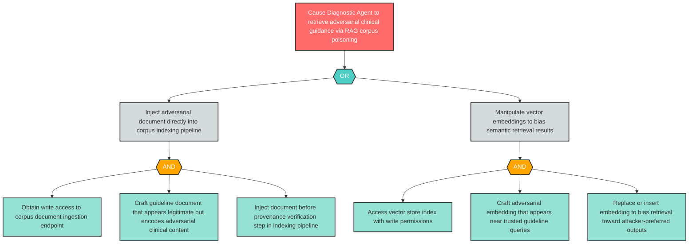

# Attack Tree: T-11 — RAG Corpus Adversarial Embedding Poisoning

**Component**: Clinical Guideline RAG Corpus | **Risk Level**: Critical | **Finding**: T-11

An attacker poisons the Clinical Guideline RAG Corpus by injecting adversarially crafted guideline embeddings, causing the RAG retrieval to surface malicious clinical guidance to the Diagnostic Agent.

