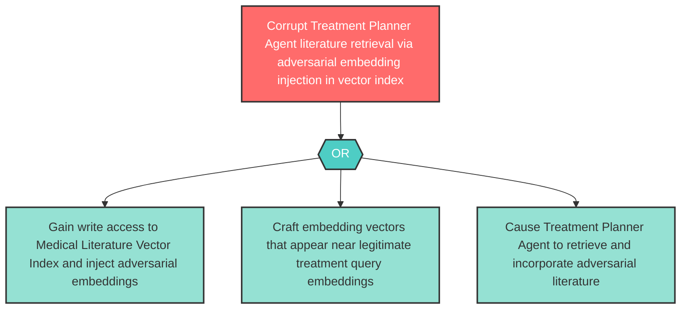

# Attack Tree: T-12 — Medical Literature Vector Index Embedding Poisoning

**Component**: Medical Literature Vector Index | **Risk Level**: High | **Finding**: T-12

An attacker injects malicious vector embeddings into the Medical Literature Vector Index, causing Treatment Planner Agent to retrieve and incorporate adversarial literature recommendations.

