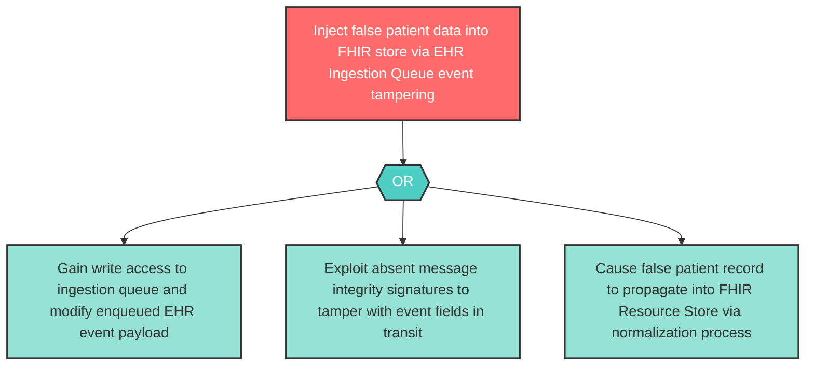

# Attack Tree: T-14 — EHR Ingestion Queue Event Tampering

**Component**: EHR Ingestion Queue | **Risk Level**: High | **Finding**: T-14

An attacker tampers with EHR update events in the ingestion queue before normalization, injecting false patient data that propagates into the FHIR Resource Store.

