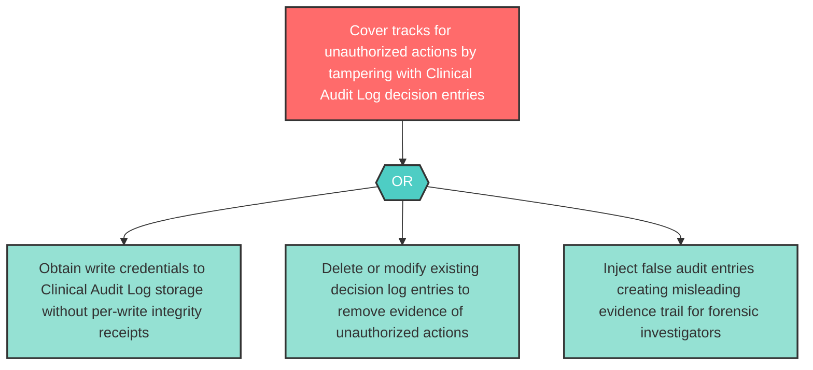

# Attack Tree: T-15 — Clinical Audit Log Tampering

**Component**: Clinical Audit Log | **Risk Level**: High | **Finding**: T-15

An attacker who gains write access to the Clinical Audit Log tampers with decision log entries, covering tracks for unauthorized actions or injecting false audit evidence.

