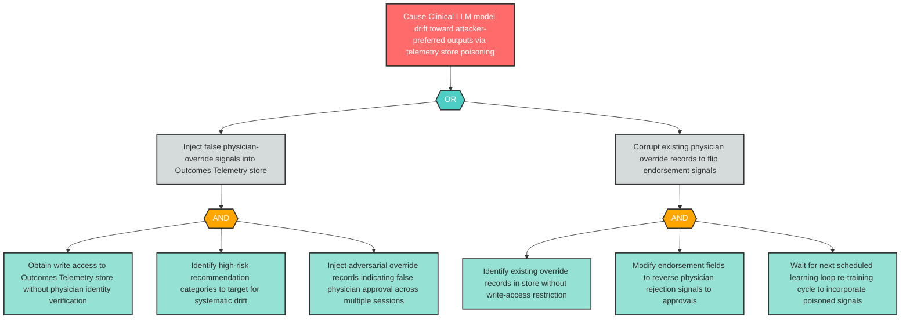

# Attack Tree: T-16 — Outcomes Telemetry Learning Loop Poisoning

**Component**: Outcomes Telemetry and Physician Override Audit Store | **Risk Level**: Critical | **Finding**: T-16

An attacker tampers with the Outcomes Telemetry store, injecting adversarial physician-override signals that corrupt the learning loop re-training process and cause model drift toward attacker-preferred outputs.

