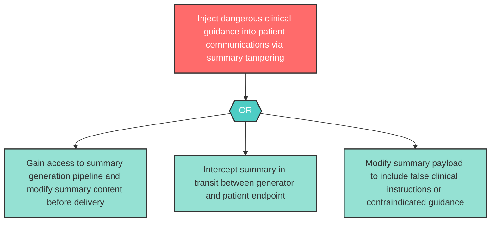

# Attack Tree: T-2 — Patient Summary Tampering

**Component**: Patient Summary Generator | **Risk Level**: High | **Finding**: T-2

An attacker with access to the summary generation pipeline tampers with patient-facing summaries, injecting dangerous or false clinical guidance into patient communications.

