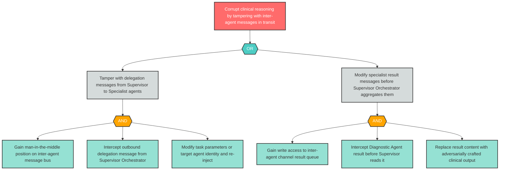

# Attack Tree: T-3 — Inter-Agent Channel Message Tampering

**Component**: Inter-Agent Communication Channel | **Risk Level**: Critical | **Finding**: T-3

An attacker with access to the inter-agent message bus tampers with delegation messages or specialist results in transit, corrupting clinical reasoning across the multi-agent pipeline.

