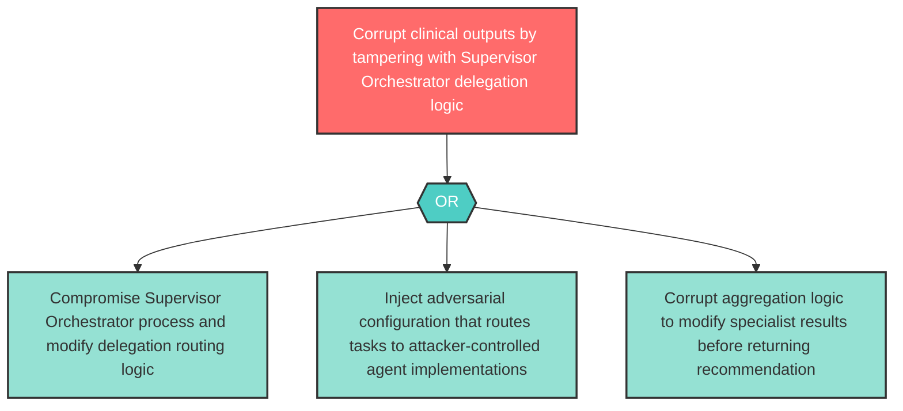

# Attack Tree: T-4 — Supervisor Orchestrator Delegation Logic Tampering

**Component**: Supervisor Orchestrator | **Risk Level**: High | **Finding**: T-4

An attacker who compromises the Supervisor Orchestrator tampers with the delegation logic, routing clinical tasks to adversary-controlled specialist implementations or corrupting aggregated outputs.

