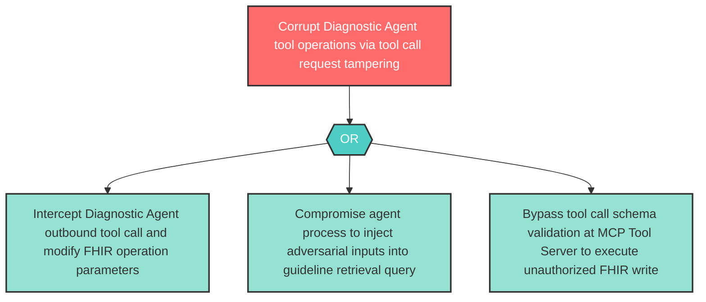

# Attack Tree: T-5 — Diagnostic Agent Tool Call Tampering

**Component**: Diagnostic Agent | **Risk Level**: High | **Finding**: T-5

An attacker tampers with the Diagnostic Agent's tool call requests to Clinical MCP Tool Server, injecting malicious FHIR operations or corrupting guideline retrieval queries.

