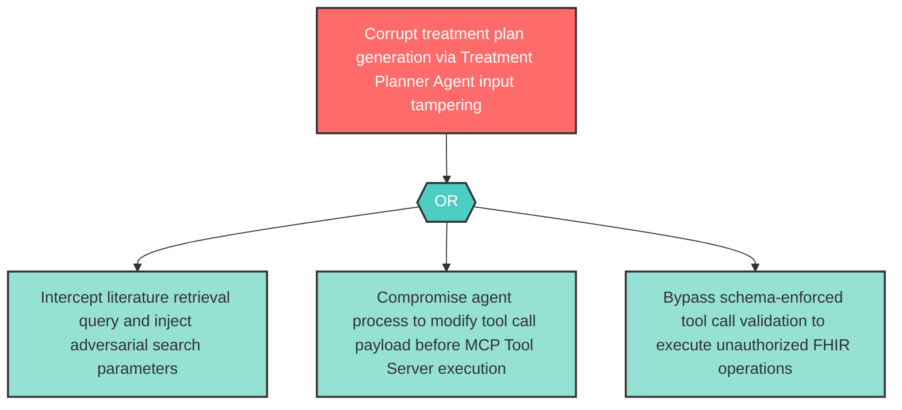

# Attack Tree: T-6 — Treatment Planner Agent Input Tampering

**Component**: Treatment Planner Agent | **Risk Level**: High | **Finding**: T-6

An attacker tampers with the Treatment Planner Agent's literature retrieval queries or tool calls, injecting adversarially crafted inputs that corrupt treatment plan generation.

