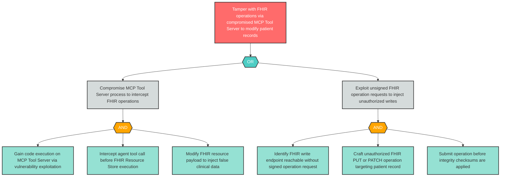

# Attack Tree: T-7 — Clinical MCP Tool Server FHIR Tampering

**Component**: Clinical MCP Tool Server | **Risk Level**: Critical | **Finding**: T-7

A compromised MCP Tool Server tampers with FHIR read/write operations, modifying patient records without authorization or returning corrupted data to agents.

