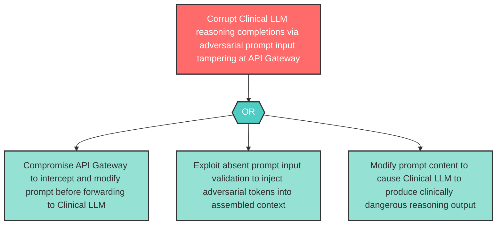

# Attack Tree: T-8 — Clinical LLM Prompt Input Tampering

**Component**: Clinical LLM | **Risk Level**: High | **Finding**: T-8

An attacker tampers with Clinical LLM prompt inputs forwarded by the API Gateway, injecting adversarial tokens that corrupt the clinical reasoning completion.

