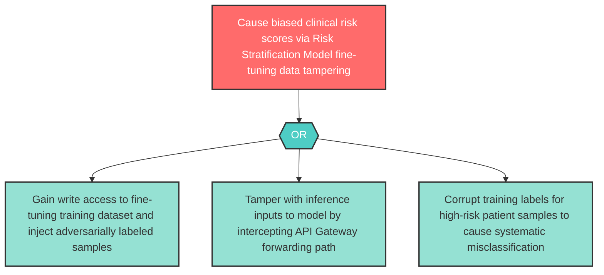

# Attack Tree: T-9 — Risk Stratification Model Fine-Tuning Data Tampering

**Component**: Risk Stratification Model | **Risk Level**: High | **Finding**: T-9

An attacker tampers with fine-tuning data or inference inputs to the Risk Stratification Model, causing systematically biased risk scores leading to incorrect clinical decisions.

