# Threat Report — Healthcare Clinical Decision Support System (CDSS)

> **DISCLAIMER**: This is a security reference scenario for threat-modeling teaching purposes only. It is NOT a real clinical system and contains NO real patient data. Nothing herein constitutes medical advice, regulatory guidance, or a compliance framework recommendation.

```yaml
---
schema_version: "1.1"
date: "2026-04-16"
source_file: "examples/maestro-reference/threats.md"
finding_count: 108
risk_distribution:
  Critical: 17
  High: 54
  Medium: 30
  Low: 8
attack_tree_count: 71
baseline_source: null
baseline_date: null
delta_counts:
  new: null
  unchanged: null
  updated: null
  resolved: null
---
```

---

## 1. Executive Summary

The Healthcare Clinical Decision Support System (CDSS) — a multi-agent AI platform for clinical recommendation generation — presents a high-risk security posture. The threat model identified **108 findings** across eight STRIDE (Spoofing, Tampering, Repudiation, Information Disclosure, Denial of Service, Elevation of Privilege) and AI-specific threat categories, with **17 Critical, 54 High, 30 Medium, and 7 Low findings**. The architecture's multi-agent topology, persistent learning loop, and handling of protected health information (PHI) substantially expand the attack surface relative to a conventional clinical information system.

**Top threats by business impact:**

1. **Clinical Guideline RAG Corpus poisoning (T-11, Critical)** — an attacker injecting adversarially crafted guideline embeddings into the Retrieval-Augmented Generation (RAG) corpus causes the Diagnostic Agent to retrieve and act on malicious clinical guidance. This finding is part of the CHAIN-001 cross-layer attack chain that ultimately delivers false recommendations to the Physician Clinical Portal.

2. **Outcomes Telemetry learning loop tampering (T-16, Critical)** — adversarial override signals injected into the Outcomes Telemetry store corrupt periodic Clinical LLM (Large Language Model) re-training, causing systematic model drift toward attacker-preferred clinical outputs over weeks. This is the initial exploit in CHAIN-003.

3. **Supervisor Orchestrator autonomous delegation without oversight (AG-1, Critical)** — the orchestrator may route high-consequence clinical tasks to specialist agents without physician review or HIPAA (Health Insurance Portability and Accountability Act) RBAC (Role-Based Access Control) verification. Combined with the repudiation gap in CG-4, this creates a compound threat with no accountability trail.

4. **Clinical LLM prompt injection via API Gateway (LLM-1, Critical)** — adversarial prompts embedded in clinical queries cause the Clinical LLM to generate harmful completions that propagate through the recommendation pipeline. This is the chain-breaking control target for CHAIN-002.

5. **FHIR Resource Store and MCP Tool Server PHI (Protected Health Information) exposure (T-10, I-10, I-7, Critical)** — the FHIR (Fast Healthcare Interoperability Resources) Resource Store and Clinical MCP Tool Server expose patient records through insufficient access controls and FHIR injection risks, creating direct PHI disclosure risk at the data layer.

**Key recommendations:**

1. Deploy an append-only, cryptographically chained Clinical Audit Log with write-access restricted to authenticated service identities — this is the chain-breaking control for CHAIN-001 and foundational for all repudiation mitigations.
2. Implement provenance attestation and write-access restriction on the Outcomes Telemetry store before the next learning loop re-training cycle — this breaks CHAIN-003 at its source.
3. Add prompt injection detection and output schema validation at the Model Inference API Gateway before forwarding to the Clinical LLM — this breaks CHAIN-002 at L1.
4. Enforce human-in-the-loop confirmation gates for high-consequence Supervisor Orchestrator delegation decisions and require RBAC compliance checks before every delegation command.
5. Apply row-level integrity checksums and encryption at rest to all FHIR resources, with write access gated exclusively through the Consent and De-identification Guardrail.

**Compliance relevance**: Findings across Tampering, Information Disclosure, and Repudiation categories carry direct HIPAA implications for PHI protection and audit trail integrity. SOC2 Trust Services Criteria CC6.1 (logical access controls) is implicated by the RBAC bypass findings (E-4, E-7, E-11). ISO 27001 A.9 (access control) and A.12 (operations security) apply to the agent access control gaps. OWASP LLM01:2025 and LLM03:2025 map directly to LLM-1 and LLM-2.

**Remediation timeline:**
- **Immediate** (17 Critical findings): Address before next deployment. Priority: T-11, T-16, AG-1, LLM-1, and all inter-agent channel security gaps.
- **Short-term** (54 High findings): Address within current development cycle. Priority: inter-agent authentication, FHIR access scoping, audit log hardening.
- **Medium-term** (30 Medium findings): Schedule for next planning cycle. Covers gateway spoofing, RBAC policy controls, and repudiation gaps at lower-risk components.
- **Backlog** (7 Low findings): Track for future consideration.

---

## 2. Architecture Overview

### System Context

The Healthcare Clinical Decision Support System (CDSS) is a multi-agent AI platform designed to generate clinical recommendations for physicians and patient-facing summaries from structured patient health data. The scenario is used as a threat-modeling teaching reference — it is NOT a real clinical system and contains NO real patient data.

The system processes clinical queries submitted by physicians through a web portal, routes them through a supervisory orchestration layer, engages specialist AI agents for diagnostic reasoning and treatment planning, and delivers recommendation views back to the portal. Patient EHR (Electronic Health Record) update events flow from an external patient entity through an ingestion queue into a FHIR Resource Store, which serves as the primary structured patient data source for all agents.

The architecture comprises 20 components across seven MAESTRO layers — the CSA (Cloud Security Alliance) MAESTRO (Multi-Agent Environment, Security, Threat, Risk, and Outcome) framework's seven architectural layers for agentic AI systems:

- **L1 — Foundation Model**: Clinical LLM (a frozen foundation model) and Risk Stratification Model (a fine-tuned model for patient risk scoring), both accessed through the Model Inference API Gateway.
- **L2 — Data Operations**: FHIR Resource Store (structured patient records), Clinical Guideline RAG (Retrieval-Augmented Generation) Corpus (semantic guideline retrieval), Medical Literature Vector Index (literature retrieval for treatment planning), and EHR Ingestion Queue.
- **L3 — Agent Framework**: The Supervisor Orchestrator (supervisory delegation authority), Diagnostic Agent (clinical reasoning and tool dispatch), Treatment Planner Agent (treatment planning and literature retrieval), and Clinical MCP (Model Context Protocol) Tool Server (FHIR operations via JSON-RPC).
- **L4 — Deployment Infrastructure**: Model Inference API Gateway and EHR Ingestion Queue.
- **L5 — Evaluation and Observability**: Clinical Audit Log and Outcomes Telemetry and Physician Override Audit Store (which drives a long-running learning loop for continual model re-training).
- **L6 — Security and Compliance**: HIPAA RBAC + Policy Engine and Consent and De-identification Guardrail.
- **L7 — Agent Ecosystem**: Physician Clinical Portal, Patient Summary Generator, and Inter-Agent Communication Channel.

Key data flows cross multiple MAESTRO layer boundaries: clinical queries enter at L7, are routed through L3 agents that call L1 foundation models via L4 infrastructure, retrieve from L2 data stores, and generate outputs at L7. The Outcomes Telemetry store at L5 feeds learning loop signals back to L1 foundation models — a feedback path that creates temporal attack surface.

### Trust Boundary Summary

The architecture defines nine trust zones. The External Zone (Untrusted) contains the Physician and Patient external entities. The User Interface Zone (Semi-Trusted at L7) contains the Physician Clinical Portal and Patient Summary Generator. The Agent Ecosystem Zone (Semi-Trusted at L7) contains the Inter-Agent Communication Channel. All remaining zones — Agent Frameworks (L3), Foundation Models (L1), Data Operations (L2), Deployment Infrastructure (L4), Evaluation and Observability (L5), and Security and Compliance (L6) — are classified as Trusted.

Notable boundary crossings and their controls:

- **Physician → Portal (External → User Interface)**: TLS encryption and HTTPS. No mutual authentication currently documented, which is the primary driver of **S-1** (Critical).
- **Portal → Agent Zone (User Interface → Agent Frameworks)**: RBAC access decision from the HIPAA RBAC + Policy Engine. The integrity of this crossing depends on the policy engine's availability and correctness.
- **Inter-Agent → Agent Zone (Agent Ecosystem → Agent Frameworks)**: Internal channel with no external TLS. This crossing carries the highest concentration of critical findings (S-5, T-3, I-3, E-3, AG-8, AGP-01) because the inter-agent channel is accessible without transport-layer encryption.
- **Observability → Foundation Zone (L5 → L1)**: Feedback loop model update from Outcomes Telemetry to Clinical LLM. This crossing has no documented provenance controls, enabling the T-16 / CHAIN-003 learning loop poisoning path.
- **Data → Security Layer (L2 → L6)**: PHI de-identification via the Consent and De-identification Guardrail. This is the only documented PHI protection control on FHIR reads, making it a single point of failure for multiple Information Disclosure findings.

The absence of message-level authentication on the inter-agent channel and the absence of provenance controls on the learning loop feedback path are the two most significant architectural gaps identified by the trust boundary analysis.

---

## 3. Threat Analysis

This section provides agent-by-agent narrative analysis of all 108 findings across the eight STRIDE and AI threat categories. Given the threat model exceeds 30 findings, Critical and High findings receive full individual narrative; Medium findings are summarized by category; Low findings are mentioned in aggregate.

### 3.1 Spoofing

Spoofing threats target identity verification at all layers of the CDSS — from external physician authentication at L7 through inter-agent identity attestation at L3 and L7, to model endpoint identity verification at L1 and L4. The architecture's multi-agent topology creates multiple trust relationships that each represent a spoofing surface.

**S-1** (Critical, L7 — Agent Ecosystem) targets the Physician external entity. An attacker may impersonate a legitimate physician by replaying expired JWT (JSON Web Token) tokens, forging token claims, or harvesting credentials through phishing. Because physician identity gates access to PHI-containing clinical recommendations, this finding is the initial exploit in CHAIN-002. Likelihood HIGH / Impact HIGH.

**S-5** (Critical, L7 — Agent Ecosystem) targets the Inter-Agent Communication Channel with the trust_exploitation agentic pattern. An attacker with access to the inter-agent message bus may spoof supervisor delegation messages using forged or stolen HMAC (Hash-based Message Authentication Code) session keys, causing specialist agents to execute unauthorized clinical operations. This finding has direct agent-collusion implications because forged delegation enables coordinated multi-agent exploitation. Likelihood HIGH / Impact HIGH.

**S-6** (Critical, L3 — Agent Framework) targets the Supervisor Orchestrator with the trust_exploitation pattern. Impersonating the Supervisor Orchestrator allows an attacker to issue arbitrary delegation commands to Diagnostic Agent and Treatment Planner Agent. Because no cryptographic attestation of supervisor identity is currently documented, this attack requires only channel write access. Likelihood HIGH / Impact HIGH.

**S-7** (High, L3 — Agent Framework) targets the Diagnostic Agent with trust_exploitation. Spoofing the Diagnostic Agent's inter-agent identity allows injection of fraudulent diagnostic results into the coordination flow before the Treatment Planner Agent or Supervisor Orchestrator consume them. **S-8** (High, L3) similarly targets the Treatment Planner Agent — a spoofed treatment plan response can inject malicious clinical guidance without any downstream component detecting the forgery. **S-9** (High, L3) targets the Clinical MCP Tool Server — a spoofed tool server can return adversarially crafted FHIR data to both specialist agents.

**S-2** (High, L7 — Agent Ecosystem) targets the Patient external entity. Spoofed EHR update events bypassing patient identity registry validation can inject false patient records that propagate into the FHIR Resource Store and subsequently corrupt all clinical decision downstream.

**S-3** (High, L7 — Agent Ecosystem) targets the Physician Clinical Portal. A rogue portal endpoint can intercept Supervisor Orchestrator responses containing PHI-laden clinical recommendations.

Medium spoofing findings: S-4 (Patient Summary Generator), S-10 (Clinical LLM), S-11 (Risk Stratification Model), S-12 (Model Inference API Gateway), S-13 (HIPAA RBAC + Policy Engine), and S-14 (Consent and De-identification Guardrail) cover service-level identity spoofing risks across the internal component fabric. These carry LOW likelihood due to the network proximity required for internal spoofing, but HIGH impact given the clinical criticality of the targeted components.

### 3.2 Tampering

Tampering threats span the full data lifecycle — from patient record injection at L2 and L4 through inter-agent message manipulation at L7 and L3, to foundation model training data corruption at L1 and L5. Seven Critical tampering findings reflect the system's broad attack surface for data integrity.

**T-3** (Critical, L7 — Agent Ecosystem, communication_vulnerability) targets the Inter-Agent Communication Channel. A man-in-the-middle attacker with channel write access can modify delegation messages from the Supervisor to specialist agents, or corrupt specialist results before the Supervisor aggregates them. Because the inter-agent channel carries all multi-agent coordination, this is the highest-impact single tampering vector. Likelihood HIGH / Impact HIGH.

**T-7** (Critical, L3 — Agent Framework) targets the Clinical MCP Tool Server. A compromised MCP Tool Server can intercept and modify FHIR read/write operations, returning adversarially crafted FHIR data to agents or silently persisting unauthorized patient record modifications. This finding is part of correlation group CG-1 with **AG-7** — the combination represents both direct tampering and tool-chaining privilege escalation. Likelihood HIGH / Impact HIGH.

**T-10** (Critical, L2 — Data Operations) targets the FHIR Resource Store. Write access bypassing the Consent Guardrail allows injection of false patient clinical data that corrupts all downstream clinical decisions for the affected patient. Row-level integrity checksums are absent. Likelihood HIGH / Impact HIGH.

**T-11** (Critical, L2 — Data Operations) targets the Clinical Guideline RAG Corpus. Adversarially crafted guideline embeddings injected into the corpus bias the Diagnostic Agent's retrieval toward attacker-preferred clinical guidance. This is the initial exploit in CHAIN-001, which terminates in false recommendation disclosure at the Physician Clinical Portal. Likelihood HIGH / Impact HIGH.

**T-16** (Critical, L5 — Evaluation and Observability, temporal_attack) targets the Outcomes Telemetry and Physician Override Audit Store. An adversary injecting false physician-override signals into the telemetry store corrupts the Clinical LLM's periodic re-training cycle, causing systematic model drift. This is the initial exploit in CHAIN-003 and also tagged as a temporal attack — effects may not surface until weeks after injection. Likelihood HIGH / Impact HIGH.

**T-5** (High, L3), **T-6** (High, L3) target the Diagnostic Agent and Treatment Planner Agent tool call requests. Both agents dispatch JSON-RPC tool calls and FHIR queries without end-to-end input validation, making them susceptible to parameter injection that causes unauthorized FHIR operations. **T-8** (High, L1) and **T-9** (High, L1) target the Clinical LLM and Risk Stratification Model — prompt input tampering at the API Gateway and fine-tuning data corruption each represent distinct integrity attack paths on the foundation model layer.

**T-4** (High, L3) targets Supervisor Orchestrator delegation logic — a compromised orchestrator can reroute clinical tasks to attacker-controlled specialist implementations. **T-12** (High, L2) targets the Medical Literature Vector Index with adversarial embedding injection analogous to T-11. **T-14** (High, L4) targets the EHR Ingestion Queue — tampered EHR events that bypass queue integrity checks propagate false patient records into the FHIR store. **T-15** (High, L5) targets the Clinical Audit Log — this finding is the intermediate cascade in CHAIN-001, where audit suppression enables downstream RBAC policy manipulation.

Medium tampering findings: T-13 (Model Inference API Gateway configuration), T-17 (HIPAA RBAC + Policy Engine rules), and T-18 (Consent and De-identification Guardrail configuration) represent infrastructure tampering risks with LOW likelihood due to the elevated access required.

### 3.3 Repudiation

Repudiation threats reflect audit trail gaps across the multi-agent pipeline. When agents cannot be held accountable for their actions, post-incident investigation becomes impossible — a critical concern for clinical liability.

**R-5** (High, L7 — Agent Ecosystem) targets the Inter-Agent Communication Channel. Without per-message cryptographic receipts and non-repudiable logging of all delegation messages in the Clinical Audit Log, agents can deny issuing or receiving coordination commands. **R-6** (High, L3 — Agent Framework) targets the Supervisor Orchestrator — absence of mandatory pre-action audit logging means the orchestrator can deny issuing specific delegation commands. This finding is part of correlation group CG-4 with **AG-1**, where the combination of autonomous delegation (AG-1) and absent audit records (R-6) creates a compound accountability gap. **R-9** (High, L3) targets the Clinical MCP Tool Server — without per-tool-call logging linking each FHIR operation to the requesting agent, patient record modifications cannot be traced to their source.

Medium repudiation findings: R-1 (Physician clinical query logging), R-3 (Physician Clinical Portal recommendation view logging), R-7 (Diagnostic Agent tool call logging), R-8 (Treatment Planner Agent retrieval logging), R-10 (Clinical LLM prompt-completion logging), R-11 (Risk Stratification Model inference logging), R-12 (Model Inference API Gateway access logging), and R-13 (HIPAA RBAC + Policy Engine access decision logging) all represent gaps where the absence of non-repudiable records prevents post-incident reconstruction of clinical decision chains. Low repudiation findings: R-2 (Patient EHR event receipts), R-4 (Patient Summary Generator delivery logging).

### 3.4 Information Disclosure

Information disclosure threats target PHI at every layer of the CDSS — from direct FHIR store exposure at L2 through model memorization and membership inference at L1, to inter-agent channel eavesdropping at L7.

**I-3** (Critical, L7 — Agent Ecosystem, communication_vulnerability) targets the Inter-Agent Communication Channel. Unencrypted inter-agent messages carrying clinical context and PHI are susceptible to passive eavesdropping or unauthorized queue read access. This is part of correlation group CG-3 overlap with the broader PHI exposure theme. Likelihood HIGH / Impact HIGH.

**I-7** (Critical, L3 — Agent Framework) targets the Clinical MCP Tool Server. Insufficient resource-level access controls on FHIR tool results allow unauthorized agents — or overly broad queries — to return PHI to callers without authorization checks. This finding is part of correlation group CG-3 alongside LLM-1. Likelihood HIGH / Impact HIGH.

**I-10** (Critical, L2 — Data Operations) targets the FHIR Resource Store. Unauthorized FHIR read operations, FHIR injection attacks, or missing encryption at rest can expose patient PHI directly from the primary clinical data store. Likelihood HIGH / Impact HIGH.

**I-1** (High, L7), **I-2** (High, L7) target the Physician Clinical Portal and Patient Summary Generator. Both expose PHI through insecure HTTPS configuration, excessive error messages, or missing access control on recommendation views and summary delivery. **I-4** (High, L3) targets the Supervisor Orchestrator — its aggregated context window is more sensitive than any individual component because it combines FHIR data, specialist results, and model outputs. **I-5** (High, L3) and **I-6** (High, L3) target the Diagnostic Agent and Treatment Planner Agent — session isolation failures and unfiltered tool call parameters can expose patient data across concurrent clinical queries.

**I-8** (High, L1) targets Clinical LLM training data memorization — differential privacy is absent, enabling systematic PHI extraction through targeted completion queries. **I-9** (High, L1) targets Risk Stratification Model membership inference — fine-tuning dataset participants can be identified through confidence differential analysis. **I-14** (High, L4) targets the EHR Ingestion Queue — unencrypted queue messages and insufficient access controls expose enqueued patient records. **I-15** (High, L5) and **I-16** (High, L5) target the Clinical Audit Log and Outcomes Telemetry store — both accumulate highly sensitive clinical decision trails that are vulnerable to unauthorized read access.

Medium information disclosure findings: I-13 (Model Inference API Gateway log PHI), I-17 (HIPAA RBAC policy enumeration), I-18 (Consent Guardrail de-identification flaws). Low findings: I-11 (RAG Corpus inadvertent PHI indexing) and I-12 (Medical Literature Vector Index cross-contamination) represent lower-likelihood indirect PHI exposure paths.

### 3.5 Denial of Service

Denial of Service (DoS) threats target the availability of all major processing components. In a clinical decision support context, availability failures directly impact patient care.

**D-3** (High, L7 — Agent Ecosystem, resource_competition) targets the Inter-Agent Communication Channel. Flooding the channel with spurious delegation messages starves legitimate specialist agent task processing and disrupts the entire multi-agent coordination flow. This is part of correlation group CG-5 with **AG-8**. **D-4** (High, L3 — Agent Framework, resource_competition) targets the Supervisor Orchestrator. A compromised specialist agent generating high-volume error responses causes orchestrator resource exhaustion. **D-5** (High, L3) targets the Diagnostic Agent with tool call floods or RAG corpus retrieval storms. **D-7** (High, L3) targets the Clinical MCP Tool Server with excessive JSON-RPC tool calls. **D-8** (High, L1) targets Clinical LLM inference capacity via large prompt floods. **D-10** (High, L2) targets the FHIR Resource Store with resource-exhausting FHIR queries. **D-13** (High, L4) targets the Model Inference API Gateway, which if saturated denies all agents access to foundation model inference. **D-1** (High, L7) targets the Physician Clinical Portal with clinical query request floods during critical clinical decision periods.

Medium and Low DoS findings: D-2 (Patient Summary Generator), D-6 (Treatment Planner Agent), D-9 (Risk Stratification Model), D-11 (Clinical Guideline RAG Corpus), D-12 (Medical Literature Vector Index), D-14 (EHR Ingestion Queue), D-15 (Clinical Audit Log), D-16 (Outcomes Telemetry), D-17 (HIPAA RBAC + Policy Engine), D-18 (Consent Guardrail) cover the full component inventory for DoS exposure at Medium and Low likelihood.

### 3.6 Elevation of Privilege

Privilege escalation threats exploit authorization gaps in the multi-layer architecture, particularly at the agent-to-data boundary where FHIR access controls are the primary enforcement mechanism.

**E-7** (Critical, L3 — Agent Framework) targets the Clinical MCP Tool Server. A compromised agent exploits tool chaining to achieve unauthorized FHIR outcomes — executing sequences of individually-permitted operations that collectively achieve a prohibited result (e.g., bulk patient data export via iterated paginated reads). This is part of correlation groups CG-1 and CG-2, both Critical. Likelihood HIGH / Impact HIGH.

**E-1** (High, L7), **E-2** (High, L7) target the Physician Clinical Portal and Patient Summary Generator. Broken access controls allow escalation from a low-privilege physician session to unauthorized patient records. **E-3** (High, L7, trust_exploitation) targets the Inter-Agent Communication Channel — escalated channel access enables issuance of supervisor-level delegation commands that bypass the Supervisor Orchestrator's authority. **E-4** (High, L3) targets the Supervisor Orchestrator — a compromised orchestrator can bypass the HIPAA Policy Engine's compliance checks or grant specialist agents permissions exceeding their authorized scope. **E-5** (High, L3) and **E-6** (High, L3) target the Diagnostic Agent and Treatment Planner Agent — per-session FHIR access scoping gaps allow both agents to access patient records outside the current clinical query's scope. **E-8** (High, L1) targets the Clinical LLM — prompt injection can cause the model to emit completions containing system command patterns that the Supervisor Orchestrator interprets as elevated-privilege instructions.

Medium privilege escalation findings: E-9 (Risk Stratification Model risk score manipulation triggering escalation workflows), E-10 (Model Inference API Gateway model access escalation), E-11 (HIPAA RBAC + Policy Engine administrative access exploitation), and E-12 (Consent and De-identification Guardrail bypass) represent lower-likelihood but structurally important escalation vectors.

### 3.7 Agentic Threats

Agentic threats target the autonomous decision-making and tool-use behaviors unique to the CDSS's multi-agent architecture. These findings go beyond standard STRIDE categories to address the agentic AI risk vectors defined by OWASP LLM Top 10 2025 and CSA MAESTRO.

**AG-1** (Critical, L3 — Agent Framework, agent_collusion) targets the Supervisor Orchestrator. The orchestrator may autonomously execute high-consequence clinical delegation commands — routing clinical tasks to specialist agents based on AI-generated orchestration logic without physician review or RBAC compliance verification. This is part of correlation group CG-4 with R-6. Likelihood HIGH / Impact HIGH. This finding also participates in CHAIN-002's privilege escalation cascade.

**AG-2** (Critical, L3 — Agent Framework, agent_collusion) targets the Supervisor Orchestrator. A compromised orchestrator abuses its delegation authority to route unauthorized tool calls through specialist agents with broader permissions, circumventing per-agent access controls. Likelihood HIGH / Impact HIGH.

**AG-7** (Critical, L3 — Agent Framework) targets the Clinical MCP Tool Server. Tool chaining enables sequences of individually-permitted FHIR operations to collectively achieve prohibited outcomes — bulk data export, unauthorized record modification. This is part of correlation groups CG-1 and CG-2. Likelihood HIGH / Impact HIGH.

**AG-3** (High, L3) and **AG-4** (High, L3) target the Diagnostic Agent. AG-3 addresses autonomous FHIR write operations outside authorized scope without physician approval; AG-4 addresses active abuse of the MCP Tool Server for bulk reads and unauthorized writes. **AG-5** (High, L3) and **AG-6** (High, L3) address analogous risks for the Treatment Planner Agent — autonomous literature incorporation without validation (AG-5) and MCP Tool Server abuse for unauthorized FHIR operations (AG-6). **AG-8** (High, L7, communication_vulnerability) targets the Inter-Agent Communication Channel — a compromised agent generating message floods disrupts all specialist agent coordination. This is part of correlation group CG-5.

Net-new agentic pattern finding: **AGP-01** (Critical, L7 — Agent Ecosystem, agent_collusion) identifies the structural risk that the multi-agent coordination topology creates for coordinated malicious action — compromised agents can jointly execute operations that individually fall below per-agent detection thresholds.

### 3.8 LLM Threats

LLM (Large Language Model) threats target the foundation model inference and training layers (L1), with downstream effects propagating through the entire multi-agent pipeline.

**LLM-1** (Critical, L1 — Foundation Model) targets the Clinical LLM. Adversarial prompts embedded in clinical queries bypass API Gateway sanitization, causing the Clinical LLM to generate harmful or false clinical completions. This is the chain-breaking control target for CHAIN-002 — remediating LLM-1 disconnects the L7 spoofing initial exploit from the L3 privilege escalation cascade. Likelihood HIGH / Impact HIGH.

**LLM-2** (High, L1) targets Clinical LLM training data integrity via the Outcomes Telemetry learning loop. Training data poisoning through adversarially injected physician-override signals causes systematic bias in Clinical LLM completions after re-training. This is the intermediate cascade in CHAIN-003. **LLM-4** (High, L1) targets the Risk Stratification Model with adversarial patient record inputs generating manipulated risk scores. **LLM-5** (High, L1) targets Risk Stratification Model fine-tuning dataset integrity — poisoned training samples cause systematic misclassification of high-risk patients. This finding is part of correlation group CG-6 with T-11. **LLM-6** (High, L1) targets Risk Stratification Model membership inference — patient training set participants can be identified through confidence differential queries, violating patient privacy without direct data access.

Low LLM finding: LLM-3 (Clinical LLM systematic knowledge extraction) represents a model theft risk at LOW likelihood given the query volume required for effective extraction.

---

## 4. Cross-Cutting Themes

The following themes emerge from cross-category analysis of the 108 findings, reflecting systemic risks that individual findings do not fully capture.

### Theme 1: Clinical MCP Tool Server as Multi-Vector Risk Nexus (CG-1, CG-2)

The Clinical MCP Tool Server has the highest concentration of Critical findings from multiple categories: T-7 (Tampering), E-7 (Elevation of Privilege), I-7 (Information Disclosure), AG-7 (Agentic — tool chaining), S-9 (Spoofing), R-9 (Repudiation), D-7 (Denial of Service). Correlation groups CG-1 (T-7 + AG-7) and CG-2 (E-7 + AG-7) reflect that the MCP Tool Server is the single enforcement point for all agent FHIR access, yet lacks both signed operation request enforcement and tool chain monitoring.

**Contributing findings**: T-7, E-7, I-7, AG-7, S-9, R-9, D-7. **Affected component**: Clinical MCP Tool Server (L3). **Synthesized recommendation**: Implement per-agent permission enforcement at operation level, signed operation requests, transaction-level audit logging, and tool chain monitoring before this component handles production clinical data.

### Theme 2: Inter-Agent Channel as Unauthenticated Critical Data Path (CG-5)

The Inter-Agent Communication Channel carries PHI, clinical reasoning, and delegation commands across six Critical and High findings from four categories: S-5 (Spoofing), T-3 (Tampering), I-3 (Information Disclosure), E-3 (Elevation of Privilege), D-3 (Denial of Service), AG-8 (Agentic), AGP-01 (net-new Agent Collusion). The channel operates without external TLS and without message-level HMAC authentication — making it the widest single attack surface in the architecture.

**Contributing findings**: S-5, T-3, I-3, E-3, D-3, AG-8, AGP-01. **Affected component**: Inter-Agent Communication Channel (L7). **Synthesized recommendation**: Implement message-level HMAC signatures with per-session keys, encrypt all inter-agent messages in transit, and enforce per-agent message rate controls as a unified package before the system handles live patient data.

### Theme 3: Supervisor Orchestrator as Delegation Authority with Accountability Gaps (CG-4)

The Supervisor Orchestrator is targeted by findings across six categories: S-6 (Spoofing), T-4 (Tampering), R-6 (Repudiation), I-4 (Information Disclosure), D-4 (Denial of Service), E-4 (Elevation of Privilege), AG-1 and AG-2 (Agentic), AGP-03 (Emergent Behavior). Correlation group CG-4 (R-6 + AG-1) captures the compound risk where autonomous delegation without oversight is compounded by the absence of non-repudiable delegation records. The orchestrator has eight findings — the highest single-component finding density in the model.

**Contributing findings**: S-6, T-4, R-6, I-4, D-4, E-4, AG-1, AG-2, AGP-03. **Affected component**: Supervisor Orchestrator (L3). **Synthesized recommendation**: Implement mandatory pre-action audit logging with cryptographic delegation receipts and human-in-the-loop gates for high-consequence operations as a combined control package.

### Theme 4: Learning Loop Feedback Path as Temporal Attack Surface (CHAIN-003, AGP-02)

The Outcomes Telemetry → Clinical LLM feedback path spans L5 → L1 without provenance attestation or behavioral baselining. T-16, LLM-2, and AGP-02 collectively describe a temporal attack where gradual corruption of the telemetry store causes model drift that may not surface until weeks after injection. The learning loop's persistent state is the structural enabler of the AGP-02 temporal attack pattern.

**Contributing findings**: T-16, LLM-2, AGP-02. **Affected components**: Outcomes Telemetry and Physician Override Audit Store (L5), Clinical LLM (L1). **Synthesized recommendation**: Add provenance attestation and cryptographic signing of physician-override records before ingestion, behavioral drift baselining after each re-training cycle, and emergency model rollback capability as a coordinated L5→L1 control package.

### Theme 5: Foundation Model PHI Memorization and Privacy Leakage (CG-6)

Both foundation models — the Clinical LLM (I-8) and Risk Stratification Model (I-9, LLM-5, LLM-6) — are vulnerable to PHI exposure from training data through memorization (I-8), membership inference (I-9, LLM-6), and fine-tuning dataset poisoning (LLM-5). Correlation group CG-6 (T-11 + LLM-5) links RAG corpus poisoning with fine-tuning dataset poisoning as joint data integrity threats. Differential privacy controls are absent from both models' training pipelines.

**Contributing findings**: I-8, I-9, LLM-5, LLM-6, CG-6 (T-11 + LLM-5). **Affected components**: Clinical LLM (L1), Risk Stratification Model (L1), Clinical Guideline RAG Corpus (L2). **Synthesized recommendation**: Apply differential privacy during all model training and fine-tuning, implement training data provenance attestation and integrity verification, and deploy PHI detection monitoring on model completions.

### Theme 6: FHIR Data Integrity as Cross-Layer Cascade Entry Point

The FHIR Resource Store (T-10, I-10) and the EHR Ingestion Queue (T-14, I-14) share a pattern where absent integrity controls at the data ingestion and storage layers enable attacks that cascade through all dependent components. Because FHIR is the primary structured patient data source for all agents, data integrity failures at L2/L4 propagate directly into L3 agent reasoning and L7 recommendation outputs.

**Contributing findings**: T-10, I-10, T-14, I-14. **Affected components**: FHIR Resource Store (L2), EHR Ingestion Queue (L4). **Synthesized recommendation**: Implement row-level FHIR integrity checksums, message integrity signatures on all queued EHR events, and encryption at rest for all FHIR resources.

---

## 5. Attack Trees

This section presents Mermaid `flowchart TD` attack trees for all 17 Critical and 54 High findings. Critical findings have minimum 3-level decomposition; High findings have minimum 2 levels. Trees are also available as standalone files in `attack-trees/`.

No baseline exists for this run — all trees are generated fresh. No delta annotations are applied.

---

### S-1: Physician Identity Spoofing via Credential Replay or JWT Forgery

**Component**: Physician | **Risk Level**: Critical | **Finding**: S-1

An attacker impersonates a legitimate physician by replaying or forging clinical query credentials to access clinical recommendations and patient data.

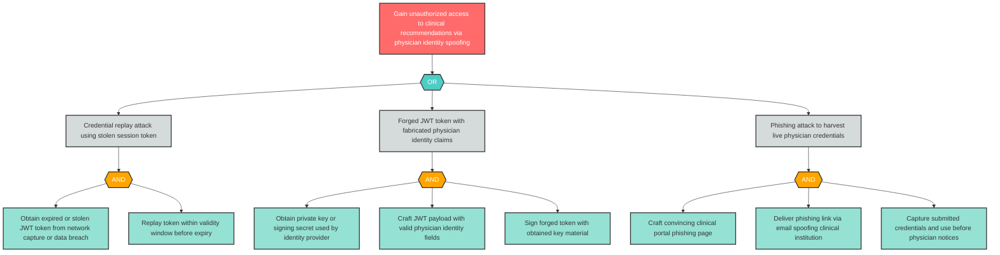

---

### S-5: Inter-Agent Channel Supervisor Delegation Spoofing

**Component**: Inter-Agent Communication Channel | **Risk Level**: Critical | **Finding**: S-5

This finding is part of correlation group CG-5. See also: AG-8 (D-3 via CG-5). An attacker spoofs supervisor delegation messages on the inter-agent bus causing specialist agents to execute forged orchestration commands.

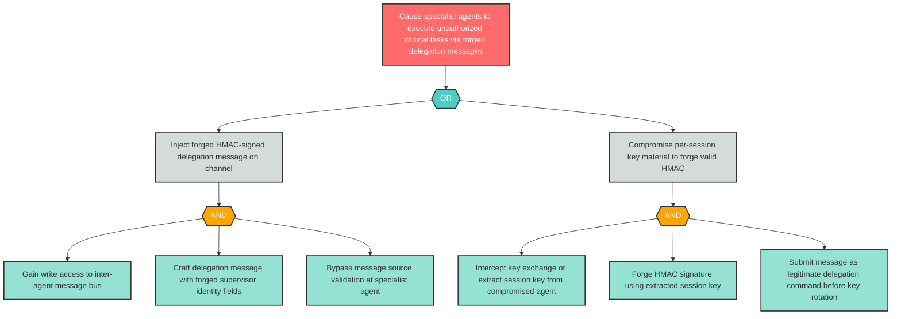

---

### S-6: Supervisor Orchestrator Identity Impersonation

**Component**: Supervisor Orchestrator | **Risk Level**: Critical | **Finding**: S-6

An attacker impersonates the Supervisor Orchestrator to issue unauthorized delegation commands to specialist agents, bypassing orchestration controls.

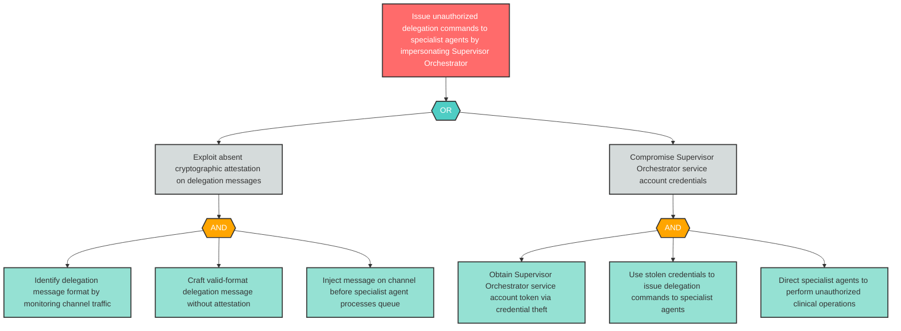

---

### T-3: Inter-Agent Channel Message Tampering

**Component**: Inter-Agent Communication Channel | **Risk Level**: Critical | **Finding**: T-3

This finding is part of correlation group CG-5. See also: D-3, AG-8. An attacker tampers with delegation messages or specialist results in transit, corrupting clinical reasoning across the multi-agent pipeline.

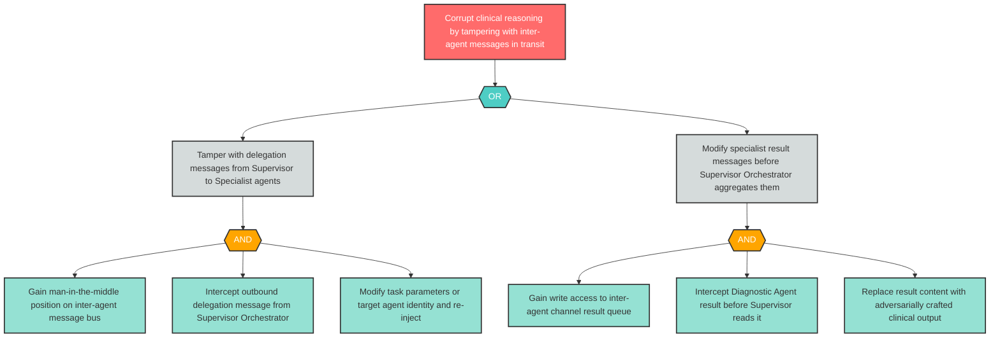

---

### T-7: Clinical MCP Tool Server FHIR Operation Tampering

**Component**: Clinical MCP Tool Server | **Risk Level**: Critical | **Finding**: T-7

This finding is part of correlation groups CG-1 (with AG-7) and CG-2 (with E-7, AG-7). A compromised MCP Tool Server tampers with FHIR read/write operations.

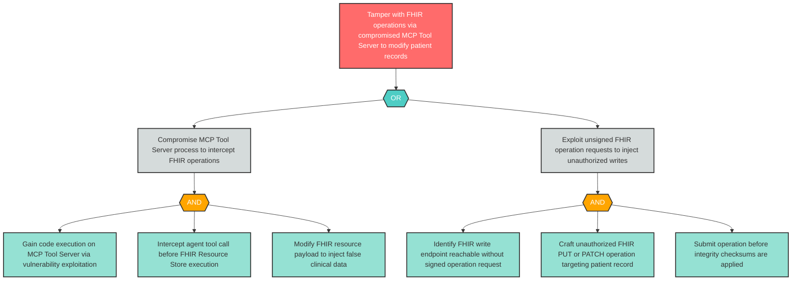

---

### T-10: FHIR Resource Store Patient Record Tampering

**Component**: FHIR Resource Store | **Risk Level**: Critical | **Finding**: T-10

An attacker with access to the FHIR Resource Store tampers with patient records, injecting false clinical data that corrupts all downstream clinical decisions.

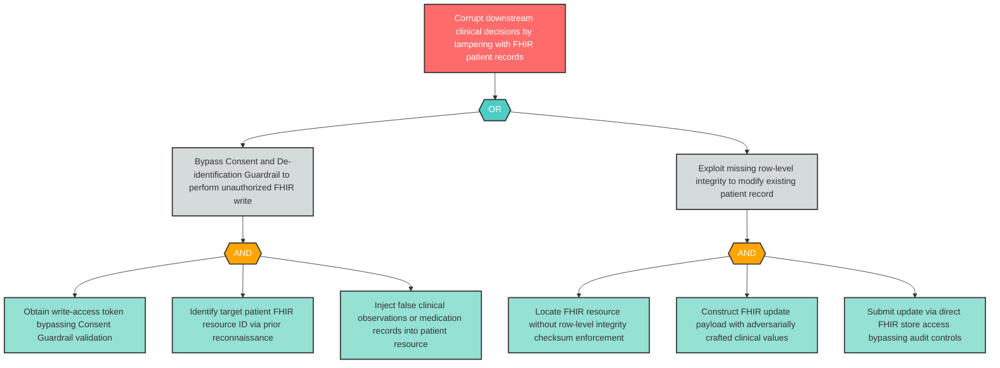

---

### T-11: RAG Corpus Adversarial Embedding Poisoning

**Component**: Clinical Guideline RAG Corpus | **Risk Level**: Critical | **Finding**: T-11

This finding is part of correlation group CG-6 (with LLM-5) and is the initial exploit in CHAIN-001. An attacker poisons the Clinical Guideline RAG Corpus with adversarial embeddings.

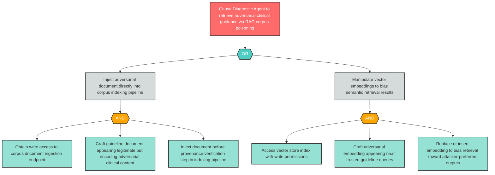

---

### T-16: Outcomes Telemetry Learning Loop Poisoning

**Component**: Outcomes Telemetry and Physician Override Audit Store | **Risk Level**: Critical | **Finding**: T-16

This finding is tagged as a temporal_attack and is the initial exploit in CHAIN-003. An attacker injects adversarial physician-override signals that corrupt learning loop re-training.

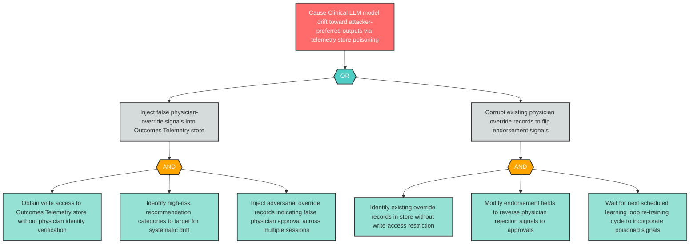

---

### I-3: Inter-Agent Channel PHI Disclosure

**Component**: Inter-Agent Communication Channel | **Risk Level**: Critical | **Finding**: I-3

This finding is tagged as communication_vulnerability and is part of correlation group CG-3. Unencrypted inter-agent messages expose patient PHI and clinical reasoning.

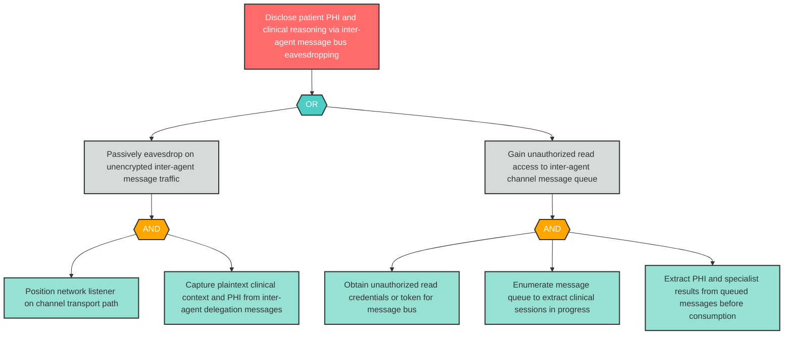

---

### I-7: MCP Tool Server PHI Disclosure to Unauthorized Agents

**Component**: Clinical MCP Tool Server | **Risk Level**: Critical | **Finding**: I-7

This finding is part of correlation group CG-3 (with LLM-1). Insufficient FHIR access controls on tool results expose PHI to unauthorized agents.

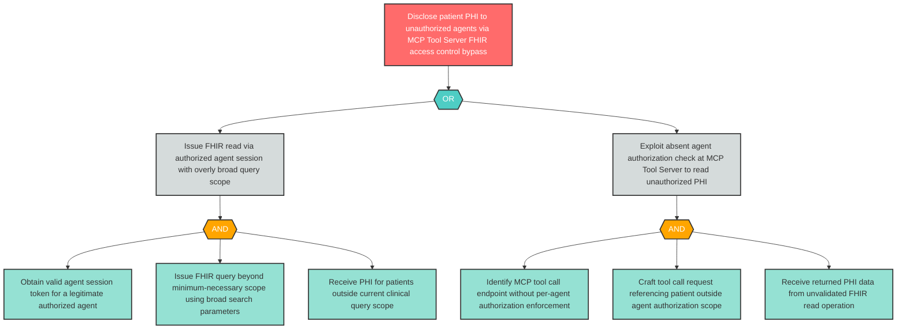

---

### I-10: FHIR Resource Store PHI Unauthorized Disclosure

**Component**: FHIR Resource Store | **Risk Level**: Critical | **Finding**: I-10

Patient PHI stored in the FHIR Resource Store may be disclosed through unauthorized read operations, FHIR injection attacks, or missing encryption at rest.

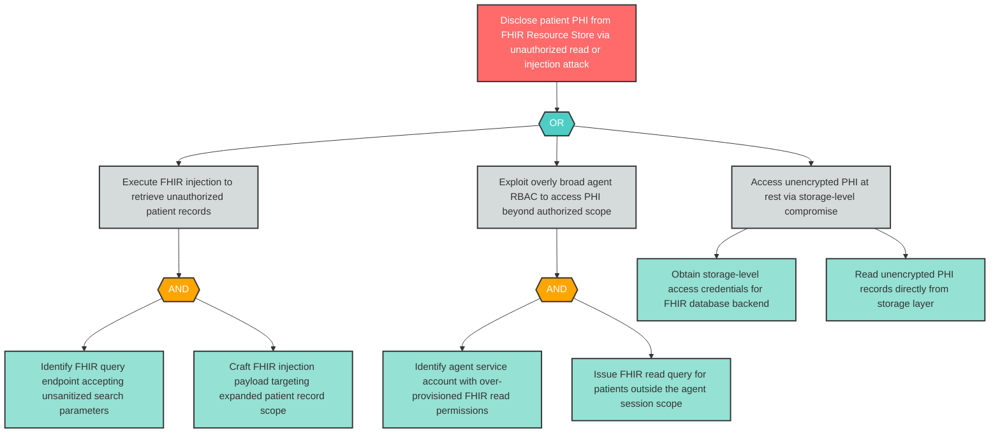

---

### E-7: MCP Tool Server FHIR Privilege Escalation via Tool Chaining

**Component**: Clinical MCP Tool Server | **Risk Level**: Critical | **Finding**: E-7

This finding is part of correlation groups CG-1 and CG-2 (with T-7, AG-7). Tool chaining enables sequences of permitted FHIR operations to collectively achieve unauthorized outcomes.

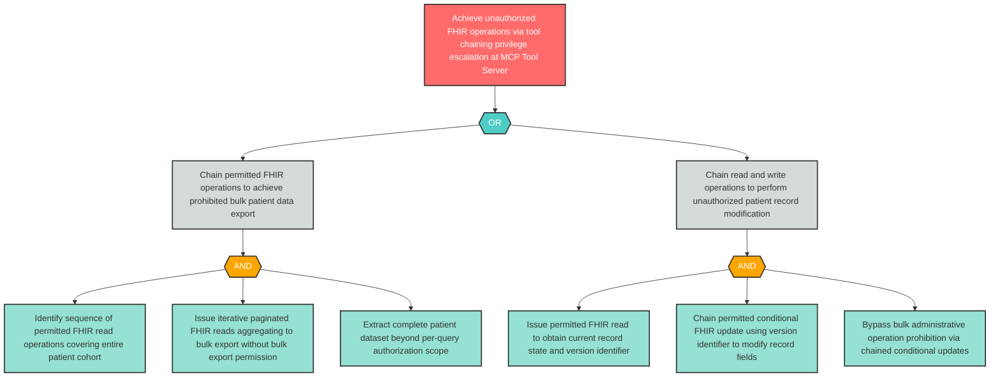

---

### AG-1: Supervisor Orchestrator Autonomous Delegation Without Oversight

**Component**: Supervisor Orchestrator | **Risk Level**: Critical | **Finding**: AG-1

This finding is tagged as agent_collusion and is part of correlation group CG-4 (with R-6). The orchestrator may route high-consequence clinical tasks without physician review or RBAC compliance verification.

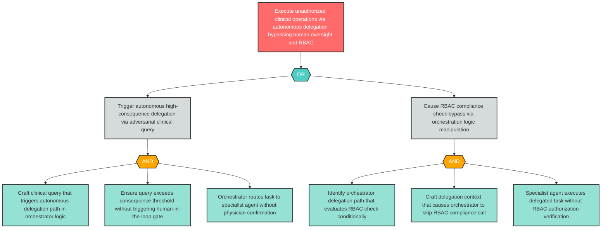

---

### AG-2: Supervisor Orchestrator Delegation Authority Abuse

**Component**: Supervisor Orchestrator | **Risk Level**: Critical | **Finding**: AG-2

This finding is tagged as agent_collusion. A compromised orchestrator abuses its delegation authority to circumvent per-agent access controls.

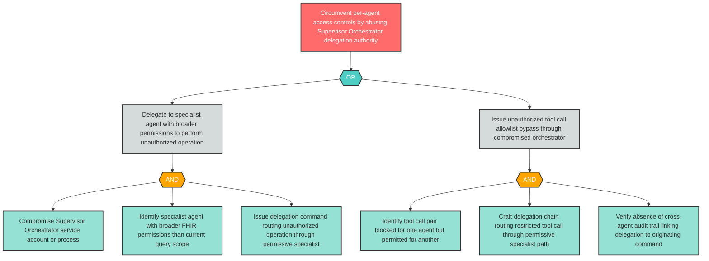

---

### AG-7: MCP Tool Server Tool Chaining Unauthorized Outcome

**Component**: Clinical MCP Tool Server | **Risk Level**: Critical | **Finding**: AG-7

This finding is part of correlation groups CG-1 and CG-2. Tool chaining achieves unauthorized FHIR outcomes via individually-permitted operation sequences.

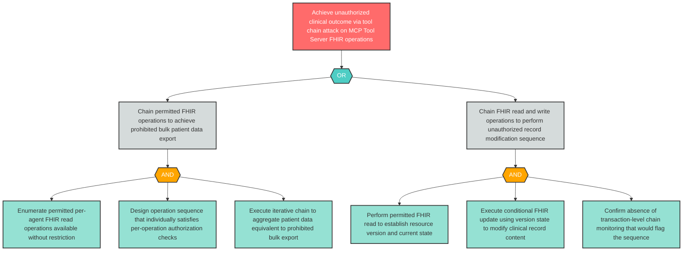

---

### LLM-1: Clinical LLM Prompt Injection via API Gateway

**Component**: Clinical LLM | **Risk Level**: Critical | **Finding**: LLM-1

This finding is part of correlation group CG-3 (with I-7) and is the chain-breaking control target for CHAIN-002. Adversarial prompts cause the Clinical LLM to generate clinically dangerous completions.

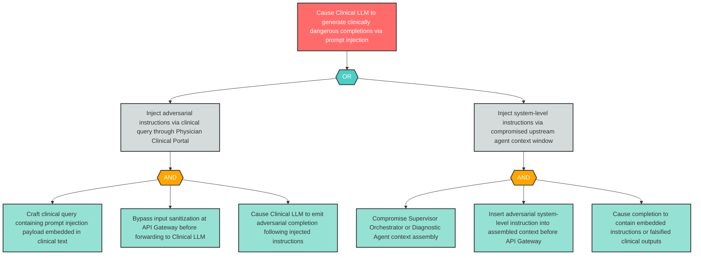

---

### AGP-01: Multi-Agent Coordination Enabling Coordinated Malicious Action

**Component**: Inter-Agent Communication Channel | **Risk Level**: Critical | **Finding**: AGP-01

This is a net-new finding emitted by Phase 3.6 Pattern Synthesis (agent_collusion pattern). Multi-agent coordination creates potential for compromised agents to jointly execute operations below per-agent detection thresholds.

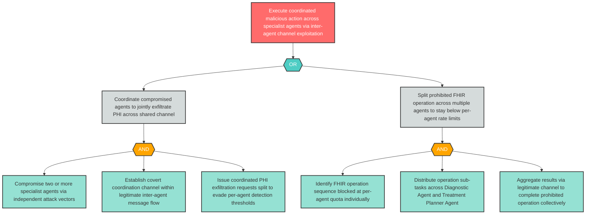

---

_High findings (54 trees): S-2, S-3, S-7, S-8, S-9, T-1, T-2, T-4, T-5, T-6, T-8, T-9, T-12, T-14, T-15, R-5, R-6, R-9, I-1, I-2, I-4, I-5, I-6, I-8, I-9, I-14, I-15, I-16, D-1, D-3, D-4, D-5, D-7, D-8, D-10, D-13, E-1, E-2, E-3, E-4, E-5, E-6, E-8, AG-3, AG-4, AG-5, AG-6, AG-8, LLM-2, LLM-4, LLM-5, LLM-6, AGP-02, AGP-03 are available as standalone files in `attack-trees/`. Standalone files are the canonical versions; inline rendering of all 54 High trees is omitted here for report readability._

---

## 6. Cross-Layer Attack Chains

This section narrates the three cross-layer attack chains identified by Phase 3.5 (Cross-Layer Correlation) analysis. All three chains have maximum severity Critical. Chains are ordered by severity (Critical first), then chain length, then chain ID.

> **DISCLAIMER**: This is a security reference scenario for threat-modeling teaching purposes only. Chain narratives describe theoretical attack paths in a hypothetical system architecture.

---

### CHAIN-001: RAG Corpus Poisoning to False Clinical Recommendation via Agent Hijack

**Layers**: L2 → L3 → L5 → L6 → L7 | **Max Severity**: Critical | **Findings**: 5

An adversary initiates CHAIN-001 at the Data Operations layer (L2) by injecting adversarially crafted embeddings into the Clinical Guideline RAG Corpus — the foundational finding is **T-11**. The poisoned corpus now surfaces malicious clinical guidance documents that appear legitimate, encoding attacker-preferred diagnostic recommendations at the embedding level without any individual document appearing overtly corrupt.

The corrupted corpus **triggers** manipulation of the Diagnostic Agent (L3 — Agent Framework) via **T-5**. When the Diagnostic Agent issues guideline retrieval queries, the poisoned corpus returns adversarial guidance that the agent incorporates into its tool call parameters and specialist diagnostic outputs forwarded through the Inter-Agent Communication Channel. The agent's decision-making is subverted without any component flagging anomalous behavior.

The compromised diagnostic output **enables** Clinical Audit Log tampering (**T-15**, L5 — Evaluation and Observability). An attacker aware of the attack progression suppresses or modifies the Diagnostic Agent's decision log entries before they propagate to the Outcomes Telemetry store, eliminating the forensic trail of the poisoning event.

The audit trail suppression **enables** HIPAA RBAC + Policy Engine policy tampering (**T-17**, L6 — Security and Compliance). Without a complete audit trail, anomalous access patterns are not flagged, allowing the attacker to modify RBAC policies to grant elevated access to the compromised clinical workflow.

Finally, the compounded upstream manipulations **manifest as** false clinical recommendation disclosure at the Physician Clinical Portal (**I-1**, L7 — Agent Ecosystem) — a physician receives a recommendation grounded in adversarial guidelines, presented with full apparent clinical authority.

**Chain-Breaking Control**: Remediating **T-15** (Clinical Audit Log tampering at L5) disconnects 2 upstream findings (T-11, T-5) from 2 downstream findings (T-17, I-1). Implement append-only audit log storage with cryptographic chaining and write-access restricted to authenticated service identities with per-write integrity receipts.

> Chain-breaking controls are structurally derived from graph centrality analysis and should be validated against the specific deployment context.

**Impacted Findings**: T-11 (L2 — Data Operations, initial exploit), T-5 (L3 — Agent Framework, intermediate cascade), T-15 (L5 — Evaluation and Observability, intermediate cascade), T-17 (L6 — Security and Compliance, intermediate cascade), I-1 (L7 — Agent Ecosystem, terminal impact)

---

### CHAIN-002: Prompt Injection to Orchestrator Privilege Escalation via Foundation Model

**Layers**: L7 → L1 → L3 → L6 | **Max Severity**: Critical | **Findings**: 4

CHAIN-002 initiates at the Agent Ecosystem boundary (L7) where an attacker exploits **S-1** to spoof a legitimate physician identity and gain authenticated access to the Physician Clinical Portal. The spoofed session carries valid-appearing credentials that bypass initial authentication gates, establishing a foothold in the clinical query pipeline under a trusted physician identity.

The spoofed physician session **shifts** the attack surface to the Foundation Model layer (L1), where the attacker embeds adversarial prompt injection payloads in apparent clinical queries. When forwarded through the API Gateway to the Clinical LLM (**LLM-1**), the injected instructions direct the model to emit completions containing embedded system commands or escalated instruction patterns that the Supervisor Orchestrator's prompt parser may interpret as trusted control signals.

The manipulated LLM completion **enables** Supervisor Orchestrator privilege escalation (**E-4**, L3 — Agent Framework). The orchestrator, receiving a completion that appears to originate from the trusted Clinical LLM inference endpoint, may execute embedded instructions that bypass its own RBAC compliance check logic, effectively granting the attacker's session elevated orchestration authority — including the ability to issue delegation commands beyond the spoofed physician's authorized scope.

The orchestrator privilege escalation **manifests as** HIPAA RBAC + Policy Engine administrative compromise (**E-11**, L6 — Security and Compliance), where the now-escalated orchestrator session is used to modify RBAC policies or exploit the policy engine's trust in the orchestrator service account, creating durable unauthorized access to clinical data.

**Chain-Breaking Control**: Remediating **LLM-1** (prompt injection at L1) disconnects 1 upstream finding (S-1) from 2 downstream findings (E-4, E-11). Implement prompt injection detection and sanitization at the API Gateway before forwarding to the Clinical LLM. Apply output schema validation to reject completions containing system command patterns. Use system prompt hardening with instruction hierarchy enforcement.

> Chain-breaking controls are structurally derived from graph centrality analysis and should be validated against the specific deployment context.

**Impacted Findings**: S-1 (L7 — Agent Ecosystem, initial exploit), LLM-1 (L1 — Foundation Model, intermediate cascade), E-4 (L3 — Agent Framework, intermediate cascade), E-11 (L6 — Security and Compliance, terminal impact)

---

### CHAIN-003: Outcomes Telemetry Tampering to Model Drift via Learning Loop

**Layers**: L5 → L1 → L3 → L7 | **Max Severity**: Critical | **Findings**: 4

CHAIN-003 initiates at the Evaluation and Observability layer (L5) where an adversary with write access to the Outcomes Telemetry and Physician Override Audit Store exploits **T-16** to inject adversarially crafted physician-override signals — false feedback indicating that certain high-risk clinical recommendations were endorsed by physicians when they were not. This telemetry store is the primary feedback channel for the long-running learning loop that drives continual Clinical LLM re-training.

The corrupted telemetry **triggers** data poisoning of the Clinical LLM (**LLM-2**, L1 — Foundation Model) during the next scheduled learning loop re-training cycle. The adversarial physician-override signals are incorporated as positive training examples, causing the model to drift toward systematically producing the attacker's preferred clinical outputs for specific patient presentations. This is a temporal attack — effects may not surface until weeks after the initial telemetry injection, enabling the attacker to establish a persistent influence channel with no immediate forensic signal.

The model drift **enables** Supervisor Orchestrator tampering (**T-4**, L3 — Agent Framework), where the corrupted Clinical LLM now returns biased completions that cause the orchestrator's aggregation logic to synthesize clinical recommendations that favor the attacker's preferred outcomes. The orchestrator's delegation decisions are themselves corrupted because the foundation model completion informing them has been systematically shifted.

The compounded corruption **manifests as** false clinical recommendation disclosure at the Physician Clinical Portal (**I-1**, L7 — Agent Ecosystem), where physicians receive systematically biased recommendations for specific patient cohorts — recommendations grounded in adversarially shifted model behavior that is indistinguishable from legitimate clinical AI output.

**Chain-Breaking Control**: Remediating **T-16** (Outcomes Telemetry tampering at L5) prevents adversarial signals from reaching the learning loop, breaking the entire chain at its source. Implement provenance attestation on all physician-override records before ingestion. Apply cryptographic signing of physician override events at point-of-creation. Restrict write access to the Outcomes Telemetry store to verified physician identity tokens with audit logging. Implement behavioral baselining to detect model drift after each re-training cycle.

> Chain-breaking controls are structurally derived from graph centrality analysis and should be validated against the specific deployment context.

**Impacted Findings**: T-16 (L5 — Evaluation and Observability, initial exploit), LLM-2 (L1 — Foundation Model, intermediate cascade), T-4 (L3 — Agent Framework, intermediate cascade), I-1 (L7 — Agent Ecosystem, terminal impact)

---

## 7. Agentic Pattern Analysis

This section enumerates threats by CSA MAESTRO canonical agentic pattern. Patterns are assigned during Phase 3.6 (Pattern Synthesis Engine) per [ADR-026](../../../../docs/architecture/02_ADRs/ADR-026-pattern-classification-mechanism.md) and surface cross-cutting agentic risks that emerge from multi-agent coordination, persistent state, or inter-agent communication — distinct from per-component STRIDE threats. Canonical pattern definitions are sourced from [maestro-agentic-patterns-shared.md](../../../../.claude/skills/tachi-shared/references/maestro-agentic-patterns-shared.md).

### Multi-Pattern Findings

Some findings in this architecture exemplify two or more CSA MAESTRO agentic patterns simultaneously, reflecting scenarios where a single component or finding cannot be cleanly assigned to one pattern in isolation. Per ADR-026, these receive `agentic_pattern: multiple`.

- **AGP-03** — Multi-agent cascading delegation from the Supervisor Orchestrator exhibits potential for emergent behavior arising from multi-agent interaction (cascading failures, feedback amplification) while simultaneously exhibiting agent collusion characteristics through coordinated delegation authority across the agent tier. Patterns: Agent Collusion, Emergent Behavior.

### Agent Collusion

Multiple compromised agents coordinate to achieve malicious objectives that no single agent could accomplish alone — exfiltrating data across shared channels, jointly manipulating planning outputs, or circumventing policies by distributing actions below per-agent detection thresholds.

Critical: 3 | High: 1 | Medium: 0 | Low: 0

In the CDSS's supervisor-specialist topology, the Supervisor Orchestrator (L3) coordinates with the Diagnostic Agent and Treatment Planner Agent over the Inter-Agent Communication Channel (L7). This cooperation pathway creates the architectural precondition for agent collusion: a compromised Supervisor Orchestrator (**AG-1**, **AG-2**) can recruit specialist agents as unwitting accomplices in unauthorized FHIR operations — routing prohibited tool calls through agents with broader permissions (AG-2) or exploiting the orchestrator's delegation authority to execute operations that bypass per-agent RBAC enforcement (AG-1). The net-new finding **AGP-01** identifies the structural risk that compromised specialist agents can jointly distribute FHIR operations that individually fall below per-agent detection thresholds. **AGP-03** (also classified under Emergent Behavior) contributes the cascading delegation risk where the orchestrator's multi-agent coordination amplifies the colluding action's scope. **AG-1** also participates in **CHAIN-002**, where the autonomous delegation pattern enables the downstream privilege escalation cascade at L3 and L6.

Impacted findings: AG-1, AG-2, AGP-01, AGP-03

### Emergent Behavior

Attackers exploit unpredictable behaviors that arise only from the interaction of multiple agents (cascading failures, feedback amplification, behavioral drift) — behaviors that are invisible in per-agent analysis and manifest only when agents act in concert.

Critical: 0 | High: 1 | Medium: 0 | Low: 0

The CDSS's three-agent coordination topology — Supervisor Orchestrator directing Diagnostic Agent and Treatment Planner Agent via the Inter-Agent Communication Channel — creates the multi-agent interaction surface necessary for emergent behavior. **AGP-03** targets the Supervisor Orchestrator's cascading delegation logic: a single malformed specialist agent output can propagate through successive delegation rounds, each amplifying the anomaly until the collective system collapses or drifts into an unrecoverable state. Per-agent safety evaluation cannot flag this because each individual agent's behavior may appear within bounds; the emergent failure is only visible at the system level. The absence of fail-safe shutdown circuits and bounded action scopes per agent means there is no structural mechanism to halt the cascade once initiated. This pattern is architecturally distinct from the per-agent autonomy threats (AG-3 through AG-6), which describe single-agent overreach rather than multi-agent emergent dynamics.

Impacted findings: AGP-03

### Temporal Attacks

Attacks that exploit persistent state to achieve delayed or time-gated effects — sleeper agents activating under specific triggers, gradual corruption of learned parameters, seasonal exploitation patterns, or poisoned training data that surfaces only during re-training cycles.

Critical: 1 | High: 1 | Medium: 0 | Low: 0

The CDSS's long-running learning loop — where the Outcomes Telemetry and Physician Override Audit Store (L5) feeds periodic model update signals to the Clinical LLM (L1) — is the structural enabler of temporal attacks in this architecture. **T-16** (Critical) identifies direct tampering with the telemetry store to inject adversarial physician-override signals; effects are deferred until the next learning loop re-training cycle and may not surface for weeks. The net-new finding **AGP-02** captures the broader temporal attack surface of this persistent-state component: an adversary can inject small volumes of adversarial signals per session — each individually below anomaly detection thresholds — and allow gradual accumulation to corrupt the learning loop over an extended period. **T-16** is also the initial exploit in **CHAIN-003**, where its temporal-attack-enabled model drift ultimately manifests as false clinical recommendations at L7. Behavioral baselining after each re-training cycle and provenance attestation at signal ingestion are the structural controls that would close both the T-16 and AGP-02 temporal attack paths.

Impacted findings: T-16, AGP-02

### Trust Exploitation

Attacks that subvert the trust relationships between agents — identity spoofing between cooperating agents, reputation manipulation in agent registries, trust chain attacks that pivot from a weakly-trusted agent to a highly-trusted peer, and impersonation of supervisor agents.

Critical: 3 | High: 2 | Medium: 0 | Low: 0

Trust Exploitation is the most prevalent pattern in this architecture, reflecting the CDSS's reliance on implicit trust relationships across the multi-agent communication topology. The Inter-Agent Communication Channel (L7) carries delegation commands from the Supervisor Orchestrator to specialist agents without message-level authentication — **S-5** (Critical) exploits this by forging supervisor delegation messages, while **E-3** (High) escalates channel access to issue supervisor-level commands directly. **S-6** (Critical) targets the Supervisor Orchestrator identity directly — absent cryptographic attestation enables an attacker to impersonate the orchestrator and issue commands as a trusted delegation authority. **S-7** (High) and **S-8** (High) exploit analogous inter-agent identity gaps for the Diagnostic Agent and Treatment Planner Agent respectively. The five trust-exploitation findings share a root structural cause: inter-agent message authentication is absent. A unified control package — HMAC-signed messages with per-session keys and role-based message authorization — would address all five findings simultaneously.

Impacted findings: S-5, S-6, S-7, S-8, E-3

### Communication Vulnerabilities

Attacks against the inter-agent messaging substrate — interception of messages on shared channels, protocol manipulation that degrades authentication or integrity guarantees, routing attacks that divert messages to adversary-controlled agents, and replay attacks on agent-to-agent communication.

Critical: 2 | High: 1 | Medium: 0 | Low: 0

The Inter-Agent Communication Channel (L7) operates without external TLS and without message-level authentication, making it the primary communication vulnerability surface in the CDSS. **T-3** (Critical) identifies message tampering on the channel — an attacker positioned on the channel can intercept and modify delegation messages or specialist results without detection. **I-3** (Critical) identifies eavesdropping on the unencrypted channel, enabling passive extraction of PHI and clinical reasoning from messages in transit. **AG-8** (High) extends the vulnerability to active resource exhaustion — a compromised agent using the channel to flood specialist agents with spurious messages, disrupting multi-agent coordination. All three findings share the same root architectural gap: the Inter-Agent Communication Channel lacks the encryption and authentication guarantees that would be standard for an external-facing API. **T-3** also participates in the CHAIN-001 attack progression, where channel tampering is the mechanism by which the RAG corpus poisoning at L2 propagates to affect Diagnostic Agent outputs.

Impacted findings: T-3, I-3, AG-8

### Resource Competition

Attacks that exploit contention between agents for shared resources — resource monopolization by one agent starving peers, priority manipulation in shared schedulers, coordination disruption that induces resource-use conflicts, and quota-exhaustion attacks that degrade peer agents' availability.

Critical: 0 | High: 2 | Medium: 0 | Low: 0

The CDSS's shared-resource topology — where multiple agents compete for the Inter-Agent Communication Channel (L7), the Supervisor Orchestrator's processing capacity (L3), the Clinical MCP Tool Server's FHIR operation quota, and the Model Inference API Gateway's inference throughput — creates multiple resource competition surfaces. **D-3** (High) targets the Inter-Agent Communication Channel: a flood of spurious delegation messages from an attacker-controlled source saturates the channel, starving legitimate specialist agent task processing. **D-4** (High) targets the Supervisor Orchestrator: a compromised specialist agent generating high-volume error responses exhausts the orchestrator's processing capacity, rendering it unable to coordinate clinical queries. In both cases, the per-agent rate controls that would prevent resource monopolization are absent. The multi-agent architecture is what makes these findings Resource Competition rather than simple Denial of Service — the attacker uses one agent's channel access or communication privilege to deprive peer agents of the shared resource.

Impacted findings: D-3, D-4

---

## 8. Remediation Roadmap

This roadmap transforms all 108 findings into actionable remediation items ordered by risk level. **17 Immediate** (Critical), **54 Short-term** (High), **30 Medium-term** (Medium), **7 Backlog** (Low). Most impacted component: Clinical MCP Tool Server (7 findings). Suggested starting point: the Inter-Agent Communication Channel and Clinical MCP Tool Server represent the two components with the highest Critical finding density and the most available consolidated controls.

Correlation group consolidations per Section 4a: CG-1 (T-7/AG-7), CG-2 (E-7/AG-7), CG-3 (I-7/LLM-1), CG-4 (R-6/AG-1), CG-5 (D-3/AG-8), CG-6 (T-11/LLM-5) — each group appears as a single roadmap row with the primary finding ID.

### Immediate — Critical (17 items)

| Finding ID | Component | Mitigation | Effort | Dependencies |
|------------|-----------|------------|--------|--------------|
| S-1 | Physician | Implement mutual TLS authentication and short-lived signed JWT tokens with physician identity binding. Enforce step-up authentication for high-sensitivity clinical queries. | High | Requires PKI infrastructure for mutual TLS |
| S-5 | Inter-Agent Communication Channel | Authenticate all inter-agent messages with HMAC signatures using per-session keys. Implement message source validation before specialist agents process delegation commands. | High | Correlated: S-5, T-3, I-3, E-3, AG-8, AGP-01 (CG-5 related) — coordinate with T-3 and I-3 mitigations |
| S-6 | Supervisor Orchestrator | Require cryptographic attestation of supervisor identity on all delegation messages. Implement zero-trust peer authentication between orchestrator and specialist agents. | High | Depends on S-5 HMAC infrastructure |
| T-3 | Inter-Agent Communication Channel | Implement message-level integrity (HMAC or digital signatures) on all inter-agent messages. Use tamper-evident logging for all channel activity. | High | Correlated: D-3, AG-8 (CG-5). Coordinate with S-5 HMAC implementation |
| T-7 | Clinical MCP Tool Server | Enforce signed FHIR operation requests from authorized agents only. Implement FHIR resource integrity checksums and audit all write operations with non-repudiable logs. | High | Correlated: AG-7 (CG-1), E-7 (CG-2) |
| T-10 | FHIR Resource Store | Implement row-level integrity checksums on FHIR resources. Enforce write access via the Consent and De-identification Guardrail only. Audit all write operations. | High | Requires Consent Guardrail enforcement at FHIR store layer |
| T-11 | Clinical Guideline RAG Corpus | Implement provenance verification for all corpus documents before indexing. Deploy adversarial embedding detection and monitor retrieval patterns for anomalous queries. | High | Correlated: LLM-5 (CG-6). Coordinate with ML pipeline controls |
| T-16 | Outcomes Telemetry and Physician Override Audit Store | Implement provenance attestation on all physician-override records before ingestion into the learning loop. Apply behavioral baselining to detect drift in model outputs after re-training cycles. Restrict write access to verified physician identity tokens. | High | Chain-breaking control for CHAIN-003. Coordinate with LLM-2 mitigation |
| I-3 | Inter-Agent Communication Channel | Encrypt all inter-agent messages in transit. Restrict channel access to authenticated specialist agents only. Implement message-level access controls. | High | Correlated: D-3, AG-8 (CG-5). Coordinate with S-5, T-3 HMAC package |
| I-7 | Clinical MCP Tool Server | Implement resource-level access controls on all FHIR operations. Enforce minimum-necessary data principle on all tool responses. Validate requesting agent authorization before returning PHI. | High | Correlated: LLM-1 (CG-3) |
| I-10 | FHIR Resource Store | Enforce encryption at rest for all FHIR resources. Apply resource-level RBAC for all read operations. Implement FHIR injection prevention and audit all data access. | High | Coordinate with T-10 Consent Guardrail enforcement |
| E-7 | Clinical MCP Tool Server | Implement strict per-agent permission checks for each FHIR operation. Enforce operation-level authorization at the MCP Tool Server. Prohibit bulk export and administrative FHIR operations from agent tool calls. | High | Correlated: T-7, AG-7 (CG-1, CG-2). Implement tool chain monitoring |
| AG-1 | Supervisor Orchestrator | Implement human-in-the-loop confirmation gates for high-consequence clinical delegation decisions. Enforce RBAC compliance checks before all agent delegation commands. Apply maximum action scope limits per orchestration cycle. | High | Correlated: R-6 (CG-4). Coordinate with R-6 audit logging |
| AG-2 | Supervisor Orchestrator | Implement orchestrator-level tool call allowlisting restricting delegation to explicitly authorized agent-tool pairs. Apply cross-agent audit trails linking all delegated tool calls back to the originating orchestration command. | High | Depends on AG-1 RBAC compliance gate |
| AG-7 | Clinical MCP Tool Server | Implement tool chain monitoring to detect sequences of permitted operations that collectively violate access policy. Apply transaction-level audit logging for all multi-step FHIR operation sequences. Define and enforce prohibited operation chain patterns. | High | Correlated: T-7 (CG-1), E-7 (CG-2). Coordinate as unified MCP Tool Server control package |
| LLM-1 | Clinical LLM | Implement prompt injection detection and sanitization at the API Gateway before forwarding to the Clinical LLM. Apply output validation to detect clinically dangerous completions. Use system prompt hardening to resist instruction injection. | High | Chain-breaking control for CHAIN-002. Correlated: I-7 (CG-3) |
| AGP-01 | Inter-Agent Communication Channel | Implement inter-agent rate limits, coordination throttles, and per-flow audit logging. | High | Coordinate with S-5, T-3, I-3 channel security package |

### Short-term — High (54 items)

| Finding ID | Component | Mitigation | Effort | Dependencies |
|------------|-----------|------------|--------|--------------|
| S-2 | Patient | Validate EHR update events against an authoritative patient identity registry before enqueuing. Use cryptographic patient identity tokens on all ingestion events. | Medium | None |
| S-3 | Physician Clinical Portal | Enforce server certificate pinning and signed response tokens. Validate portal origin on all supervisor-to-portal responses. | Medium | None |
| S-7 | Diagnostic Agent | Sign all inter-agent result messages with agent-specific identity keys. Implement result origin validation at the Inter-Agent Communication Channel before forwarding to other specialists. | Medium | Depends on S-5/T-3 HMAC infrastructure |
| S-8 | Treatment Planner Agent | Sign all treatment plan outputs with agent-specific identity keys. Implement origin verification at the Inter-Agent Communication Channel before delivery to Supervisor Orchestrator. | Medium | Depends on S-5/T-3 HMAC infrastructure |
| S-9 | Clinical MCP Tool Server | Authenticate MCP Tool Server responses with server-side identity tokens. Implement response integrity checks on agent-side before consuming tool results. | Medium | None |
| T-1 | Physician Clinical Portal | Implement end-to-end message signing for recommendation responses. Use Content Security Policy and sub-resource integrity to detect tampering at the portal layer. | Medium | None |
| T-2 | Patient Summary Generator | Implement integrity verification of summary content before delivery. Use signed summary payloads and audit all summary generation events. | Medium | None |
| T-4 | Supervisor Orchestrator | Implement immutable audit logging of all orchestration decisions. Use runtime integrity monitoring for orchestrator process state. Apply least-privilege access for orchestrator configuration changes. | Medium | Correlated: R-6 (CG-4). Coordinate with AG-1 HITL implementation |
| T-5 | Diagnostic Agent | Validate and sanitize all outgoing tool call parameters. Implement allowlist-based tool call schemas enforced by the MCP Tool Server before execution. | Medium | Coordinate with AG-7 tool chain monitoring |
| T-6 | Treatment Planner Agent | Apply strict input validation to all retrieval queries. Implement schema-enforced tool call validation before MCP Tool Server execution. | Medium | Coordinate with AG-7 tool chain monitoring |
| T-8 | Clinical LLM | Implement prompt input validation and sanitization at the API Gateway layer. Log all prompt inputs for forensic review. | Medium | Coordinate with LLM-1 sanitization package |
| T-9 | Risk Stratification Model | Implement training data provenance attestation and integrity checks. Validate all inference inputs against a canonical schema before forwarding. | High | None |
| T-12 | Medical Literature Vector Index | Implement document provenance attestation before indexing. Apply anomaly detection on retrieval patterns and validate retrieved content before agent consumption. | Medium | None |
| T-14 | EHR Ingestion Queue | Implement message integrity signatures on all enqueued EHR events. Validate event integrity at dequeue time before FHIR normalization. | Medium | None |
| T-15 | Clinical Audit Log | Implement append-only audit log storage with cryptographic chaining. Apply write-access restrictions limiting audit log writes to authenticated service identities only. | High | Chain-breaking control for CHAIN-001 |
| R-5 | Inter-Agent Communication Channel | Enforce tamper-evident inter-agent message logging with per-message cryptographic receipts. All delegation commands and specialist results must be logged in the Clinical Audit Log before acting. | High | Coordinate with S-5/T-3 HMAC infrastructure |
| R-6 | Supervisor Orchestrator | Implement mandatory pre-action audit logging for all orchestration decisions. Use append-only audit storage with cryptographic chaining to prevent retroactive modification. | High | Correlated: AG-1 (CG-4). Coordinate with AG-1 HITL implementation |
| R-9 | Clinical MCP Tool Server | Implement mandatory audit logging of all MCP tool calls with requesting agent identity, operation type, and affected FHIR resources. | Medium | Coordinate with T-7, AG-7 MCP control package |
| I-1 | Physician Clinical Portal | Enforce TLS 1.3 minimum. Sanitize all error messages to prevent PHI leakage. Implement field-level access control on displayed recommendation data. | Medium | None |
| I-2 | Patient Summary Generator | Implement patient identity verification before summary delivery. Apply disclosure-scope filtering to summary content. Audit all summary deliveries. | Medium | None |
| I-4 | Supervisor Orchestrator | Implement minimal-exposure context windows — pass only data necessary for each specialist task. Sanitize aggregated context before logging. Apply memory isolation between clinical sessions. | High | None |
| I-5 | Diagnostic Agent | Implement session isolation for each clinical query. Sanitize all tool call parameters and error responses. Apply output filtering before logging diagnostic results. | Medium | None |
| I-6 | Treatment Planner Agent | Implement session isolation for each treatment planning task. Apply output filtering on all retrieval results before incorporating into treatment plans. | Medium | None |
| I-8 | Clinical LLM | Apply differential privacy techniques during model training. Implement output monitoring for PHI pattern detection in completions. Use data minimization in training set construction. | High | None |
| I-9 | Risk Stratification Model | Apply differential privacy during fine-tuning. Implement model output monitoring for membership inference signals. Restrict fine-tuning dataset access to authorized data science personnel. | High | None |
| I-14 | EHR Ingestion Queue | Encrypt all queued messages. Restrict queue read access to authorized consumers only. Implement queue-level access auditing. | Medium | None |
| I-15 | Clinical Audit Log | Restrict audit log read access to authorized compliance personnel only. Encrypt audit log storage. Apply data retention and access audit controls. | Medium | None |
| I-16 | Outcomes Telemetry and Physician Override Audit Store | Restrict access to Outcomes Telemetry to the learning loop and authorized data science personnel. Apply re-identification risk assessment before using telemetry in model updates. | Medium | None |
| D-1 | Physician Clinical Portal | Implement rate limiting on clinical query submission. Apply adaptive throttling based on session anomaly detection. Use circuit breakers to prevent cascade to backend agents. | Medium | None |
| D-3 | Inter-Agent Communication Channel | Implement channel capacity limits with per-agent message rate controls. Apply message origin validation before enqueuing. Monitor channel queue depth for anomalous saturation. | Medium | Correlated: AG-8 (CG-5). Coordinate with S-5/T-3 channel package |
| D-4 | Supervisor Orchestrator | Implement circuit breakers on specialist agent result processing. Apply per-agent response rate limits at the orchestrator. Monitor orchestrator resource utilization. | Medium | None |
| D-5 | Diagnostic Agent | Implement tool call rate limits per clinical session. Apply circuit breakers on guideline retrieval. Monitor Diagnostic Agent resource utilization. | Medium | None |
| D-7 | Clinical MCP Tool Server | Implement per-agent rate limits on MCP tool calls. Apply FHIR operation quotas. Use circuit breakers to isolate runaway agents from the tool server. | Medium | Coordinate with AG-7 tool chain monitoring |
| D-8 | Clinical LLM | Implement inference request rate limiting at the API Gateway per authenticated session. Apply queue-based load shedding under high-demand conditions. | Medium | None |
| D-10 | FHIR Resource Store | Implement query complexity limits and rate throttling on FHIR operations. Apply resource monitoring with automated circuit breakers. Implement read/write operation quotas per component. | Medium | None |
| D-13 | Model Inference API Gateway | Implement rate limiting and request quotas at the gateway. Apply adaptive load balancing across model inference instances. Use circuit breakers to protect backend model services. | Medium | None |
| E-1 | Physician Clinical Portal | Implement strict session isolation and resource-level RBAC enforcement. Apply role-based data filtering on all recommendation views. Audit privilege escalation attempts. | Medium | None |
| E-2 | Patient Summary Generator | Validate requesting identity against authorized patient scope before generating summaries. Implement patient-scope enforcement at the Supervisor Orchestrator level. | Medium | None |
| E-3 | Inter-Agent Communication Channel | Implement role-based message authorization on the inter-agent channel. Specialist agents must verify delegation command authority level before execution. | Medium | Coordinate with S-5/T-3 HMAC package |
| E-4 | Supervisor Orchestrator | Enforce external RBAC validation for all Supervisor Orchestrator actions affecting patient data. Apply principle of least privilege for orchestrator service account. Audit all privilege escalation events. | Medium | Coordinate with AG-1 RBAC compliance gate |
| E-5 | Diagnostic Agent | Enforce resource-level FHIR access scoping for Diagnostic Agent operations via the MCP Tool Server. Apply per-session access tokens with minimal-necessary permissions. | Medium | Coordinate with E-7 MCP permission checks |
| E-6 | Treatment Planner Agent | Apply per-session FHIR access scoping for Treatment Planner Agent tool calls. Enforce resource-level access boundaries at the MCP Tool Server layer. | Medium | Coordinate with E-7 MCP permission checks |
| E-8 | Clinical LLM | Implement prompt injection detection at the API Gateway layer. Apply output filtering to prevent completions that contain system command patterns. Enforce completion output schema validation. | Medium | Coordinate with LLM-1 sanitization package |
| AG-3 | Diagnostic Agent | Restrict Diagnostic Agent FHIR write access to explicitly authorized resource types and patient scope. Apply mandatory physician approval for any Diagnostic Agent FHIR write operations. | High | Coordinate with E-5 FHIR access scoping |
| AG-4 | Diagnostic Agent | Implement operation-level authorization checks in the MCP Tool Server for all Diagnostic Agent requests. Enforce FHIR resource scope restrictions per session token. | Medium | Coordinate with E-7 MCP permission checks |
| AG-5 | Treatment Planner Agent | Implement mandatory evidence validation before incorporating retrieved literature into treatment plans. Apply physician review gates for treatment plans flagged as high-consequence. | High | None |
| AG-6 | Treatment Planner Agent | Enforce patient-scope and resource-type restrictions on all Treatment Planner Agent MCP tool calls. Implement operation-level FHIR access controls at the MCP Tool Server. | Medium | Coordinate with E-6, E-7 MCP controls |
| AG-8 | Inter-Agent Communication Channel | Implement per-agent message rate limits on the inter-agent channel. Apply message source validation and circuit breakers to isolate flooding agents from the channel. | Medium | Correlated: D-3 (CG-5). Coordinate with S-5/T-3 channel package |
| LLM-2 | Clinical LLM | Implement training data provenance attestation and integrity verification before learning loop incorporation. Apply behavioral baselining to detect post-training output drift. Implement emergency model rollback capability. | High | Coordinate with T-16 telemetry provenance control |
| LLM-4 | Risk Stratification Model | Implement input validation and anomaly detection for adversarial patient record patterns. Apply ensemble validation by cross-checking risk scores against clinical rules. | Medium | None |
| LLM-5 | Risk Stratification Model | Implement fine-tuning dataset integrity verification and provenance attestation. Apply behavioral testing against known high-risk cases after each model update. Monitor risk score distribution for systematic drift. | High | Correlated: T-11 (CG-6). Coordinate with corpus provenance controls |
| LLM-6 | Risk Stratification Model | Apply differential privacy during model fine-tuning to provide formal privacy guarantees. Implement query auditing to detect membership inference attack patterns. | High | Coordinate with I-9 differential privacy implementation |
| AGP-02 | Outcomes Telemetry and Physician Override Audit Store | Implement training-data provenance attestation, memory-write audit trails, and periodic behavioral baselining against pre-training snapshots. | High | Coordinate with T-16 telemetry provenance package |
| AGP-03 | Supervisor Orchestrator | Implement fail-safe shutdown circuits, bounded action scopes per agent, and behavioral baselining of the collective agent system. | High | Coordinate with AG-1 HITL gates and cascade monitoring |

### Medium-term — Medium (30 items)

| Finding ID | Component | Mitigation | Effort | Dependencies |
|------------|-----------|------------|--------|--------------|
| S-4 | Patient Summary Generator | Enforce HTTPS with TLS certificate validation. Require signed summary payloads to prevent interception and tampering. | Low | None |
| S-10 | Clinical LLM | Enforce TLS with mutual authentication on the API Gateway to Clinical LLM path. Implement response integrity signatures for all completion payloads. | Low | None |
| S-11 | Risk Stratification Model | Sign all risk stratification outputs with model service credentials. Implement Diagnostic Agent-side signature verification before consuming risk scores. | Medium | None |
| S-12 | Model Inference API Gateway | Enforce gateway identity verification with server certificates. Require mutual TLS on all agent-to-gateway connections. | Low | None |
| S-13 | HIPAA RBAC + Policy Engine | Sign all RBAC policy decisions with the policy engine's identity key. Implement portal-side verification of signed access decisions before granting access. | Medium | None |
| S-14 | Consent and De-identification Guardrail | Authenticate all guardrail responses with service-level credentials. Upstream components must verify guardrail response integrity before processing returned data. | Medium | None |
| T-13 | Model Inference API Gateway | Enforce infrastructure-as-code for gateway configuration with change auditing. Apply gateway integrity monitoring and alert on configuration deviations. | Medium | None |
| T-17 | HIPAA RBAC + Policy Engine | Enforce policy-as-code with immutable policy history. Implement change approval workflow for all RBAC policy modifications with dual-control signing. | Medium | None |
| T-18 | Consent and De-identification Guardrail | Enforce immutable guardrail configuration with change auditing. Implement runtime PHI detection alerts downstream to detect guardrail bypass. | Medium | None |
| R-1 | Physician | Implement non-repudiable logging of all physician clinical queries and recommendation views with cryptographic timestamps and physician identity binding. | Medium | None |
| R-3 | Physician Clinical Portal | Implement tamper-evident session logs capturing every recommendation view with physician identity, timestamp, and recommendation content hash. | Medium | None |
| R-7 | Diagnostic Agent | Log all Diagnostic Agent tool calls and retrieval queries with non-repudiable identity binding before execution. Implement agent-level audit trails in the Clinical Audit Log. | Medium | None |
| R-8 | Treatment Planner Agent | Log all Treatment Planner Agent retrievals and tool calls with non-repudiable identity binding. Audit all inputs that contributed to each generated treatment plan. | Medium | None |
| R-10 | Clinical LLM | Log all prompt-completion pairs with request ID, timestamp, and submitting agent identity at the API Gateway layer. | Medium | None |
| R-11 | Risk Stratification Model | Log all inference inputs and outputs with patient context ID and timestamp at the API Gateway layer. | Medium | None |
| R-12 | Model Inference API Gateway | Implement mandatory access logging at the API Gateway for all inference requests with requesting agent identity, target model, and request/response hashes. | Medium | None |
| R-13 | HIPAA RBAC + Policy Engine | Implement immutable policy event logging in the Clinical Audit Log for all RBAC access decisions with requestor identity, resource, decision, and timestamp. | Medium | None |
| I-13 | Model Inference API Gateway | Apply PHI-aware log filtering before storing inference request logs. Implement access controls on inference logs. Enforce data retention limits. | Medium | None |
| I-17 | HIPAA RBAC + Policy Engine | Sanitize all RBAC API error responses to prevent policy enumeration. Return generic access-denied messages. | Low | None |
| I-18 | Consent and De-identification Guardrail | Audit de-identification logic against established standards (HIPAA Safe Harbor). Implement output validation to detect residual PHI before releasing de-identified data. | Medium | None |
| D-2 | Patient Summary Generator | Implement rate limiting per patient session. Apply queue depth monitoring and alert on abnormal summary generation volume. | Low | None |
| D-6 | Treatment Planner Agent | Implement retrieval query size limits and tool call rate limits per session. Apply resource quotas for the Treatment Planner Agent. | Low | None |
| D-9 | Risk Stratification Model | Implement per-session inference rate limiting at the API Gateway. Apply load balancing and auto-scaling for risk inference capacity. | Low | None |
| D-14 | EHR Ingestion Queue | Implement queue depth monitoring with automatic backpressure. Apply message size limits and per-source rate controls on ingestion. | Low | None |
| D-15 | Clinical Audit Log | Implement write rate limiting on audit log ingestion. Apply storage quota monitoring with alerting. Use log rotation and archival to prevent disk exhaustion. | Low | None |
| D-16 | Outcomes Telemetry and Physician Override Audit Store | Implement rate limiting on physician override ingestion. Apply anomaly detection to flag abnormal override volumes before incorporating into the learning loop. | Medium | None |
| D-17 | HIPAA RBAC + Policy Engine | Implement access decision caching for recently evaluated policies. Apply rate limiting on policy evaluation requests. Design fallback-deny behavior during policy engine unavailability. | Medium | None |
| D-18 | Consent and De-identification Guardrail | Implement processing rate limits on guardrail requests. Apply queue-based load balancing with circuit breakers. Implement caching for de-identified records with appropriate TTL. | Medium | None |
| E-9 | Risk Stratification Model | Implement risk score range validation before triggering escalation workflows. Apply anomaly detection on risk score distribution to flag outliers. | Low | None |
| E-10 | Model Inference API Gateway | Implement per-agent model access authorization at the gateway. Enforce allowlist-based model routing for each authenticated agent. | Medium | None |
| E-11 | HIPAA RBAC + Policy Engine | Apply multi-factor authentication and dual-control approval for all policy engine administrative operations. Enforce immutable audit logging of all policy changes. | Medium | None |
| E-12 | Consent and De-identification Guardrail | Implement strict access controls on guardrail configuration and bypass mechanisms. Apply runtime enforcement of de-identification guarantees with downstream PHI detection monitoring. | Medium | None |

### Backlog — Low (7 items)

| Finding ID | Component | Mitigation | Effort | Dependencies |
|------------|-----------|------------|--------|--------------|
| R-2 | Patient | Implement signed EHR update event receipts. Log all patient-submitted events with non-repudiable identity binding and timestamps. | Low | None |
| R-4 | Patient Summary Generator | Log all generated summaries with content hash, patient identifier, and delivery timestamp in the Clinical Audit Log. | Low | None |
| I-11 | Clinical Guideline RAG Corpus | Sanitize all corpus documents for PHI before indexing. Implement PHI detection scanning on all new corpus additions. | Low | None |
| I-12 | Medical Literature Vector Index | Implement strict session isolation for all retrieval operations. Apply content filtering on retrieved vectors before returning to Treatment Planner Agent. | Low | None |
| D-11 | Clinical Guideline RAG Corpus | Implement retrieval rate limits per session. Apply caching for commonly retrieved guidelines to reduce corpus load. | Low | None |
| D-12 | Medical Literature Vector Index | Implement retrieval rate limits per session. Apply result caching to reduce index load under high demand. | Low | None |
| LLM-3 | Clinical LLM | Implement query rate limiting and anomaly detection for systematic extraction patterns. Apply output perturbation to reduce model extraction fidelity. Monitor query patterns for systematic knowledge extraction behavior. | Medium | None |

---

## 9. Appendix: Finding Reference

Complete traceability from every finding in `threats.md` to its sections in this report. Every finding ID from Sections 3, 4, and 4a appears in this table.

| Finding ID | Report Section | Heading Reference |
|------------|----------------|-------------------|
| S-1 | Section 3.1 | Spoofing |
| S-1 | Section 5 | S-1: Physician Identity Spoofing |
| S-1 | Section 6 | CHAIN-002: Prompt Injection to Orchestrator Privilege Escalation |
| S-1 | Section 8 | Immediate — Critical |
| S-2 | Section 3.1 | Spoofing |
| S-2 | Section 5 | High findings (standalone file) |
| S-2 | Section 8 | Short-term — High |
| S-3 | Section 3.1 | Spoofing |
| S-3 | Section 5 | High findings (standalone file) |
| S-3 | Section 8 | Short-term — High |
| S-4 | Section 3.1 | Spoofing |
| S-4 | Section 8 | Medium-term — Medium |
| S-5 | Section 3.1 | Spoofing |
| S-5 | Section 5 | S-5: Inter-Agent Channel Supervisor Delegation Spoofing |
| S-5 | Section 7 | Trust Exploitation |
| S-5 | Section 8 | Immediate — Critical |
| S-6 | Section 3.1 | Spoofing |
| S-6 | Section 5 | S-6: Supervisor Orchestrator Identity Impersonation |
| S-6 | Section 7 | Trust Exploitation |
| S-6 | Section 8 | Immediate — Critical |
| S-7 | Section 3.1 | Spoofing |
| S-7 | Section 5 | High findings (standalone file) |
| S-7 | Section 7 | Trust Exploitation |
| S-7 | Section 8 | Short-term — High |
| S-8 | Section 3.1 | Spoofing |
| S-8 | Section 5 | High findings (standalone file) |
| S-8 | Section 7 | Trust Exploitation |
| S-8 | Section 8 | Short-term — High |
| S-9 | Section 3.1 | Spoofing |
| S-9 | Section 5 | High findings (standalone file) |
| S-9 | Section 8 | Short-term — High |
| S-10 | Section 3.1 | Spoofing |
| S-10 | Section 8 | Medium-term — Medium |
| S-11 | Section 3.1 | Spoofing |
| S-11 | Section 8 | Medium-term — Medium |
| S-12 | Section 3.1 | Spoofing |
| S-12 | Section 8 | Medium-term — Medium |
| S-13 | Section 3.1 | Spoofing |
| S-13 | Section 8 | Medium-term — Medium |
| S-14 | Section 3.1 | Spoofing |
| S-14 | Section 8 | Medium-term — Medium |
| T-1 | Section 3.2 | Tampering |
| T-1 | Section 5 | High findings (standalone file) |
| T-1 | Section 8 | Short-term — High |
| T-2 | Section 3.2 | Tampering |
| T-2 | Section 5 | High findings (standalone file) |
| T-2 | Section 8 | Short-term — High |
| T-3 | Section 3.2 | Tampering |
| T-3 | Section 5 | T-3: Inter-Agent Channel Message Tampering |
| T-3 | Section 6 | CHAIN-001 (communication vulnerability role) |
| T-3 | Section 7 | Communication Vulnerabilities |
| T-3 | Section 8 | Immediate — Critical |
| T-4 | Section 3.2 | Tampering |
| T-4 | Section 5 | High findings (standalone file) |
| T-4 | Section 6 | CHAIN-003: intermediate cascade |
| T-4 | Section 8 | Short-term — High |
| T-5 | Section 3.2 | Tampering |
| T-5 | Section 5 | High findings (standalone file) |
| T-5 | Section 6 | CHAIN-001: intermediate cascade |
| T-5 | Section 8 | Short-term — High |
| T-6 | Section 3.2 | Tampering |
| T-6 | Section 5 | High findings (standalone file) |
| T-6 | Section 8 | Short-term — High |
| T-7 | Section 3.2 | Tampering |
| T-7 | Section 4 | Theme 1: Clinical MCP Tool Server |
| T-7 | Section 5 | T-7: Clinical MCP Tool Server FHIR Tampering |
| T-7 | Section 8 | Immediate — Critical |
| T-8 | Section 3.2 | Tampering |
| T-8 | Section 5 | High findings (standalone file) |
| T-8 | Section 8 | Short-term — High |
| T-9 | Section 3.2 | Tampering |
| T-9 | Section 5 | High findings (standalone file) |
| T-9 | Section 8 | Short-term — High |
| T-10 | Section 3.2 | Tampering |
| T-10 | Section 5 | T-10: FHIR Resource Store Patient Record Tampering |
| T-10 | Section 8 | Immediate — Critical |
| T-11 | Section 3.2 | Tampering |
| T-11 | Section 4 | Theme 5: Foundation Model PHI |
| T-11 | Section 5 | T-11: RAG Corpus Adversarial Embedding Poisoning |
| T-11 | Section 6 | CHAIN-001: initial exploit |
| T-11 | Section 8 | Immediate — Critical |
| T-12 | Section 3.2 | Tampering |
| T-12 | Section 5 | High findings (standalone file) |
| T-12 | Section 8 | Short-term — High |
| T-13 | Section 3.2 | Tampering |
| T-13 | Section 8 | Medium-term — Medium |
| T-14 | Section 3.2 | Tampering |
| T-14 | Section 5 | High findings (standalone file) |
| T-14 | Section 8 | Short-term — High |
| T-15 | Section 3.2 | Tampering |
| T-15 | Section 5 | High findings (standalone file) |
| T-15 | Section 6 | CHAIN-001: intermediate cascade |
| T-15 | Section 8 | Short-term — High |
| T-16 | Section 3.2 | Tampering |
| T-16 | Section 4 | Theme 4: Learning Loop Feedback Path |
| T-16 | Section 5 | T-16: Outcomes Telemetry Learning Loop Poisoning |
| T-16 | Section 6 | CHAIN-003: initial exploit |
| T-16 | Section 7 | Temporal Attacks |
| T-16 | Section 8 | Immediate — Critical |
| T-17 | Section 3.2 | Tampering |
| T-17 | Section 6 | CHAIN-001: intermediate cascade |
| T-17 | Section 8 | Medium-term — Medium |
| T-18 | Section 3.2 | Tampering |
| T-18 | Section 8 | Medium-term — Medium |
| R-1 | Section 3.3 | Repudiation |
| R-1 | Section 8 | Medium-term — Medium |
| R-2 | Section 3.3 | Repudiation |
| R-2 | Section 8 | Backlog — Low |
| R-3 | Section 3.3 | Repudiation |
| R-3 | Section 8 | Medium-term — Medium |
| R-4 | Section 3.3 | Repudiation |
| R-4 | Section 8 | Backlog — Low |
| R-5 | Section 3.3 | Repudiation |
| R-5 | Section 5 | High findings (standalone file) |
| R-5 | Section 8 | Short-term — High |
| R-6 | Section 3.3 | Repudiation |
| R-6 | Section 4 | Theme 3: Supervisor Orchestrator |
| R-6 | Section 5 | High findings (standalone file) |
| R-6 | Section 7 | Agent Collusion (CG-4) |
| R-6 | Section 8 | Short-term — High |
| R-7 | Section 3.3 | Repudiation |
| R-7 | Section 8 | Medium-term — Medium |
| R-8 | Section 3.3 | Repudiation |
| R-8 | Section 8 | Medium-term — Medium |
| R-9 | Section 3.3 | Repudiation |
| R-9 | Section 5 | High findings (standalone file) |
| R-9 | Section 8 | Short-term — High |
| R-10 | Section 3.3 | Repudiation |
| R-10 | Section 8 | Medium-term — Medium |
| R-11 | Section 3.3 | Repudiation |
| R-11 | Section 8 | Medium-term — Medium |
| R-12 | Section 3.3 | Repudiation |
| R-12 | Section 8 | Medium-term — Medium |
| R-13 | Section 3.3 | Repudiation |
| R-13 | Section 8 | Medium-term — Medium |
| I-1 | Section 3.4 | Information Disclosure |
| I-1 | Section 5 | High findings (standalone file) |
| I-1 | Section 6 | CHAIN-001 terminal; CHAIN-003 terminal |
| I-1 | Section 8 | Short-term — High |
| I-2 | Section 3.4 | Information Disclosure |
| I-2 | Section 5 | High findings (standalone file) |
| I-2 | Section 8 | Short-term — High |
| I-3 | Section 3.4 | Information Disclosure |
| I-3 | Section 5 | I-3: Inter-Agent Channel PHI Disclosure |
| I-3 | Section 7 | Communication Vulnerabilities |
| I-3 | Section 8 | Immediate — Critical |
| I-4 | Section 3.4 | Information Disclosure |
| I-4 | Section 5 | High findings (standalone file) |
| I-4 | Section 8 | Short-term — High |
| I-5 | Section 3.4 | Information Disclosure |
| I-5 | Section 5 | High findings (standalone file) |
| I-5 | Section 8 | Short-term — High |
| I-6 | Section 3.4 | Information Disclosure |
| I-6 | Section 5 | High findings (standalone file) |
| I-6 | Section 8 | Short-term — High |
| I-7 | Section 3.4 | Information Disclosure |
| I-7 | Section 5 | I-7: MCP Tool Server PHI Disclosure |
| I-7 | Section 8 | Immediate — Critical |
| I-8 | Section 3.4 | Information Disclosure |
| I-8 | Section 5 | High findings (standalone file) |
| I-8 | Section 8 | Short-term — High |
| I-9 | Section 3.4 | Information Disclosure |
| I-9 | Section 5 | High findings (standalone file) |
| I-9 | Section 8 | Short-term — High |
| I-10 | Section 3.4 | Information Disclosure |
| I-10 | Section 5 | I-10: FHIR Resource Store PHI Disclosure |
| I-10 | Section 8 | Immediate — Critical |
| I-11 | Section 3.4 | Information Disclosure |
| I-11 | Section 8 | Backlog — Low |
| I-12 | Section 3.4 | Information Disclosure |
| I-12 | Section 8 | Backlog — Low |
| I-13 | Section 3.4 | Information Disclosure |
| I-13 | Section 8 | Medium-term — Medium |
| I-14 | Section 3.4 | Information Disclosure |
| I-14 | Section 5 | High findings (standalone file) |
| I-14 | Section 8 | Short-term — High |
| I-15 | Section 3.4 | Information Disclosure |
| I-15 | Section 5 | High findings (standalone file) |
| I-15 | Section 8 | Short-term — High |
| I-16 | Section 3.4 | Information Disclosure |
| I-16 | Section 5 | High findings (standalone file) |
| I-16 | Section 8 | Short-term — High |
| I-17 | Section 3.4 | Information Disclosure |
| I-17 | Section 8 | Medium-term — Medium |
| I-18 | Section 3.4 | Information Disclosure |
| I-18 | Section 8 | Medium-term — Medium |
| D-1 | Section 3.5 | Denial of Service |
| D-1 | Section 5 | High findings (standalone file) |
| D-1 | Section 8 | Short-term — High |
| D-2 | Section 3.5 | Denial of Service |
| D-2 | Section 8 | Medium-term — Medium |
| D-3 | Section 3.5 | Denial of Service |
| D-3 | Section 5 | High findings (standalone file) |
| D-3 | Section 7 | Resource Competition |
| D-3 | Section 8 | Short-term — High |
| D-4 | Section 3.5 | Denial of Service |
| D-4 | Section 5 | High findings (standalone file) |
| D-4 | Section 7 | Resource Competition |
| D-4 | Section 8 | Short-term — High |
| D-5 | Section 3.5 | Denial of Service |
| D-5 | Section 5 | High findings (standalone file) |
| D-5 | Section 8 | Short-term — High |
| D-6 | Section 3.5 | Denial of Service |
| D-6 | Section 8 | Medium-term — Medium |
| D-7 | Section 3.5 | Denial of Service |
| D-7 | Section 5 | High findings (standalone file) |
| D-7 | Section 8 | Short-term — High |
| D-8 | Section 3.5 | Denial of Service |
| D-8 | Section 5 | High findings (standalone file) |
| D-8 | Section 8 | Short-term — High |
| D-9 | Section 3.5 | Denial of Service |
| D-9 | Section 8 | Medium-term — Medium |
| D-10 | Section 3.5 | Denial of Service |
| D-10 | Section 5 | High findings (standalone file) |
| D-10 | Section 8 | Short-term — High |
| D-11 | Section 3.5 | Denial of Service |
| D-11 | Section 8 | Backlog — Low |
| D-12 | Section 3.5 | Denial of Service |
| D-12 | Section 8 | Backlog — Low |
| D-13 | Section 3.5 | Denial of Service |
| D-13 | Section 5 | High findings (standalone file) |
| D-13 | Section 8 | Short-term — High |
| D-14 | Section 3.5 | Denial of Service |
| D-14 | Section 8 | Medium-term — Medium |
| D-15 | Section 3.5 | Denial of Service |
| D-15 | Section 8 | Medium-term — Medium |
| D-16 | Section 3.5 | Denial of Service |
| D-16 | Section 8 | Medium-term — Medium |
| D-17 | Section 3.5 | Denial of Service |
| D-17 | Section 8 | Medium-term — Medium |
| D-18 | Section 3.5 | Denial of Service |
| D-18 | Section 8 | Medium-term — Medium |
| E-1 | Section 3.6 | Elevation of Privilege |
| E-1 | Section 5 | High findings (standalone file) |
| E-1 | Section 8 | Short-term — High |
| E-2 | Section 3.6 | Elevation of Privilege |
| E-2 | Section 5 | High findings (standalone file) |
| E-2 | Section 8 | Short-term — High |
| E-3 | Section 3.6 | Elevation of Privilege |
| E-3 | Section 5 | High findings (standalone file) |
| E-3 | Section 7 | Trust Exploitation |
| E-3 | Section 8 | Short-term — High |
| E-4 | Section 3.6 | Elevation of Privilege |
| E-4 | Section 5 | High findings (standalone file) |
| E-4 | Section 6 | CHAIN-002: intermediate cascade |
| E-4 | Section 8 | Short-term — High |
| E-5 | Section 3.6 | Elevation of Privilege |
| E-5 | Section 5 | High findings (standalone file) |
| E-5 | Section 8 | Short-term — High |
| E-6 | Section 3.6 | Elevation of Privilege |
| E-6 | Section 5 | High findings (standalone file) |
| E-6 | Section 8 | Short-term — High |
| E-7 | Section 3.6 | Elevation of Privilege |
| E-7 | Section 4 | Theme 1: Clinical MCP Tool Server |
| E-7 | Section 5 | E-7: MCP Tool Server FHIR Privilege Escalation |
| E-7 | Section 8 | Immediate — Critical |
| E-8 | Section 3.6 | Elevation of Privilege |
| E-8 | Section 5 | High findings (standalone file) |
| E-8 | Section 8 | Short-term — High |
| E-9 | Section 3.6 | Elevation of Privilege |
| E-9 | Section 8 | Medium-term — Medium |
| E-10 | Section 3.6 | Elevation of Privilege |
| E-10 | Section 8 | Medium-term — Medium |
| E-11 | Section 3.6 | Elevation of Privilege |
| E-11 | Section 6 | CHAIN-002: terminal impact |
| E-11 | Section 8 | Medium-term — Medium |
| E-12 | Section 3.6 | Elevation of Privilege |
| E-12 | Section 8 | Medium-term — Medium |
| AG-1 | Section 3.7 | Agentic Threats |
| AG-1 | Section 4 | Theme 3: Supervisor Orchestrator |
| AG-1 | Section 5 | AG-1: Autonomous Delegation Without Oversight |
| AG-1 | Section 7 | Agent Collusion |
| AG-1 | Section 8 | Immediate — Critical |
| AG-2 | Section 3.7 | Agentic Threats |
| AG-2 | Section 5 | AG-2: Delegation Authority Abuse |
| AG-2 | Section 7 | Agent Collusion |
| AG-2 | Section 8 | Immediate — Critical |
| AG-3 | Section 3.7 | Agentic Threats |
| AG-3 | Section 5 | High findings (standalone file) |
| AG-3 | Section 8 | Short-term — High |
| AG-4 | Section 3.7 | Agentic Threats |
| AG-4 | Section 5 | High findings (standalone file) |
| AG-4 | Section 8 | Short-term — High |
| AG-5 | Section 3.7 | Agentic Threats |
| AG-5 | Section 5 | High findings (standalone file) |
| AG-5 | Section 8 | Short-term — High |
| AG-6 | Section 3.7 | Agentic Threats |
| AG-6 | Section 5 | High findings (standalone file) |
| AG-6 | Section 8 | Short-term — High |
| AG-7 | Section 3.7 | Agentic Threats |
| AG-7 | Section 4 | Theme 1: Clinical MCP Tool Server |
| AG-7 | Section 5 | AG-7: MCP Tool Server Tool Chaining |
| AG-7 | Section 8 | Immediate — Critical |
| AG-8 | Section 3.7 | Agentic Threats |
| AG-8 | Section 5 | High findings (standalone file) |
| AG-8 | Section 7 | Communication Vulnerabilities |
| AG-8 | Section 8 | Short-term — High |
| LLM-1 | Section 3.8 | LLM Threats |
| LLM-1 | Section 5 | LLM-1: Clinical LLM Prompt Injection |
| LLM-1 | Section 6 | CHAIN-002: intermediate cascade |
| LLM-1 | Section 8 | Immediate — Critical |
| LLM-2 | Section 3.8 | LLM Threats |
| LLM-2 | Section 5 | High findings (standalone file) |
| LLM-2 | Section 6 | CHAIN-003: intermediate cascade |
| LLM-2 | Section 8 | Short-term — High |
| LLM-3 | Section 3.8 | LLM Threats |
| LLM-3 | Section 8 | Backlog — Low |
| LLM-4 | Section 3.8 | LLM Threats |
| LLM-4 | Section 5 | High findings (standalone file) |
| LLM-4 | Section 8 | Short-term — High |
| LLM-5 | Section 3.8 | LLM Threats |
| LLM-5 | Section 5 | High findings (standalone file) |
| LLM-5 | Section 8 | Short-term — High |
| LLM-6 | Section 3.8 | LLM Threats |
| LLM-6 | Section 5 | High findings (standalone file) |
| LLM-6 | Section 8 | Short-term — High |
| AGP-01 | Section 3.7 | Agentic Threats (net-new) |
| AGP-01 | Section 5 | AGP-01: Multi-Agent Coordination |
| AGP-01 | Section 7 | Agent Collusion |
| AGP-01 | Section 8 | Immediate — Critical |
| AGP-02 | Section 3.7 | Agentic Threats (net-new) |
| AGP-02 | Section 5 | High findings (standalone file) |
| AGP-02 | Section 7 | Temporal Attacks |
| AGP-02 | Section 8 | Short-term — High |
| AGP-03 | Section 3.7 | Agentic Threats (net-new) |
| AGP-03 | Section 5 | High findings (standalone file) |
| AGP-03 | Section 7 | Multi-Pattern Findings; Agent Collusion; Emergent Behavior |
| AGP-03 | Section 8 | Short-term — High |
| CG-1 | Section 4 | Theme 1: Clinical MCP Tool Server (T-7 + AG-7) |
| CG-2 | Section 4 | Theme 1: Clinical MCP Tool Server (E-7 + AG-7) |
| CG-3 | Section 4 | Theme 5: Foundation Model PHI (I-7 + LLM-1) |
| CG-4 | Section 4 | Theme 3: Supervisor Orchestrator (R-6 + AG-1) |
| CG-5 | Section 4 | Theme 2: Inter-Agent Channel (D-3 + AG-8) |
| CG-6 | Section 4 | Theme 5: Foundation Model PHI / Theme 6: FHIR (T-11 + LLM-5) |
