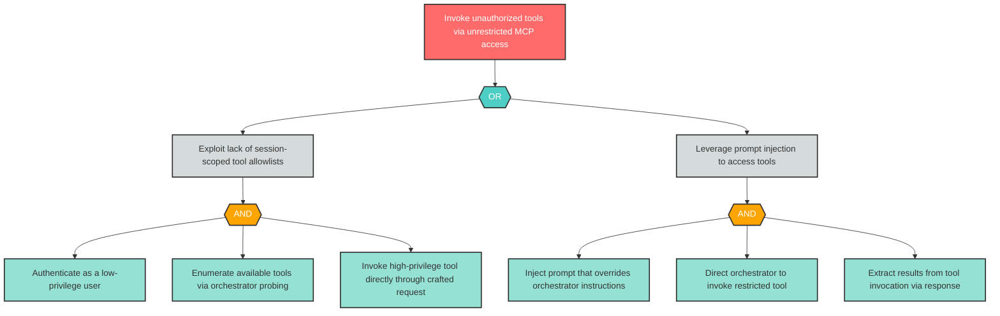

# Attack Tree: AG-2 — Unrestricted tool access without per-session capability scoping

| Field | Value |
|-------|-------|
| Finding ID | AG-2 |
| Component | MCP Tool Server |
| Risk Level | Critical |
| Threat | Unrestricted tool access without per-session capability scoping |
| Correlation | None |

