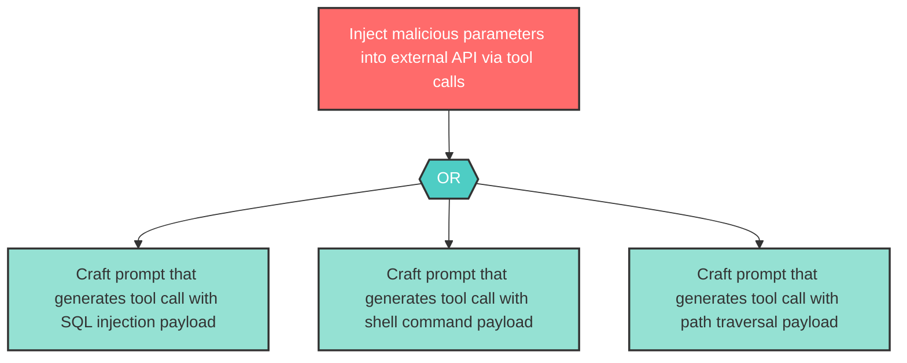

# Attack Tree: AG-3 — Unsanitized tool call parameters forwarded to External API

| Field | Value |
|-------|-------|
| Finding ID | AG-3 |
| Component | MCP Tool Server |
| Risk Level | High |
| Threat | Unsanitized tool call parameters forwarded to External API |
| Correlation | None |

