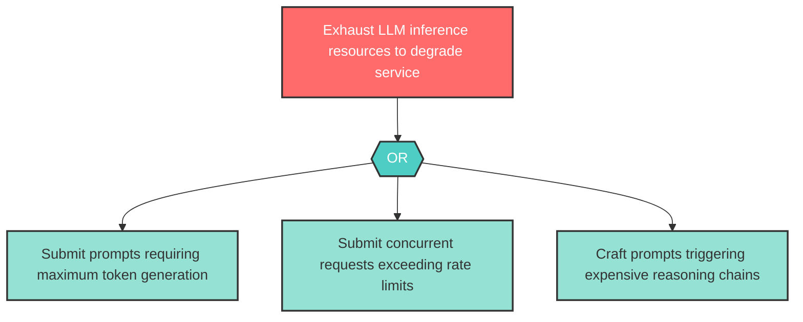

# Attack Tree: D-1 — Resource exhaustion via computationally expensive prompts

| Field | Value |
|-------|-------|
| Finding ID | D-1 |
| Component | LLM Agent Orchestrator |
| Risk Level | High |
| Threat | Resource exhaustion via computationally expensive prompts |
| Correlation | None |

