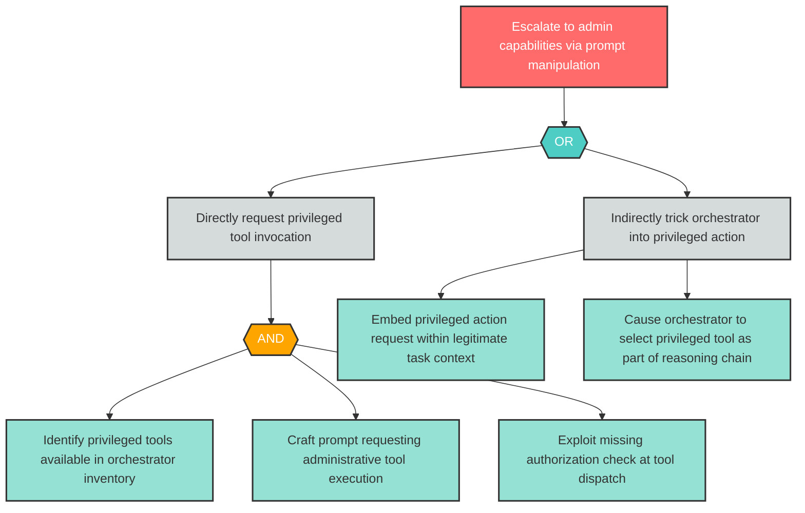

# Attack Tree: E-1 — Privilege escalation via prompt-manipulated tool calls

| Field | Value |
|-------|-------|
| Finding ID | E-1 |
| Component | LLM Agent Orchestrator |
| Risk Level | High |
| Threat | Privilege escalation via prompt-manipulated tool calls |
| Correlation | None |

