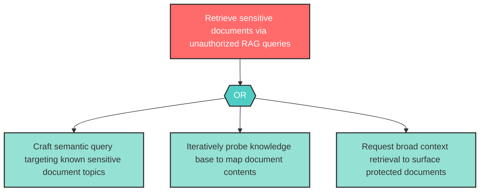

# Attack Tree: I-1 — Sensitive document retrieval by unauthorized users

| Field | Value |
|-------|-------|
| Finding ID | I-1 |
| Component | Knowledge Base |
| Risk Level | High |
| Threat | Sensitive document retrieval by unauthorized users |
| Correlation | None |

