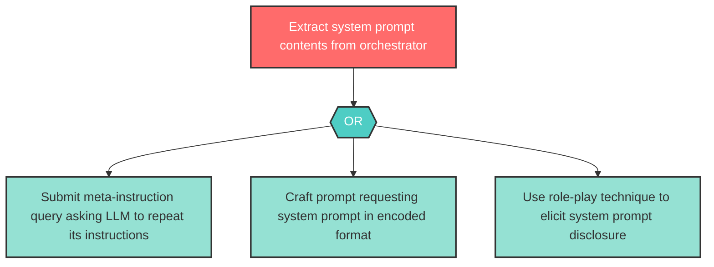

# Attack Tree: I-2 — System prompt extraction via crafted meta-instruction queries

| Field | Value |
|-------|-------|
| Finding ID | I-2 |
| Component | LLM Agent Orchestrator |
| Risk Level | High |
| Threat | System prompt extraction via crafted meta-instruction queries |
| Correlation | None |

