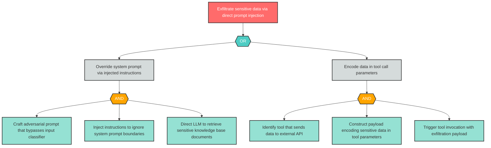

# Attack Tree: LLM-1 — Direct prompt injection causing data exfiltration via tool calls

| Field | Value |
|-------|-------|
| Finding ID | LLM-1 |
| Component | LLM Agent Orchestrator |
| Risk Level | Critical |
| Threat | Direct prompt injection causing data exfiltration via tool calls |
| Correlation | None |

