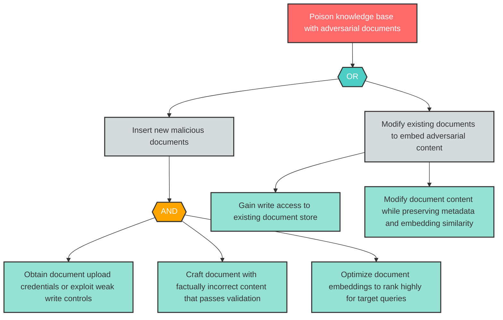

# Attack Tree: LLM-3 — Knowledge base poisoning with adversarial documents

| Field | Value |
|-------|-------|
| Finding ID | LLM-3 |
| Component | Knowledge Base |
| Risk Level | High |
| Threat | Knowledge base poisoning with adversarial documents |
| Correlation | None |

