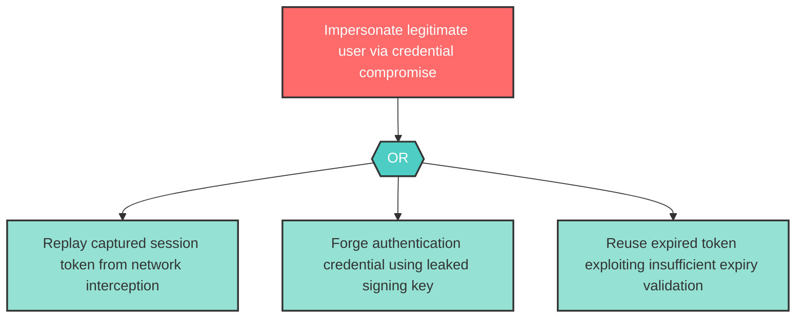

# Attack Tree: S-1 — Authentication credential replay or forgery for user impersonation

| Field | Value |
|-------|-------|
| Finding ID | S-1 |
| Component | User |
| Risk Level | High |
| Threat | Authentication credential replay or forgery for user impersonation |
| Correlation | None |

