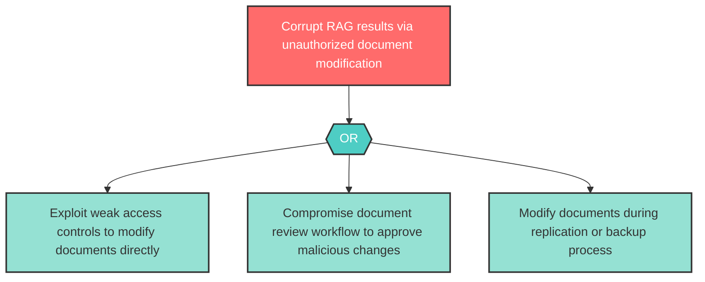

# Attack Tree: T-2 — Unauthorized document modification corrupting RAG retrieval

| Field | Value |
|-------|-------|
| Finding ID | T-2 |
| Component | Knowledge Base |
| Risk Level | High |
| Threat | Unauthorized document modification corrupting RAG retrieval |
| Correlation | None |

