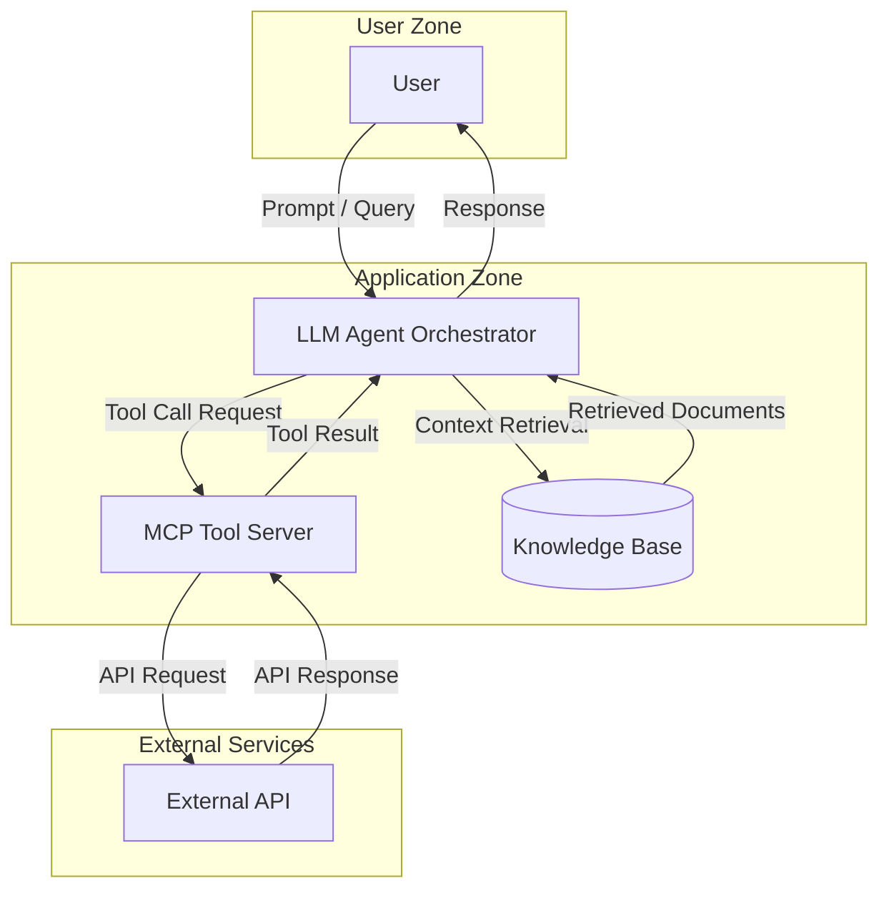

# Agentic AI Application — Mermaid Input

Example architecture input for an agentic AI application. This diagram demonstrates both LLM and Agentic (AG) dispatch triggers for AI-specific threat analysis. The LLM Agent Orchestrator triggers dual-dispatch (LLM + AG keywords), while the MCP Tool Server triggers AG dispatch independently.

format: mermaid

## Component Summary

| Component               | DFD Element Type | AI Dispatch Trigger          |
|-------------------------|------------------|------------------------------|
| User                    | External Entity  | None                         |
| LLM Agent Orchestrator  | Process          | LLM ("LLM") + AG ("Agent", "Orchestrator") |
| MCP Tool Server         | Process          | AG ("MCP", "Tool Server")    |
| Knowledge Base          | Data Store       | None                         |
| External API            | External Entity  | None                         |

## Expected Dispatch Behavior

- **LLM Agent Orchestrator**: Dual-dispatch. Matches LLM keyword "LLM" and AG keywords "Agent", "Orchestrator". Receives STRIDE (S,T,R,I,D,E) plus LLM agents (prompt-injection, data-poisoning, model-theft) plus AG agents (agent-autonomy, tool-abuse).
- **MCP Tool Server**: AG dispatch. Matches AG keywords "MCP" (from "MCP Tool Server") and "Tool Server". Receives STRIDE (S,T,R,I,D,E) plus AG agents (agent-autonomy, tool-abuse).
- **User**: Standard STRIDE only (S, R). No AI keywords.
- **Knowledge Base**: Standard STRIDE only (T, I, D). No AI keywords.
- **External API**: Standard STRIDE only (S, R). No AI keywords.
