# Threat Report

---

```yaml
---
schema_version: "1.0"
date: "2026-03-23"
source_file: "threats.md"
finding_count: 19
risk_distribution:
  Critical: 3
  High: 9
  Medium: 7
  Low: 0
attack_tree_count: 12
---
```

---

## 1. Executive Summary

This threat model assessed an agentic AI application built on Large Language Model (LLM) orchestration with tool execution via the Model Context Protocol (MCP), Retrieval-Augmented Generation (RAG) knowledge retrieval, and external API integration. The assessment identified 19 findings across 5 components: 3 Critical, 9 High, and 7 Medium severity. The system's overall risk posture is **elevated**, driven by insufficient controls around autonomous agent actions and LLM prompt handling. The application benefits from a clear separation between internal processing components and external services, but the trust boundary controls between these zones require significant strengthening.

The top threats by business impact are:

1. **Autonomous tool execution without human approval** (AG-1, Critical) -- The LLM Agent Orchestrator can execute irreversible operations, including external API calls and data modifications, without distinguishing between low-risk reads and high-risk writes. A single malicious or hallucinated prompt could trigger financial loss or data destruction.
2. **Direct prompt injection enabling data exfiltration** (LLM-1, Critical) -- User-supplied prompts can override system instructions, causing the orchestrator to leak sensitive knowledge base content or system configuration through tool call parameters routed to external services.
3. **Unrestricted tool access on the MCP Tool Server** (AG-2, Critical) -- Every tool registered on the MCP server is available to every session regardless of user role, meaning a compromised session can invoke any tool in the system's inventory.
4. **Knowledge base poisoning and unauthorized document retrieval** (LLM-3, I-1, High) -- The RAG pipeline lacks content validation on ingestion and document-level access controls on retrieval, enabling both data corruption and unauthorized information disclosure.
5. **Privilege escalation via prompt manipulation** (E-1, High) -- Standard users can manipulate the orchestrator into executing privileged tool calls because authorization checks are not enforced at the tool dispatch layer.

**Key recommendations:**

- Implement a tool risk-tier classification framework that separates read-only operations from irreversible or external actions and enforces human approval before consequential operations execute.
- Deploy structured prompt boundary enforcement with input classification to prevent prompt injection attacks from overriding system instructions.
- Restrict MCP Tool Server access to per-session, role-scoped tool allowlists rather than exposing the full tool inventory.
- Establish document-level access controls and content validation across the RAG knowledge base pipeline.

**Compliance relevance:** Findings map to SOC 2 Trust Services Criteria CC6.1 (logical access controls), CC6.6 (system boundary protections), and CC7.2 (system monitoring). Agentic threat findings (AG-1 through AG-4) align with OWASP Agentic Security Initiative reference ASI-01. LLM-specific findings reference OWASP LLM Top 10 2025 categories LLM01 (Prompt Injection), LLM03 (Supply Chain / Data Poisoning), and LLM10 (Model Theft).

**Remediation timeline:**

- **Immediate** (3 Critical findings): Address AG-1, AG-2, and LLM-1 before the next production deployment. These represent exploitable paths to data loss and unauthorized action execution.
- **Short-term** (9 High findings): Schedule S-1, T-2, I-1, I-2, D-1, E-1, AG-3, LLM-2, and LLM-3 within the current development cycle.
- **Medium-term** (7 Medium findings): Plan T-1, S-2, R-1, R-2, D-2, AG-4, and LLM-4 for the upcoming planning cycle.

---

## 2. Architecture Overview

### System Context

The assessed system is an agentic AI application designed to process user prompts through an LLM-powered orchestration layer. The architecture comprises five components organized around a central orchestrator pattern.

The **User** is the external entity who submits prompts and queries and receives generated responses. The **LLM Agent Orchestrator** serves as the central processing hub: it receives user prompts, retrieves relevant context documents from the knowledge base to enrich its responses, dispatches tool calls to an MCP server for external actions, and generates final responses using an LLM. The **MCP Tool Server** acts as the execution layer for tool calls, receiving requests from the orchestrator and interfacing with external services on its behalf. The **Knowledge Base** is a document store that supports retrieval-augmented generation, providing contextual documents to the orchestrator in response to semantic queries. The **External API** represents third-party services called by the MCP Tool Server to fulfill tool execution requests.

Data flows through the system in a request-response pattern. Users submit prompts to the orchestrator over HTTPS. The orchestrator retrieves context documents from the knowledge base over internal channels, then optionally dispatches tool call requests to the MCP Tool Server using the Model Context Protocol. The MCP Tool Server forwards API requests to external services over HTTPS and returns results to the orchestrator. Finally, the orchestrator synthesizes all inputs and returns a response to the user over HTTPS.

The technology stack centers on the Model Context Protocol for tool invocation, a retrieval-augmented generation architecture for knowledge retrieval, LLM-based agent orchestration for reasoning and response generation, and external REST API integration for third-party service access.

### Trust Boundary Summary

The system operates across three trust zones. The **User Zone** is classified as untrusted and contains only the User entity. The **Application Zone** is the trusted internal perimeter containing the LLM Agent Orchestrator, the MCP Tool Server, and the Knowledge Base. The **External Services** zone is untrusted and contains the External API.

Three boundary crossings govern security transitions. The **User-to-Application** crossing, where users submit prompts to the orchestrator, is protected by input validation, authentication, and rate limiting. The **Application-to-External** crossing, where the MCP Tool Server calls external APIs, relies on API key authentication, egress filtering, and response validation. The **Application-to-User** crossing, where the orchestrator returns responses, applies output filtering and response sanitization.

Notably, all communication within the Application Zone (between the orchestrator, MCP Tool Server, and Knowledge Base) occurs over internal channels without explicitly documented integrity or authentication controls. Several findings in this assessment target this internal trust assumption.

---

## 3. Threat Analysis

### 3.1 Spoofing

Spoofing threats involve an attacker assuming a false identity to gain unauthorized access or redirect trusted communications. Two spoofing findings were identified, targeting opposite ends of the trust boundary spectrum: one at the user entry point and one at the external API integration point.

**S-1** targets the **User** component. An attacker who replays or forges authentication credentials can impersonate a legitimate user and submit malicious prompts to the orchestrator. Because the orchestrator processes all authenticated requests with the same trust level, a successful impersonation grants full access to the system's tool invocation and knowledge retrieval capabilities. The risk is assessed as High (Medium likelihood, High impact). Mitigation centers on multi-factor authentication and session-bound tokens with short expiry windows, validated on every request.

**S-2** targets the **External API** component. An attacker performs DNS hijacking or certificate spoofing to redirect the MCP Tool Server's outbound API requests to a malicious endpoint. The attacker-controlled endpoint then returns crafted responses that the tool server processes as legitimate data, potentially injecting false information or triggering unintended orchestrator behavior. The risk is assessed as Medium (Low likelihood, High impact). Mitigation involves certificate pinning for external API connections and mutual authentication where the external service supports it.

### 3.2 Tampering

Tampering threats involve unauthorized modification of data or communications. Two tampering findings were identified, targeting the internal communication channel and the knowledge base data store.

**T-1** affects the **LLM Agent Orchestrator** component. An attacker who intercepts the communication channel between the orchestrator and the MCP Tool Server can modify tool call request parameters, causing the tool server to execute unintended operations. This threat exploits the assumption that internal Application Zone communication channels are inherently trustworthy. The risk is assessed as Medium (Low likelihood, High impact). Mitigation requires authenticated and integrity-protected communication channels between the orchestrator and tool server, including signed tool call payloads.

**T-2** targets the **Knowledge Base** component. An attacker with write access to the document store modifies existing documents to inject misleading or adversarial content. Because the RAG pipeline retrieves documents based on embedding similarity rather than content integrity, corrupted documents enter the orchestrator's context window and influence generated responses for all subsequent users. The risk is assessed as High (Medium likelihood, High impact). Mitigation includes access controls, mandatory review workflows for document modifications, and versioned snapshots with integrity checksums.

### 3.3 Repudiation

Repudiation threats arise when a system cannot prove that a specific action occurred or was initiated by a specific actor. Two repudiation findings were identified, both rated Medium severity.

**R-1** targets the **User** component. A user denies submitting a prompt that triggered a harmful or costly tool execution, and the system lacks a sufficient audit trail to attribute the action. Without immutable logging of user prompts with session context, the organization cannot establish accountability for actions taken through the system. The risk is assessed as Medium (Medium likelihood, Medium impact). Mitigation calls for immutable audit logging of all user prompts with session ID, timestamp, IP address, and user identity, retained for the compliance period.

**R-2** targets the **LLM Agent Orchestrator** component. The orchestrator executes chains of tool calls with no record of the reasoning or decision path that led to each invocation. When an incident occurs, post-mortem analysis cannot reconstruct why the orchestrator chose specific tools or parameters. The risk is assessed as Medium (Medium likelihood, Medium impact). Mitigation requires logging all orchestrator decisions, including LLM reasoning traces, tool selection rationale, and intermediate outputs with correlation IDs.

### 3.4 Information Disclosure

Information disclosure threats involve the exposure of sensitive data to unauthorized parties. Two findings were identified, both rated High severity, targeting the knowledge retrieval pipeline and system prompt content.

**I-1** targets the **Knowledge Base** component. Sensitive documents stored in the knowledge base are retrieved and included in responses to unauthorized users who craft queries specifically targeting protected content. Because the RAG pipeline retrieves documents based on semantic similarity without filtering by user authorization level, any authenticated user can potentially access any document in the store. The risk is assessed as High (Medium likelihood, High impact). Mitigation requires document-level access controls in the knowledge base with authorization filtering applied before injecting retrieved documents into the LLM context.

**I-2** targets the **LLM Agent Orchestrator** component. The system prompt, which may contain internal instructions, API endpoint URLs, or business logic, can be extracted by a user through crafted meta-instruction queries. System prompt leakage exposes the application's internal architecture and can inform more targeted attacks against other components. The risk is assessed as High (High likelihood, Medium impact). Mitigation involves avoiding sensitive information in system prompts and implementing output filtering to detect and block system prompt leakage patterns.

### 3.5 Denial of Service

Denial of service threats aim to degrade or eliminate system availability. Two findings were identified targeting the orchestrator's compute resources and the knowledge base's storage capacity.

**D-1** targets the **LLM Agent Orchestrator** component. An attacker submits computationally expensive prompts designed to consume excessive LLM inference tokens and processing time, degrading service quality for legitimate users. Because LLM inference is costly in both compute and financial terms, this threat has a direct business impact beyond availability. The risk is assessed as High (High likelihood, Medium impact). Mitigation requires per-user rate limiting, token budget caps, request timeout enforcement, and queue management with priority levels.

**D-2** targets the **Knowledge Base** component. An attacker floods the knowledge base with large volumes of documents, exhausting storage capacity and degrading retrieval performance. As the document store grows beyond its optimal operating range, embedding search latency increases and retrieval quality degrades for all users. The risk is assessed as Medium (Medium likelihood, Medium impact). Mitigation includes storage quotas, document size limits, and rate limiting on document ingestion.

### 3.6 Elevation of Privilege

Elevation of privilege threats involve an attacker gaining capabilities beyond their authorized access level. One finding was identified at High severity.

**E-1** targets the **LLM Agent Orchestrator** component. An attacker escalates from a standard user role to administrative capabilities by manipulating the orchestrator into executing privileged tool calls through crafted prompts. The orchestrator does not independently validate user authorization before dispatching tool calls -- it relies on the LLM's reasoning to determine appropriate tool usage. This means that a sufficiently persuasive prompt can cause the orchestrator to invoke administrative tools on behalf of an unprivileged user. The risk is assessed as High (Medium likelihood, High impact). Mitigation requires role-based access controls enforced at the tool invocation layer, with user authorization validated before dispatching each tool call regardless of LLM output.

### 3.7 Agentic Threats

Agentic threats are specific to AI systems with autonomous decision-making and tool execution capabilities. Four agentic findings were identified across the orchestrator and MCP Tool Server, including two Critical findings that represent the most severe risks in this assessment.

**AG-1** targets the **LLM Agent Orchestrator** component. The orchestrator autonomously executes multi-step tool call chains -- including data modifications and external API calls -- without requiring human approval for consequential actions. No distinction exists between low-stakes read operations and high-stakes write or delete operations. This means a single prompt, whether malicious or the result of LLM hallucination, can trigger irreversible actions with no human checkpoint. The risk is assessed as Critical (High likelihood, High impact), referencing OWASP Agentic Security Initiative ASI-01. Mitigation requires classifying all tool operations into risk tiers (Tier 1 for read-only auto-approve, Tier 2 for reversible writes requiring confirmation, Tier 3 for irreversible or external actions requiring human approval), implementing mandatory human-in-the-loop checkpoints, and adding maximum iteration limits and execution timeouts.

**AG-2** targets the **MCP Tool Server** component. The MCP Tool Server exposes all registered tools to the orchestrator without per-session capability scoping. Any session can invoke any tool regardless of the user's authorization level or the task's requirements. An attacker who achieves prompt injection can leverage this unrestricted access to invoke tools entirely outside the intended operation scope. The risk is assessed as Critical (High likelihood, High impact), referencing MCP-03. Mitigation requires per-session tool allowlists scoped to user role and task context, per-call authorization checks, and comprehensive audit logging.

**AG-3** targets the **MCP Tool Server** component. The MCP Tool Server forwards tool call parameters constructed from LLM output directly to the External API without parameter validation or sanitization. An attacker can manipulate the orchestrator via prompt injection to craft tool calls with malicious parameters -- SQL fragments, shell commands, or path traversal sequences -- that the External API processes as trusted input. The risk is assessed as High (Medium likelihood, High impact), referencing MCP-03. Mitigation requires strict parameter schema validation for every tool call, with type, range, and pattern checks enforced before execution.

**AG-4** targets the **LLM Agent Orchestrator** component. The orchestrator can enter an unbounded reasoning-action loop where the LLM repeatedly determines the task is incomplete and issues additional tool calls. Without iteration limits, execution timeouts, or cost caps, the loop consumes unbounded API credits and compute resources while potentially generating cascading side effects through repeated tool invocations. The risk is assessed as Medium (Medium likelihood, Medium impact), referencing ASI-01. Mitigation requires mandatory termination constraints including maximum iteration count, execution timeout, cumulative cost cap, and a circuit breaker for repeated action patterns.

### 3.8 LLM Threats

LLM threats target the language model and its integration points. Four findings were identified spanning prompt injection, data poisoning, and model information extraction.

**LLM-1** targets the **LLM Agent Orchestrator** component. A user submits a prompt containing adversarial instructions that override the orchestrator's system prompt. The injected instructions cause the orchestrator to exfiltrate sensitive data from retrieved knowledge base documents or system configuration by encoding it in tool call parameters sent to the External API. Direct injection succeeds because user input is concatenated into the LLM context without boundary enforcement or input classification. The risk is assessed as Critical (High likelihood, High impact), referencing OWASP LLM Top 10 2025 LLM01 (Prompt Injection). Mitigation requires structured prompt templates with explicit delimiter tokens, an input classifier for adversarial prompt patterns, output filtering for exfiltration indicators, and egress network controls.

**LLM-2** targets the **LLM Agent Orchestrator** component. Adversarial instructions embedded in documents stored in the Knowledge Base are retrieved during RAG and injected into the orchestrator's context window. The poisoned context causes the orchestrator to ignore its system prompt, execute unauthorized tool calls, or generate attacker-controlled content. Indirect injection succeeds because retrieved documents enter the LLM context without content sanitization. The risk is assessed as High (Medium likelihood, High impact), referencing OWASP LLM01:2025. Mitigation requires sanitization of retrieved document content, provenance tracking, content integrity checks, and retrieval pattern monitoring.

**LLM-3** targets the **Knowledge Base** component. An attacker with document upload access poisons the knowledge base by inserting documents containing factually incorrect, misleading, or adversarially crafted content. These documents rank highly for targeted queries due to embedding similarity, causing the RAG pipeline to consistently retrieve and present attacker-controlled information as authoritative. The risk is assessed as High (Medium likelihood, High impact), referencing OWASP LLM03:2025. Mitigation requires content validation and adversarial content detection before indexing, document-level access controls, provenance metadata, and a document review workflow.

**LLM-4** targets the **LLM Agent Orchestrator** component. An attacker systematically queries the orchestrator API to extract proprietary model configuration, fine-tuning data, or system prompt contents. The API lacks per-user query volume limits and returns responses detailed enough to reconstruct model behavior through distillation. Error messages reveal model framework version and parameter details. The risk is assessed as Medium (Low likelihood, High impact), referencing OWASP LLM10:2025. Mitigation requires restricting API output to essential content, per-user query budgets, query pattern analysis, and generic error responses.

---

## 4. Cross-Cutting Themes

### Theme 1: Concentrated Risk in the LLM Agent Orchestrator

The LLM Agent Orchestrator is the highest-risk component in the system, accumulating 10 of the 19 total findings across 7 of the 8 threat categories (Tampering, Repudiation, Information Disclosure, Denial of Service, Elevation of Privilege, Agentic Threats, and LLM Threats). This concentration reflects the component's central role as the processing hub that handles user input, manages context, makes autonomous decisions, and dispatches tool calls. Any vulnerability in the orchestrator has a blast radius that extends to every other component in the system.

**Detection criteria**: (d) Component cluster density -- the orchestrator has 10 findings versus a system average of 3.8 per component.

**Contributing findings**: T-1, R-2, I-2, D-1, E-1, AG-1, AG-4, LLM-1, LLM-2, LLM-4

**Affected components**: LLM Agent Orchestrator

**Synthesized recommendation**: Prioritize orchestrator hardening as a unified work stream rather than addressing individual findings in isolation. Implement defense-in-depth at the orchestrator layer: structured prompt boundaries, tool dispatch authorization, iteration controls, and comprehensive audit logging form a cohesive security envelope that addresses the majority of findings simultaneously.

### Theme 2: Input Validation and Sanitization as a Systemic Gap

Multiple findings across different threat categories identify the absence of input validation or content sanitization as a contributing factor. Prompt injection (LLM-1), indirect injection via RAG documents (LLM-2), unsanitized tool call parameters (AG-3), and document tampering (T-2) all share a common root cause: untrusted input entering the processing pipeline without validation. The mitigations for these findings converge on similar countermeasures -- input classification, schema validation, content sanitization, and boundary enforcement.

**Detection criteria**: (b) Mitigation similarity -- input validation and sanitization appear as mitigations across four different threat categories.

**Contributing findings**: T-2, AG-3, LLM-1, LLM-2

**Affected components**: LLM Agent Orchestrator, MCP Tool Server, Knowledge Base

**Synthesized recommendation**: Establish an input validation framework that applies consistently across all trust boundary crossings: user prompt input to the orchestrator, document content entering the knowledge base, retrieved documents entering the LLM context, and tool call parameters leaving the orchestrator. A unified validation layer reduces implementation effort compared to four independent validation implementations.

### Theme 3: Prompt Injection Enabling Privilege Escalation Attack Chain

Direct prompt injection (LLM-1) and privilege escalation via prompt manipulation (E-1) form a logical attack chain. A successful prompt injection provides the attacker with the ability to override system instructions, and the absence of authorization checks at the tool dispatch layer means the attacker can then direct the orchestrator to invoke privileged tools. The combination is more severe than either finding alone: LLM-1 provides the mechanism to bypass LLM-level controls, and E-1 provides the target (privileged tool invocation) that makes the bypass consequential. Unrestricted MCP tool access (AG-2) amplifies this chain by ensuring all tools are reachable once the injection succeeds.

**Detection criteria**: (c) Attack chain formation -- LLM-1's impact (system prompt override) enables E-1's precondition (orchestrator executing attacker-directed tool calls). AG-2 amplifies by removing tool scope restrictions.

**Contributing findings**: LLM-1, E-1, AG-2

**Affected components**: LLM Agent Orchestrator, MCP Tool Server

**Synthesized recommendation**: Address this chain from both ends: deploy prompt injection defenses (structured prompt boundaries, input classification) to prevent the initial compromise, and enforce tool-level authorization checks to limit the damage if injection defenses are bypassed. Neither defense alone is sufficient -- defense-in-depth is essential.

### Theme 4: Knowledge Base Integrity and Access Control

The Knowledge Base is targeted by 4 findings across 3 threat categories (Tampering, Information Disclosure, Denial of Service) plus an LLM threat (Data Poisoning). The common thread is that the knowledge base lacks both integrity protections (allowing document tampering and poisoning) and access controls (allowing unauthorized document retrieval and ingestion flooding). The mitigations for these findings converge on document-level access controls, content validation, versioning, and ingestion rate limiting.

**Detection criteria**: (a) Component convergence -- the Knowledge Base has findings from Tampering (T-2), Information Disclosure (I-1), Denial of Service (D-2), and LLM Threats (LLM-3), indicating risk concentration from multiple threat perspectives. (b) Mitigation similarity -- access controls and content validation recur across all four findings.

**Contributing findings**: T-2, I-1, D-2, LLM-3

**Affected components**: Knowledge Base

**Synthesized recommendation**: Implement a comprehensive knowledge base security layer that addresses access control (role-based read and write permissions), content integrity (validation and checksums on ingestion), and resource management (storage quotas and ingestion rate limiting) as a unified effort. This resolves four findings through one architectural improvement.

---

## 5. Attack Trees

Attack trees are presented for all 12 Critical and High findings. Critical findings appear first, followed by High findings in alphabetical order within each severity level.

### AG-1: Autonomous execution of consequential tool calls without human approval

**Component**: LLM Agent Orchestrator | **Risk Level**: Critical | **Finding**: AG-1

The attacker's goal is to execute unauthorized consequential actions through the orchestrator by exploiting the absence of tool risk-tier classification and human-in-the-loop checkpoints.

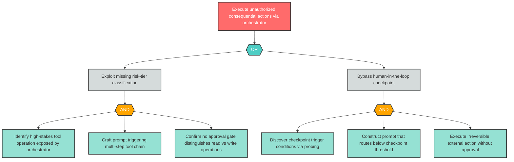

### AG-2: Unrestricted tool access without per-session capability scoping

**Component**: MCP Tool Server | **Risk Level**: Critical | **Finding**: AG-2

The attacker's goal is to invoke tools outside their authorized scope by exploiting the MCP Tool Server's lack of per-session capability restrictions.

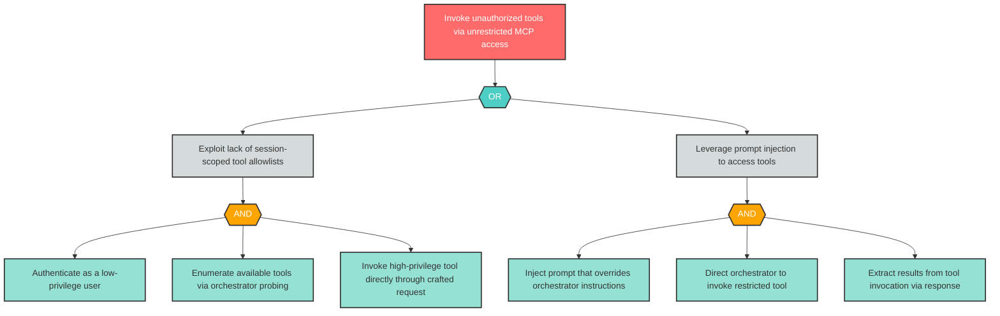

### LLM-1: Direct prompt injection causing data exfiltration via tool calls

**Component**: LLM Agent Orchestrator | **Risk Level**: Critical | **Finding**: LLM-1

The attacker's goal is to exfiltrate sensitive data by injecting adversarial instructions that override system prompt controls and encode data in outbound tool call parameters.

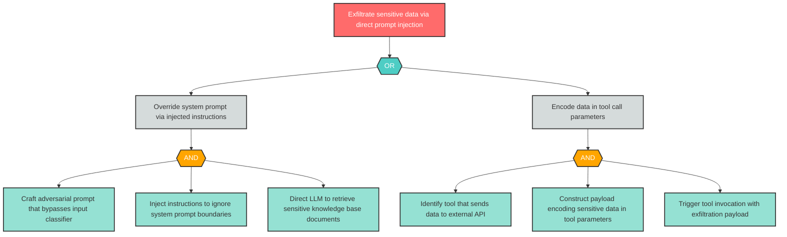

### AG-3: Unsanitized tool call parameters forwarded to External API

**Component**: MCP Tool Server | **Risk Level**: High | **Finding**: AG-3

The attacker's goal is to inject malicious parameters into tool calls that the External API processes as trusted input.

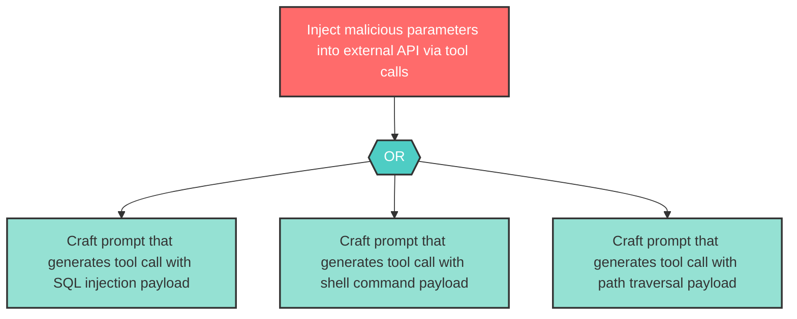

### D-1: Resource exhaustion via computationally expensive prompts

**Component**: LLM Agent Orchestrator | **Risk Level**: High | **Finding**: D-1

The attacker's goal is to degrade service availability by consuming excessive LLM inference resources through crafted prompts.

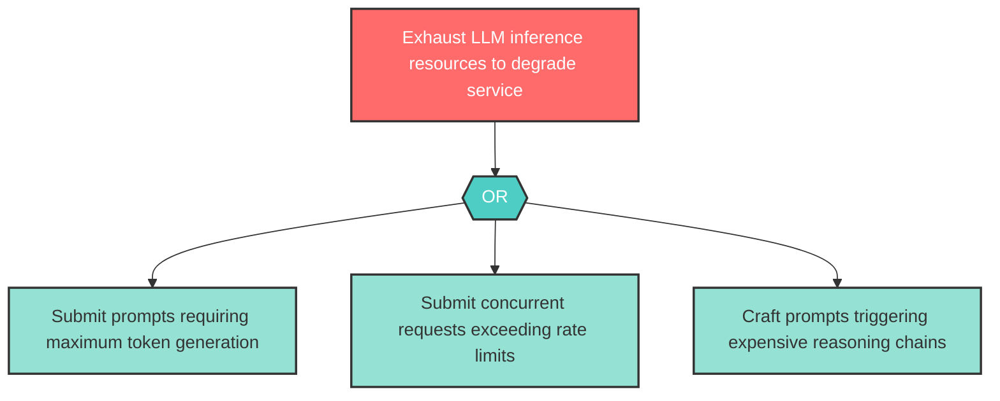

### E-1: Privilege escalation via prompt-manipulated tool calls

**Component**: LLM Agent Orchestrator | **Risk Level**: High | **Finding**: E-1

The attacker's goal is to escalate from standard user privileges to administrative capabilities by manipulating the orchestrator into executing privileged tool calls.

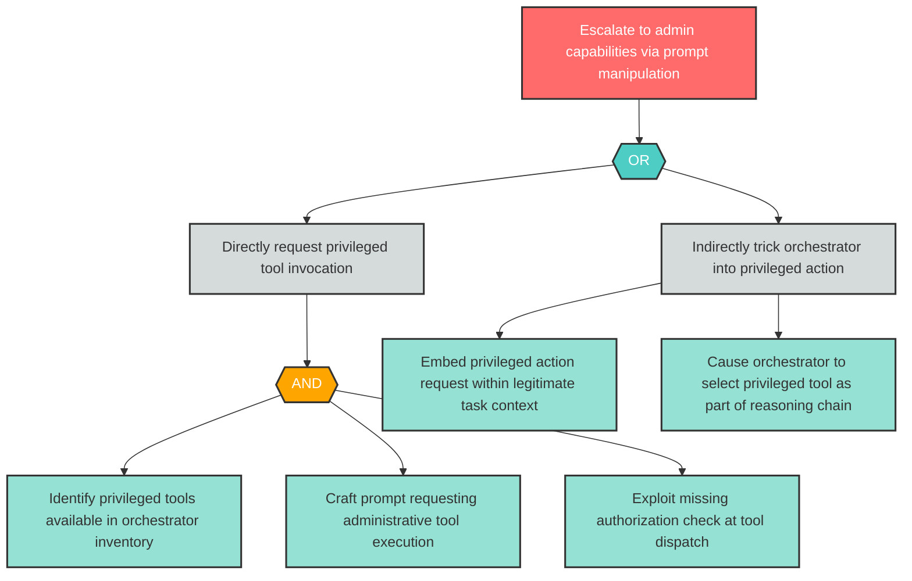

### I-1: Sensitive document retrieval by unauthorized users

**Component**: Knowledge Base | **Risk Level**: High | **Finding**: I-1

The attacker's goal is to retrieve sensitive documents from the knowledge base by exploiting the absence of document-level access controls in the RAG pipeline.

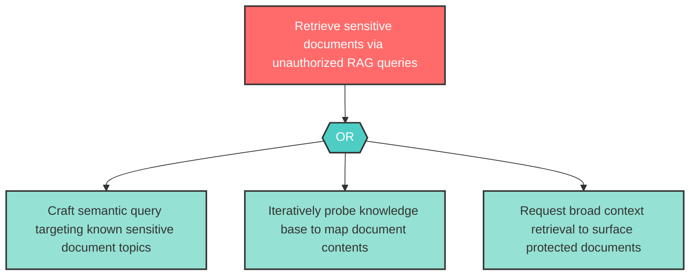

### I-2: System prompt extraction via crafted meta-instruction queries

**Component**: LLM Agent Orchestrator | **Risk Level**: High | **Finding**: I-2

The attacker's goal is to extract the system prompt contents to reveal internal instructions, API endpoints, and business logic.

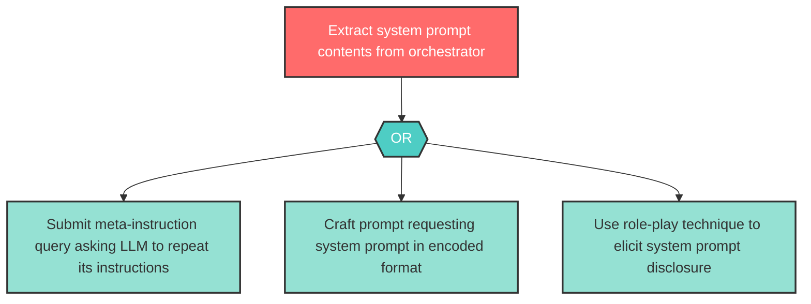

### LLM-2: Indirect prompt injection via poisoned RAG documents

**Component**: LLM Agent Orchestrator | **Risk Level**: High | **Finding**: LLM-2

The attacker's goal is to hijack orchestrator behavior by embedding adversarial instructions in knowledge base documents that are retrieved during RAG.

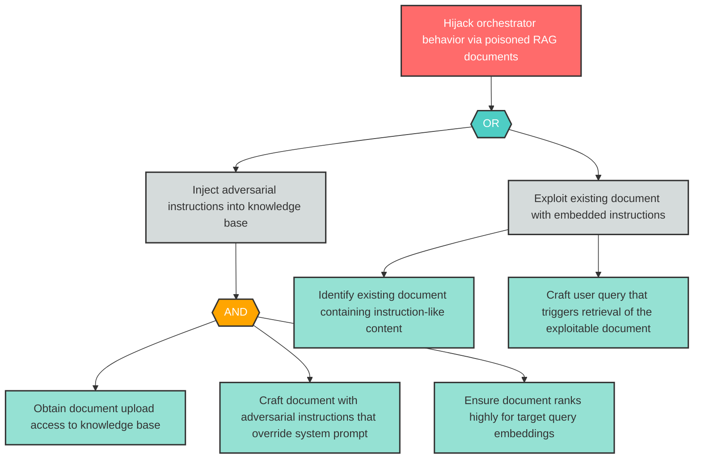

### LLM-3: Knowledge base poisoning with adversarial documents

**Component**: Knowledge Base | **Risk Level**: High | **Finding**: LLM-3

The attacker's goal is to poison the knowledge base so that adversarially crafted documents are consistently retrieved and presented as authoritative answers.

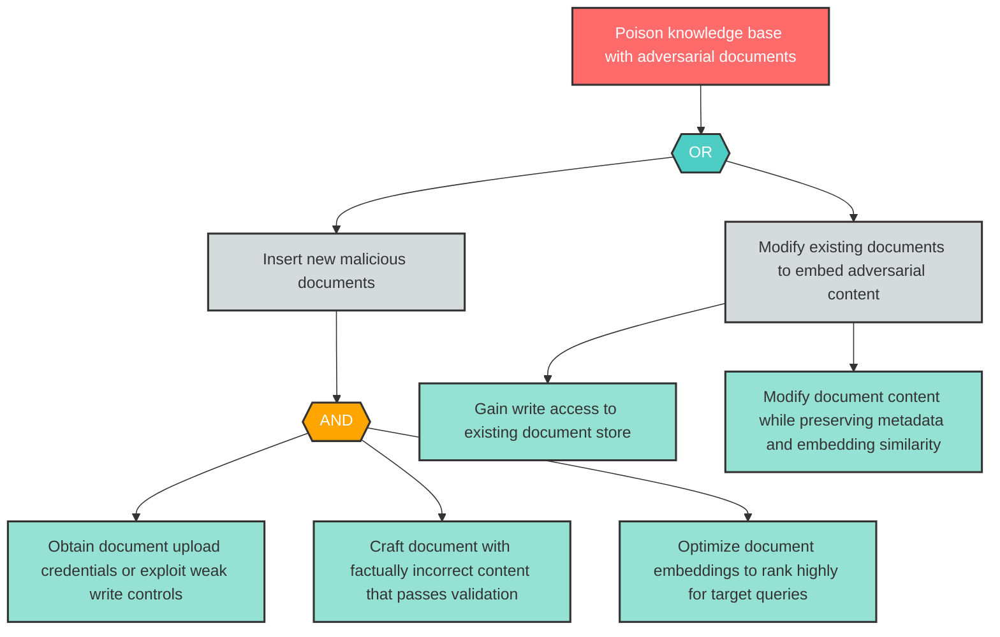

### S-1: Authentication credential replay or forgery for user impersonation

**Component**: User | **Risk Level**: High | **Finding**: S-1

The attacker's goal is to impersonate a legitimate user by replaying or forging authentication credentials to submit malicious prompts.

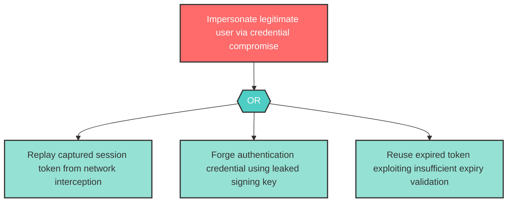

### T-2: Unauthorized document modification corrupting RAG retrieval

**Component**: Knowledge Base | **Risk Level**: High | **Finding**: T-2

The attacker's goal is to corrupt RAG retrieval results by modifying stored documents in the knowledge base to inject misleading or adversarial content.

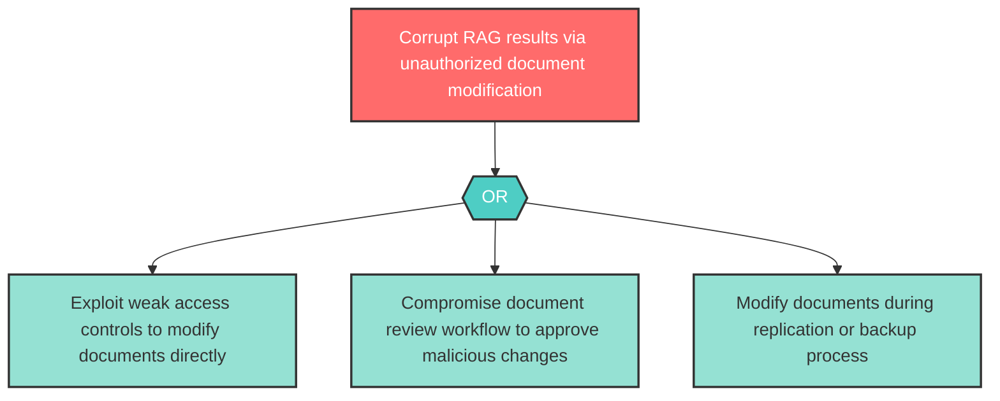

---

## 6. Remediation Roadmap

This roadmap contains 19 remediation items: 3 Immediate (Critical), 9 Short-term (High), and 7 Medium-term (Medium). The LLM Agent Orchestrator is the most impacted component with 10 findings, and should be the primary focus for remediation efforts. Implementation should begin with the three Critical findings (AG-1, AG-2, LLM-1) which collectively address the highest-risk attack paths: autonomous tool execution, unrestricted tool access, and direct prompt injection.

| Finding ID | Component | Mitigation | Effort | Dependencies |
|------------|-----------|------------|--------|--------------|
| AG-1 | LLM Agent Orchestrator | Classify all tool operations into risk tiers: Tier 1 (read-only, auto-approve), Tier 2 (reversible writes, require confirmation), Tier 3 (irreversible or external actions, require human approval). Implement mandatory human-in-the-loop checkpoints before Tier 2 and Tier 3 operations. Add maximum iteration limits and execution timeouts on orchestrator loops. | High | None |
| AG-2 | MCP Tool Server | Implement per-session tool allowlists at the MCP Tool Server level scoped to the current user's role and the active task context. Enforce tool invocation authorization checks that validate each call against the user's permission set. Log all tool invocations with caller identity and user context for audit. | High | Depends on AG-1 risk tier classification for tool categorization |
| LLM-1 | LLM Agent Orchestrator | Implement structured prompt templates with explicit delimiter tokens between system instructions and user input. Deploy an input classifier that detects adversarial prompt patterns before forwarding to the LLM. Apply output filtering to detect tool calls that contain data patterns matching exfiltration (encoded data, URLs, email addresses). Enforce egress network controls limiting external API request payloads. | High | None |
| AG-3 | MCP Tool Server | Enforce strict parameter schema validation at the MCP Tool Server for every tool call before execution. Validate all parameters against declared types, ranges, and patterns. Reject tool calls with parameters that do not conform to the registered tool schema. Implement an output classifier on LLM-generated tool calls to detect suspicious parameter patterns. | Medium | Depends on AG-2 for tool schema registry |
| D-1 | LLM Agent Orchestrator | Enforce per-user rate limiting and token budget caps; implement request timeout enforcement and queue management with priority levels. | Medium | None |
| E-1 | LLM Agent Orchestrator | Enforce role-based access controls on tool invocation; validate user authorization level before dispatching each tool call regardless of LLM output. | Medium | Depends on AG-1 risk tier classification and AG-2 tool allowlists |
| I-1 | Knowledge Base | Implement document-level access controls in the knowledge base; filter retrieved documents by user authorization level before injecting into LLM context. | Medium | None |
| I-2 | LLM Agent Orchestrator | Avoid embedding sensitive information in system prompts; implement output filtering to detect and block system prompt leakage patterns. | Medium | None |
| LLM-2 | LLM Agent Orchestrator | Sanitize retrieved document content before injection into the prompt context. Implement provenance tracking so the LLM can distinguish system instructions from retrieved content. Apply content integrity checks on documents before indexing. Monitor retrieval patterns for anomalous document frequency spikes that may indicate poisoning. | High | Depends on I-1 for document-level access controls |
| LLM-3 | Knowledge Base | Implement content validation and adversarial content detection on all documents before indexing. Apply document-level access controls restricting write access to authorized roles. Add provenance metadata to indexed documents tracking author, source, and review status. Establish a document review workflow requiring approval before new content enters the retrieval index. | High | None |
| S-1 | User | Implement multi-factor authentication and session-bound tokens with short expiry; validate user identity on every request. | Medium | None |
| T-2 | Knowledge Base | Implement access controls and mandatory review workflows for document modifications; maintain versioned snapshots with integrity checksums. | Medium | None |
| AG-4 | LLM Agent Orchestrator | Implement mandatory termination constraints: maximum iteration count (e.g., 25 iterations), execution timeout (e.g., 5 minutes), and cumulative cost cap per session. Add a circuit breaker that halts execution if the orchestrator repeats the same action pattern for 3 consecutive iterations. Log each iteration with action taken for post-hoc analysis. | Medium | Depends on AG-1 for iteration limit framework |
| D-2 | Knowledge Base | Implement storage quotas and document size limits; enforce write-access controls and rate limiting on document ingestion. | Low | None |
| LLM-4 | LLM Agent Orchestrator | Restrict API output to essential response content only. Implement per-user query budgets with alerts at threshold crossings. Deploy query pattern analysis that detects systematic probing. Implement generic error responses that do not expose model architecture details. Add rate limiting on prompt submissions per user session. | Medium | Depends on D-1 for rate limiting infrastructure |
| R-1 | User | Implement immutable audit logging of all user prompts with session ID, timestamp, IP address, and user identity; retain logs for compliance period. | Medium | None |
| R-2 | LLM Agent Orchestrator | Log all orchestrator decisions including LLM reasoning traces, tool selection rationale, and intermediate outputs with correlation IDs. | Medium | None |
| S-2 | External API | Enforce certificate pinning for external API connections; validate TLS certificates and implement mutual authentication where supported. | Low | None |
| T-1 | LLM Agent Orchestrator | Enforce authenticated and integrity-protected communication channels between orchestrator and tool server; sign tool call payloads. | Medium | None |

---

## 7. Appendix: Finding Reference

| Finding ID | Report Section | Heading Reference |
|------------|----------------|-------------------|
| S-1 | 3.1 | Spoofing |
| S-1 | 5 | Attack Trees |
| S-1 | 6 | Remediation Roadmap |
| S-2 | 3.1 | Spoofing |
| S-2 | 6 | Remediation Roadmap |
| T-1 | 3.2 | Tampering |
| T-1 | 4 | Cross-Cutting Themes |
| T-1 | 6 | Remediation Roadmap |
| T-2 | 3.2 | Tampering |
| T-2 | 4 | Cross-Cutting Themes |
| T-2 | 5 | Attack Trees |
| T-2 | 6 | Remediation Roadmap |
| R-1 | 3.3 | Repudiation |
| R-1 | 6 | Remediation Roadmap |
| R-2 | 3.3 | Repudiation |
| R-2 | 4 | Cross-Cutting Themes |
| R-2 | 6 | Remediation Roadmap |
| I-1 | 3.4 | Information Disclosure |
| I-1 | 4 | Cross-Cutting Themes |
| I-1 | 5 | Attack Trees |
| I-1 | 6 | Remediation Roadmap |
| I-2 | 3.4 | Information Disclosure |
| I-2 | 4 | Cross-Cutting Themes |
| I-2 | 5 | Attack Trees |
| I-2 | 6 | Remediation Roadmap |
| D-1 | 3.5 | Denial of Service |
| D-1 | 4 | Cross-Cutting Themes |
| D-1 | 5 | Attack Trees |
| D-1 | 6 | Remediation Roadmap |
| D-2 | 3.5 | Denial of Service |
| D-2 | 4 | Cross-Cutting Themes |
| D-2 | 6 | Remediation Roadmap |
| E-1 | 3.6 | Elevation of Privilege |
| E-1 | 4 | Cross-Cutting Themes |
| E-1 | 5 | Attack Trees |
| E-1 | 6 | Remediation Roadmap |
| AG-1 | 3.7 | Agentic Threats |
| AG-1 | 4 | Cross-Cutting Themes |
| AG-1 | 5 | Attack Trees |
| AG-1 | 6 | Remediation Roadmap |
| AG-2 | 3.7 | Agentic Threats |
| AG-2 | 4 | Cross-Cutting Themes |
| AG-2 | 5 | Attack Trees |
| AG-2 | 6 | Remediation Roadmap |
| AG-3 | 3.7 | Agentic Threats |
| AG-3 | 4 | Cross-Cutting Themes |
| AG-3 | 5 | Attack Trees |
| AG-3 | 6 | Remediation Roadmap |
| AG-4 | 3.7 | Agentic Threats |
| AG-4 | 4 | Cross-Cutting Themes |
| AG-4 | 6 | Remediation Roadmap |
| LLM-1 | 3.8 | LLM Threats |
| LLM-1 | 4 | Cross-Cutting Themes |
| LLM-1 | 5 | Attack Trees |
| LLM-1 | 6 | Remediation Roadmap |
| LLM-2 | 3.8 | LLM Threats |
| LLM-2 | 4 | Cross-Cutting Themes |
| LLM-2 | 5 | Attack Trees |
| LLM-2 | 6 | Remediation Roadmap |
| LLM-3 | 3.8 | LLM Threats |
| LLM-3 | 4 | Cross-Cutting Themes |
| LLM-3 | 5 | Attack Trees |
| LLM-3 | 6 | Remediation Roadmap |
| LLM-4 | 3.8 | LLM Threats |
| LLM-4 | 4 | Cross-Cutting Themes |
| LLM-4 | 6 | Remediation Roadmap |

**Completeness self-check**: 19 unique finding IDs present in this appendix (S-1, S-2, T-1, T-2, R-1, R-2, I-1, I-2, D-1, D-2, E-1, AG-1, AG-2, AG-3, AG-4, LLM-1, LLM-2, LLM-3, LLM-4). This matches the 19 findings in the input `threats.md` Sections 3 and 4. Zero finding loss confirmed.
