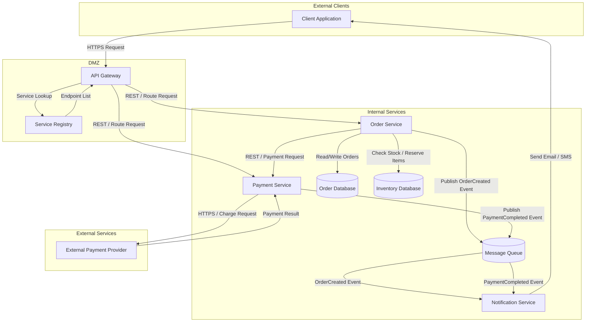

# Microservices E-Commerce Platform — Architecture

Example architecture input for a microservices-based e-commerce platform. This diagram demonstrates a traditional distributed system with synchronous REST calls between services, asynchronous event-driven communication via a message queue, and clear trust boundary separation across four zones.

format: mermaid

## Component Summary

| Component | DFD Element Type | Notes |
|-----------|------------------|-------|
| Client Application | External Entity | End-user browser or mobile app; untrusted zone |
| API Gateway | Process | Single entry point; routes requests, enforces auth; DMZ zone |
| Service Registry | Process | Maintains service endpoint catalog for dynamic discovery; DMZ zone |
| Order Service | Process | Handles order creation, validation, and lifecycle; trusted zone |
| Payment Service | Process | Orchestrates payment flow with external provider; trusted zone |
| Notification Service | Process | Consumes async events and delivers user notifications; trusted zone |
| Message Queue | Data Store | Async event bus for decoupled service-to-service communication; trusted zone |
| Order Database | Data Store | Persistent storage for order records and state; trusted zone |
| Inventory Database | Data Store | Persistent storage for product stock levels; trusted zone |
| External Payment Provider | External Entity | Third-party payment processor (e.g., Stripe); untrusted zone |
