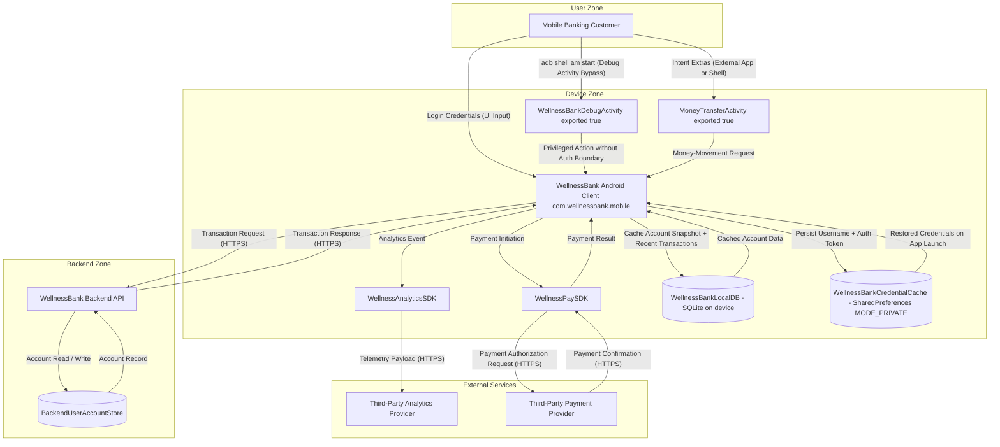

# Mobile Banking Application — Architecture

Hypothetical: example architecture input for a fictional Android-based mobile banking application that lets a retail-banking customer view balances, transfer funds, and pay bills from a personal handset. The diagram demonstrates the F-7 (Feature 237) Mobile Top 10 Coverage Bundle dispatch surfaces by exhibiting all six mobile-platform topology indicators in one architecture: (a) a mobile client process running on Android with the `com.wellnessbank.mobile` application package, (b) a credential-handling component persisting authentication material into Android `SharedPreferences` in `MODE_PRIVATE` (explicitly NOT EncryptedSharedPreferences and NOT Android Keystore), (c) an on-device secure-storage data store backed by plain SQLite (explicitly NOT SQLCipher), (d) a mobile-backend REST API the client communicates with for transaction processing, (e) two third-party mobile SDKs embedded in the client — an analytics SDK and a payment SDK — that perform their own outbound network I/O from the device, and (f) an exposed debug-only Activity (`WellnessBankDebugActivity`) that was supposed to be stripped at release-build but remains exported in production with `android:exported="true"` and accessible via `adb shell am start`, demonstrating the M8 Security Misconfiguration surface. The component "WellnessBank" is a fictional consumer-banking brand (no real bank, no real customer data, no real merchant) framed for adopters as a hypothetical baseline; the architecture deliberately omits Android Keystore / Keychain protection, `FLAG_SECURE` window protection, SQLCipher database encryption, root-detection / SafetyNet / Play Integrity attestation, certificate pinning on outbound flows, signed-SDK supply-chain policy, and release-build stripping of debug Activities so that the F-7 detection pipeline emits the Mobile Pattern Categories on a clean-slate baseline distinct from `examples/agentic-app/`, `examples/consumer-agent-app/`, and `examples/predictive-ml-app/`. The architecture is multi-component (mobile client + on-device data stores + backend API + third-party SDKs + exposed debug Activity) so that the mobile-platform topology gate per FR-15 is satisfied at all 6-of-6 indicators and the new Mobile Pattern Categories emit on the mobile surface while remaining inert on the non-mobile baselines.

format: mermaid

## Component Summary

| Component | DFD Element Type | AI Dispatch Trigger |
|---|---|---|
| Mobile Banking Customer | External Entity | None |
| Third-Party Analytics Provider | External Entity | None |
| Third-Party Payment Provider | External Entity | None |
| WellnessBank Android Client | Process | Mobile (M1, M3, M5, M6, M7, M10) — credential-handling, auth/authz, comm, privacy, binary, crypto |
| WellnessBankDebugActivity | Process | Mobile (M8 privilege-gain) — exported debug-only Activity bypassing auth boundary |
| MoneyTransferActivity | Process | Mobile (M4) — exported Activity accepting Intent extras with no permission gating |
| WellnessAnalyticsSDK | Process | Mobile (M2, M5) — third-party SDK supply chain + insecure communication |
| WellnessPaySDK | Process | Mobile (M2, M5) — third-party SDK supply chain + insecure communication |
| WellnessBank Backend API | Process | None (server-side surface) |
| WellnessBankLocalDB | Data Store | Mobile (M9) — insecure data storage on device |
| WellnessBankCredentialCache | Data Store | Mobile (M1, M9) — improper credential usage + insecure data storage |
| BackendUserAccountStore | Data Store | None (server-side surface) |

## Expected Dispatch Behavior

- **WellnessBank Android Client**: Multi-dispatch. Bearing the `com.wellnessbank.mobile` Android package identifier — primary mobile-platform topology indicator. Receives STRIDE (S, T, R, I, D, E) plus the F-7 Mobile pattern surface across six host-agent dispatches:
  - **spoofing Cat N+1 — Improper Mobile Credential Usage** per OWASP M1:2024. Credentials persist into `SharedPreferences` in `MODE_PRIVATE` with no Android Keystore reference and no iOS Keychain reference, no EncryptedSharedPreferences, and no hardware-backed credential vault. The architecture deliberately omits the platform-managed credential-vault path so the F-7 detection surface emits on a clean-slate baseline.
  - **spoofing Cat N+2 — Insecure Mobile Authentication/Authorization** per OWASP M3:2024. No biometric step-up on money-movement operations, no per-session token re-auth on sensitive actions, no challenge-response on transaction-confirmation flows, and no risk-based MFA on the WellnessBank Android Client. The architecture deliberately omits each auth-step-up control so the F-7 detection surface emits on a clean-slate baseline.
  - **info-disclosure Cat N+1 — Insecure Mobile Communication** per OWASP M5:2024. TLS established on the outbound transaction flow to the WellnessBank Backend API without certificate pinning configured, no Network Security Config pinning declaration on the client manifest, and no public-key-pinning fallback. The architecture deliberately omits certificate pinning on the primary client→backend Data Flow so the F-7 detection surface emits on a clean-slate baseline.
  - **info-disclosure Cat N+2 — Inadequate Mobile Privacy Controls** per OWASP M6:2024. No `FLAG_SECURE` on transaction-history screen exposing app contents to recents-screen screenshots and screen-recording, no PII expiry on local caches, no privacy-consent gate on analytics emission, and no privacy-policy review gate on third-party SDK telemetry. The architecture deliberately omits each privacy-control so the F-7 detection surface emits on a clean-slate baseline.
  - **tampering Cat 13 — Insufficient Mobile Binary Protections** per OWASP M7:2024. No code obfuscation (no ProGuard/R8 rules in the release build), no root-detection on security-critical features, no anti-tampering integrity check at app startup, and no debugger-detection at sensitive-flow boundaries. The architecture deliberately omits each binary-protection control so the F-7 detection surface emits on a clean-slate baseline.
  - **info-disclosure Cat N+4 — Insufficient Mobile Cryptography** per OWASP M10:2024. Custom-rolled key-derivation from a 4-digit PIN with PBKDF2 iteration count of 1000 and no salting, no platform-managed KMS-backed key wrapping, no envelope encryption on cached credentials, and no key-rotation policy. The architecture deliberately omits each cryptography control so the F-7 detection surface emits on a clean-slate baseline.
- **WellnessBankDebugActivity**: Privilege-escalation dispatch. Exported debug-only Activity Process retained in production release build — sixth mobile-platform topology indicator (exposed debug or admin endpoint).
  - **privilege-escalation M8 Cat — Mobile Misconfiguration: Privilege-Gain** per OWASP M8:2024. Receives STRIDE (S, T, R, E) plus the F-7 privilege-gain surface — debug-only `WellnessBankDebugActivity` with `android:exported="true"` retained in production build accessible via `adb shell am start`, no Play Integrity / DeviceCheck attestation gate, no `BuildConfig.DEBUG` runtime guard preventing privileged-action execution, and the privileged-action flow bypasses the standard auth boundary into the main client Process. The architecture deliberately omits the release-build stripping and runtime guards so the F-7 detection surface emits on a clean-slate baseline.
  - **repudiation M8 Cat — Mobile Misconfiguration: Accountability-Loss** per OWASP M8:2024 (dual-host path per Q1). The companion accountability-loss surface dispatches to the `repudiation` host on the WellnessBank Android Client itself — no structured audit logging on login/money-movement events, debug `Log.d("auth", "user=" + username + " token=" + token)` retained in the release build, no log-tampering detection, and no client-side telemetry forwarding to backend audit log on security-critical events. The architecture deliberately omits each accountability-control so the F-7 detection surface emits on a clean-slate baseline.
- **MoneyTransferActivity**: Tampering dispatch. Exported Android Activity Process accepting Intent extras from external apps or shell — IPC-input-validation indicator. Receives STRIDE (S, T, I) plus:
  - **tampering Cat 12 — Mobile IPC Input Validation** per OWASP M4:2024. Exported `MoneyTransferActivity` with no permission gating accepting Intent extras directly into the money-movement flow, no Intent extras schema validation, no signature-permission qualifier on the exported Activity, and no per-Intent caller verification. The cross-link to F-1 `output-integrity` Cat 1-9 boundary is explicitly named per ADR-036 D-5 (mobile IPC validation is a distinct architectural surface from generic output-integrity sanitization, and the disjoint-tells annotation in the host-agent companion catalog ensures the two Pattern Categories do not collide). The architecture deliberately omits each IPC-validation control so the F-7 detection surface emits on a clean-slate baseline.
- **WellnessAnalyticsSDK** / **WellnessPaySDK**: Multi-dispatch. Third-party mobile SDK Processes embedded in the WellnessBank Android Client and performing outbound network I/O from the device — third-party-SDK topology indicator. Each receives STRIDE (T, I, D) plus:
  - **tampering Cat 11 — Mobile Supply Chain Integrity** per OWASP M2:2024. No SDK signature verification on either the WellnessAnalyticsSDK or the WellnessPaySDK, no CocoaPods/Gradle pinning manifest with cryptographic checksum, no allowlist of trusted SDK source providers, no SDK update review gate at ingestion, and no provenance metadata captured at SDK install. The architecture deliberately omits each SDK supply-chain control so the F-7 detection surface emits on a clean-slate baseline.
  - **info-disclosure Cat N+1 — Insecure Mobile Communication** per OWASP M5:2024. TLS established on the analytics flow from the WellnessAnalyticsSDK to the Third-Party Analytics Provider without certificate pinning configured. TLS established on the payment flow from the WellnessPaySDK to the Third-Party Payment Provider without certificate pinning configured. No certificate-pinning declaration on either Data Flow. The architecture deliberately omits certificate pinning on each SDK egress flow so the F-7 detection surface emits on a clean-slate baseline.
- **WellnessBankLocalDB**: Info-disclosure dispatch. On-device SQLite Data Store holding cached account snapshots and recent-transaction records — secure-storage topology indicator. Receives STRIDE (T, I, D) plus:
  - **info-disclosure Cat N+3 — Insecure Mobile Data Storage** per OWASP M9:2024. No SQLCipher / Realm encryption on `WellnessBankLocalDB`, `allowBackup="true"` exposing the local DB to Google Drive cloud-backup with no per-tenant key separation, no Database key-rotation policy, no scoped-storage migration declaration, and no encrypted-at-rest enforcement on transaction-history rows. The architecture deliberately omits each data-storage control so the F-7 detection surface emits on a clean-slate baseline.
- **WellnessBankCredentialCache**: Multi-dispatch. On-device `SharedPreferences` Data Store in `MODE_PRIVATE` holding authentication tokens — credential-handling topology indicator. Receives STRIDE (T, I, D) plus:
  - **spoofing Cat N+1 — Improper Mobile Credential Usage** per OWASP M1:2024 (shared with the WellnessBank Android Client surface). No Android Keystore reference, no iOS Keychain reference, no EncryptedSharedPreferences usage, plain `MODE_PRIVATE` text storage of `Username + Auth Token`, and no biometric-protected key wrapping at the platform-API boundary. The architecture deliberately omits each credential-handling control so the F-7 detection surface emits on a clean-slate baseline.
- **WellnessBank Backend API**: Mobile-backend REST Process — mobile-backend topology indicator. Receives STRIDE (T, I, D). The TLS-edge between the WellnessBank Android Client and the WellnessBank Backend API has TLS established without certificate pinning configured on the client side. Server-side STRIDE applies; mobile-tier Pattern Categories do not dispatch to the server-side Process itself, but the absence of certificate pinning on the client-side outbound flow is captured at the mobile-client dispatch under M5 Insecure Mobile Communication.
- **Mobile Banking Customer** / **Third-Party Analytics Provider** / **Third-Party Payment Provider**: Standard STRIDE only (S, R). External Entities — no Mobile dispatch trigger applies to External Entities per the dispatch matrix. Captured at indicator level: the incoming `Login Credentials (UI Input)` Data Flow into the WellnessBank Android Client is the trust-boundary-crossing signal that supplies the credential-handling indicator on the consuming Process; the outbound TLS Data Flows to the analytics and payment providers supply the SDK-egress indicators on the consuming SDK Processes.
- **BackendUserAccountStore**: Standard STRIDE only (T, I, D). Data Store — server-side, not on the mobile-platform surface.

## Absent-Control Inventory

The following platform-tier and application-tier controls are deliberately omitted from this baseline so the F-7 detection pipeline emits the full Mobile Pattern Category surface on a clean-slate architecture. Each clause is grouped by OWASP M-item and triggers a distinct Pattern Category Indicator gate per spec FR-15.

- **M1 — Improper Credential Usage** (spoofing Cat N+1):
  - No Android Keystore reference on the credential-persistence path.
  - No iOS Keychain reference (Android-tier example, but the absence is named for adopters porting to the iOS-tier).
  - No EncryptedSharedPreferences in place of plain `SharedPreferences`.
  - Plain `SharedPreferences` in `MODE_PRIVATE` storing `Username + Auth Token` as cleartext on disk.
  - No hardware-backed credential vault and no biometric-protected key wrapping at the platform-API boundary.
- **M2 — Inadequate Supply Chain Security** (tampering Cat 11):
  - No SDK signature verification on the WellnessAnalyticsSDK at ingestion or update time.
  - No SDK signature verification on the WellnessPaySDK at ingestion or update time.
  - No CocoaPods/Gradle pinning manifest with cryptographic checksum.
  - No allowlist of trusted SDK source providers.
  - No SDK update review gate; no provenance metadata captured at SDK install.
- **M3 — Insecure Authentication/Authorization** (spoofing Cat N+2):
  - No biometric step-up on money-movement operations.
  - No per-session token re-authentication on sensitive actions (transaction confirmation, payment authorization, profile update).
  - No challenge-response on transaction-confirmation flows.
  - No risk-based MFA on the WellnessBank Android Client.
- **M4 — Insufficient Input/Output Validation** (tampering Cat 12):
  - Exported `MoneyTransferActivity` with no permission gating accepting Intent extras directly into the money-movement flow.
  - No Intent extras schema validation on the exported Activity.
  - No signature-permission qualifier (`android:permission` with signature-only protection level) on the exported Activity.
  - No per-Intent caller verification.
  - Disjoint-tells annotation in the `tampering` companion catalog cross-links Cat 12 to F-1 `output-integrity` Cat 1-9 boundary per ADR-036 D-5.
- **M5 — Insecure Communication** (info-disclosure Cat N+1):
  - TLS established without certificate pinning configured on the client→backend transaction flow (WellnessBank Android Client → WellnessBank Backend API).
  - TLS established without certificate pinning configured on the analytics flow (WellnessAnalyticsSDK → Third-Party Analytics Provider).
  - TLS established without certificate pinning configured on the payment flow (WellnessPaySDK → Third-Party Payment Provider).
  - No Network Security Config pinning declaration on the client manifest.
  - No public-key-pinning fallback on any Data Flow.
- **M6 — Inadequate Privacy Controls** (info-disclosure Cat N+2):
  - No `FLAG_SECURE` on the transaction-history screen exposing app contents to recents-screen screenshots and screen-recording.
  - No PII expiry on local caches (account snapshots and recent-transaction records persist indefinitely until app data is cleared).
  - No privacy-consent gate on analytics emission.
  - No privacy-policy review gate on third-party SDK telemetry payloads.
- **M7 — Insufficient Binary Protections** (tampering Cat 13):
  - No code obfuscation (no ProGuard/R8 rules in the release build).
  - No root-detection on security-critical features (transaction confirmation, payment authorization, biometric step-up surfaces).
  - No anti-tampering integrity check at app startup (no SafetyNet attestation, no Play Integrity check, no checksum-of-self verification).
  - No debugger-detection at sensitive-flow boundaries.
- **M8 — Security Misconfiguration: Privilege-Gain** (privilege-escalation host, dual-host path per Q1):
  - No Play Integrity / DeviceCheck attestation gate at app startup.
  - Debug-only `WellnessBankDebugActivity` with `android:exported="true"` retained in production build.
  - No `BuildConfig.DEBUG` runtime guard preventing privileged-action execution.
  - Debug-Activity-bypass flow accessible via `adb shell am start` reaches the main client Process without traversing the standard auth boundary.
- **M8 — Security Misconfiguration: Accountability-Loss** (repudiation host, dual-host path per Q1):
  - No structured audit logging on login events; no structured audit logging on money-movement events.
  - Debug `Log.d("auth", "user=" + username + " token=" + token)` retained in the release build, leaking authentication material into the device-shared logcat sink.
  - No log-tampering detection on client-side telemetry forwarding.
  - No client-side telemetry forwarding to the backend audit log on security-critical events.
- **M9 — Insecure Data Storage** (info-disclosure Cat N+3):
  - No SQLCipher / Realm encryption on `WellnessBankLocalDB`.
  - `allowBackup="true"` in the application manifest, exposing the local DB to Google Drive cloud-backup with no per-tenant key separation.
  - No Database key-rotation policy.
  - No scoped-storage migration declaration.
  - No encrypted-at-rest enforcement on transaction-history rows.
- **M10 — Insufficient Cryptography** (info-disclosure Cat N+4):
  - Custom-rolled key-derivation from a 4-digit PIN with PBKDF2 iteration count of 1000 (well below the OWASP-recommended 600,000 baseline).
  - No salting on the PIN-to-key derivation function.
  - No platform-managed KMS-backed key wrapping (Android Keystore-backed AES wrapping or iOS Keychain-backed key derivation).
  - No envelope encryption on cached credentials.
  - No key-rotation policy.

## Mobile-Platform Topology Indicators

The mobile-platform topology gate per spec FR-15 emits the new F-7 Mobile Pattern Categories only when the architecture exhibits ≥4 mobile-platform structural indicators. This baseline exhibits all 6 of 6 indicators:

1. **Declared mobile client component** — the WellnessBank Android Client Process bears the `com.wellnessbank.mobile` Android package identifier.
2. **Credential-handling component** — the WellnessBankCredentialCache Data Store explicitly references `SharedPreferences` in `MODE_PRIVATE` (and explicitly NOT EncryptedSharedPreferences, NOT Android Keystore, NOT iOS Keychain).
3. **Secure-storage data store** — the WellnessBankLocalDB Data Store is backed by SQLite on the device (and explicitly NOT SQLCipher, NOT Realm with encryption, NOT Room with EncryptedSharedPreferences integration).
4. **Mobile-backend API process** — the WellnessBank Backend API is the REST service the client communicates with for transaction processing, with TLS established but without certificate pinning configured on the client side.
5. **Third-party mobile SDK integration** — the WellnessAnalyticsSDK and the WellnessPaySDK are embedded in the WellnessBank Android Client as in-process SDKs and perform their own outbound network I/O from the device.
6. **Exposed debug or admin endpoint** — the WellnessBankDebugActivity is an `android:exported="true"` debug-only Activity retained in the production release build, accessible via `adb shell am start`, demonstrating the M8 Security Misconfiguration surface.

## Trust Boundaries

- **Device Boundary** — encloses the mobile client (`WellnessBank Android Client`), the exported debug Activity (`WellnessBankDebugActivity`), the exported money-movement Activity (`MoneyTransferActivity`), the embedded third-party SDKs (`WellnessAnalyticsSDK`, `WellnessPaySDK`), and on-device data stores (`WellnessBankLocalDB`, `WellnessBankCredentialCache`). All on-device components share the device's process trust posture and the absence of platform-level isolation controls is a mobile-platform-tier concern. The exported Activities cross the device-internal IPC boundary without permission gating, and the debug-Activity bypass flow does not traverse the standard auth boundary into the main client Process.
- **Network Boundary** — encloses three TLS edges, each declared without certificate pinning: (a) the client→backend transaction flow between the `WellnessBank Android Client` and the `WellnessBank Backend API` — TLS established without certificate pinning configured; (b) the analytics flow between the `WellnessAnalyticsSDK` and the `Third-Party Analytics Provider` — TLS established without certificate pinning configured; (c) the payment flow between the `WellnessPaySDK` and the `Third-Party Payment Provider` — TLS established without certificate pinning configured. No certificate-pinning declaration on any Data Flow; no Network Security Config pinning manifest; no public-key-pinning fallback.
- **Backend Boundary** — encloses the `WellnessBank Backend API` Process and the `BackendUserAccountStore` Data Store. Server-side surface; outside the mobile-platform topology gate.

## Notes for Adopters

This baseline is the full Wave 0.1 draft for the F-7 (Feature 237) Mobile Top 10 Coverage Bundle and demonstrates all six mobile-platform topology indicators required by the FR-15 mobile-platform topology gate: (1) mobile client process bearing the `com.wellnessbank.mobile` Android package identifier, (2) credential-handling component via `SharedPreferences` in `MODE_PRIVATE`, (3) on-device secure-storage SQLite Data Store, (4) mobile-backend REST API, (5) third-party mobile SDK integration (analytics + payment), and (6) an exposed debug-only Activity (`WellnessBankDebugActivity`) demonstrating the M8 Security Misconfiguration surface. The architecture additionally exhibits an exported `MoneyTransferActivity` accepting Intent extras directly to provide the M4 IPC-input-validation surface. Each absent control is named explicitly in the Absent-Control Inventory section so that each Pattern Category Indicator gate is satisfied on regen. The clearly-fictional WellnessBank brand is used throughout per Constitution V Privacy guidance (no real bank, no real customer, no real merchant). This file is excluded from the `BASELINE_EXAMPLES` byte-identity loop per Q6 plan-time decision (mirrors `agentic-app`, `consumer-agent-app`, and `predictive-ml-app/` precedent), and the new F-7 Mobile Pattern Categories will emit on this surface while remaining inert on the six non-mobile baselines.
