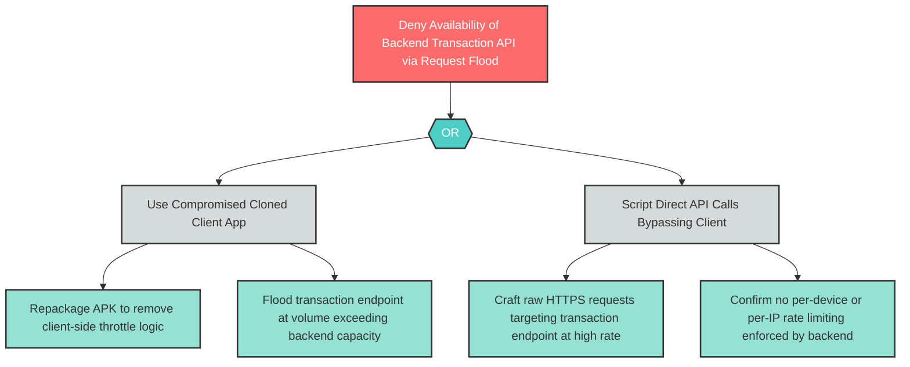

# D-2: Missing Rate Limiting on Backend Transaction API

**Component**: WellnessBank Backend API | **Risk Level**: High | **Finding**: D-2

An attacker uses compromised or cloned client applications to flood the backend transaction API with high-volume requests, saturating processing capacity and denying service to legitimate users.

