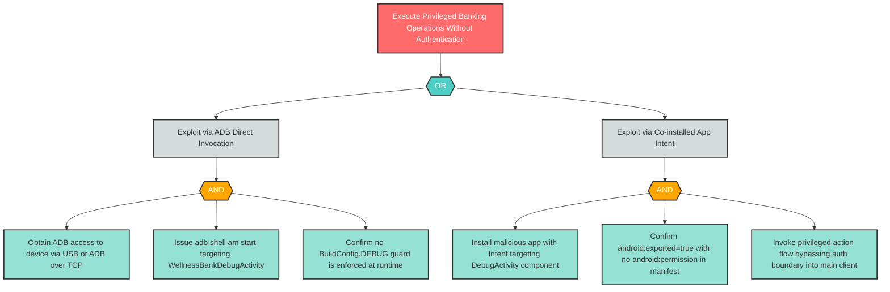

# E-1: Exported Debug Activity Bypassing Authentication Boundary

**Component**: WellnessBankDebugActivity | **Risk Level**: Critical | **Finding**: E-1

An attacker with ADB access exploits the production-retained debug Activity to execute privileged banking operations without authentication, bypassing all standard auth boundary controls.

