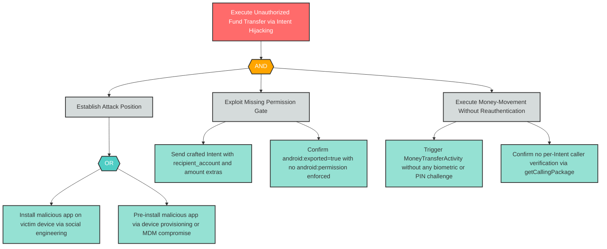

# E-2: Unauthorized Money Transfer via Intent Hijacking and Privilege Escalation

**Component**: MoneyTransferActivity | **Risk Level**: Critical | **Finding**: E-2

A malicious co-installed app exploits the exported MoneyTransferActivity to initiate unauthorized fund transfers under the legitimate user's authenticated session, escalating from unprivileged-app context to full banking privileges.

