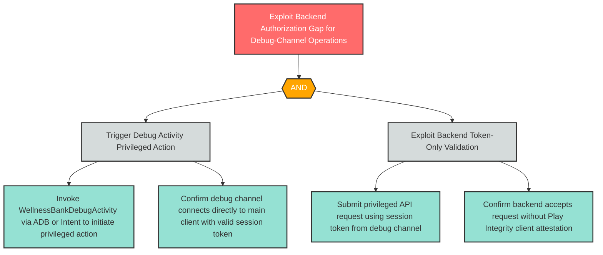

# E-3: Server-Side Authorization Gap for Debug-Initiated Operations

**Component**: WellnessBank Backend API | **Risk Level**: High | **Finding**: E-3

An attacker exploiting the debug Activity initiates privileged operations that the backend accepts on the basis of the session token alone, without verifying that the request originated from a legitimate in-app user action.

