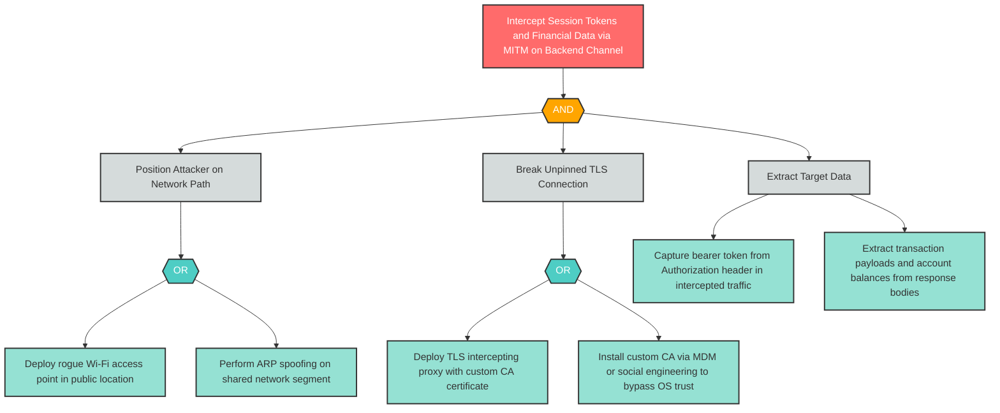

# I-1: Insecure Mobile Communication — Client-to-Backend MITM

**Component**: WellnessBank Android Client | **Risk Level**: Critical | **Finding**: I-1

An attacker on a rogue Wi-Fi access point performs a MITM attack against the unpinned TLS connection between the Android client and the backend API, intercepting session tokens and financial data.

