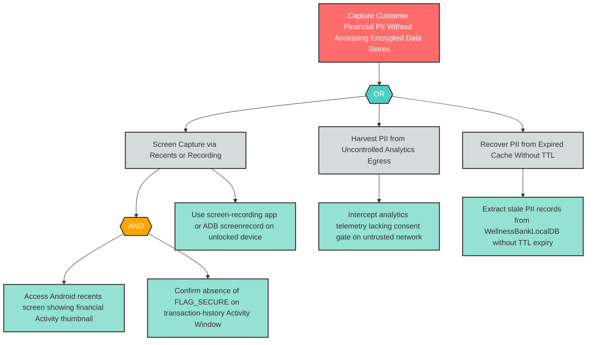

# I-2: Inadequate Mobile Privacy Controls — Screen Capture and PII Leakage

**Component**: WellnessBank Android Client | **Risk Level**: Critical | **Finding**: I-2

An attacker exploits the absence of FLAG_SECURE and privacy controls to capture financial PII from the device screen, Android recents, or analytics telemetry without any access to the encrypted data stores.

