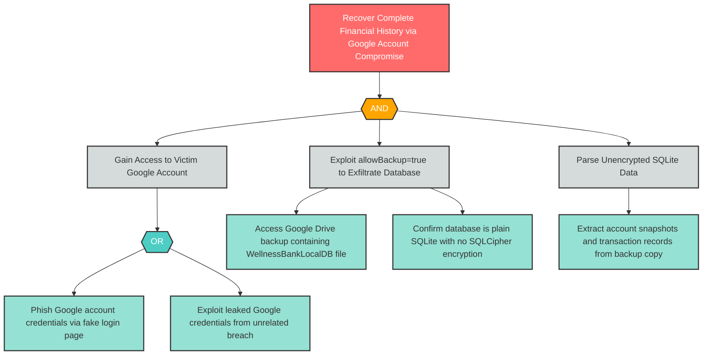

# I-3: Insecure Mobile Data Storage — Unencrypted SQLite via Cloud Backup

**Component**: WellnessBankLocalDB | **Risk Level**: Critical | **Finding**: I-3

An attacker who compromises a user's Google account recovers complete transaction history and account snapshots from Google Drive cloud backup, bypassing device authentication entirely.

