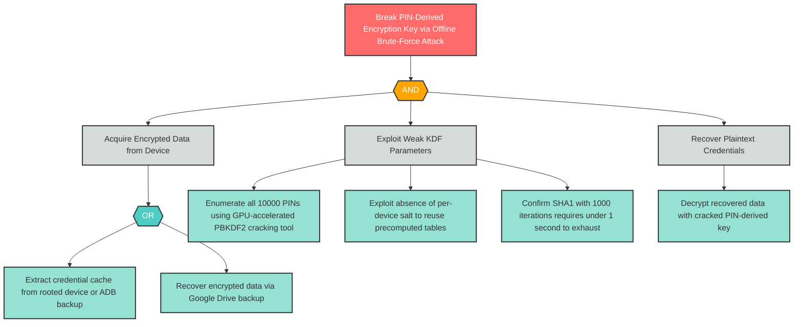

# I-4: Insufficient Mobile Cryptography — Weak PIN-Based Key Derivation

**Component**: WellnessBank Android Client | **Risk Level**: Critical | **Finding**: I-4

An attacker obtains encrypted data from the device and brute-forces the 4-digit PIN space in under one second, recovering the derived key and decrypting all protected credentials and data.

