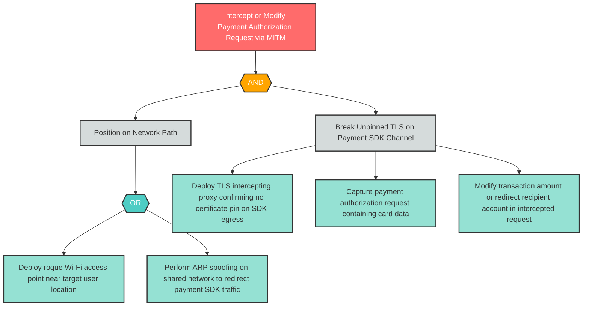

# I-6: Insecure Mobile Communication — Payment SDK MITM

**Component**: WellnessPaySDK | **Risk Level**: High | **Finding**: I-6

An attacker intercepts the unpinned TLS connection between WellnessPaySDK and the Third-Party Payment Provider, capturing or modifying payment authorization requests containing card data and transaction amounts.

