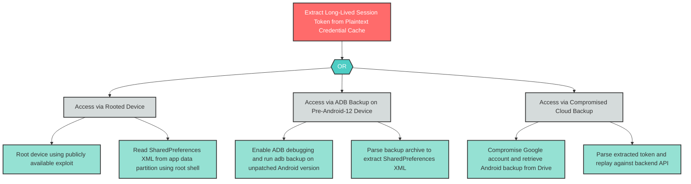

# I-7: Insecure Mobile Data Storage — Credential Cache in Plaintext SharedPreferences

**Component**: WellnessBankCredentialCache | **Risk Level**: Critical | **Finding**: I-7

An attacker extracts long-lived session tokens from plaintext SharedPreferences, enabling full account access without any biometric or PIN challenge.

