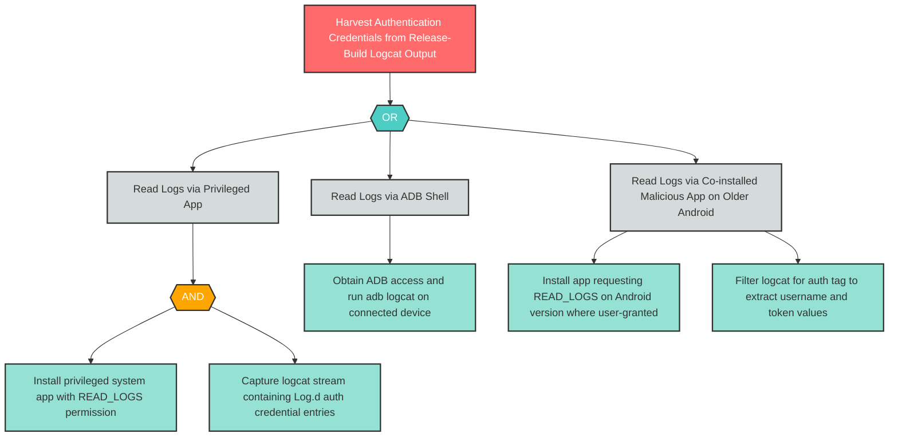

# I-8: Debug Log PII Leakage via Logcat

**Component**: WellnessBank Android Client | **Risk Level**: Critical | **Finding**: I-8

An attacker harvests authentication credentials (username and session token) written to the device-shared logcat sink by unguarded Log.d calls retained in the release build.

