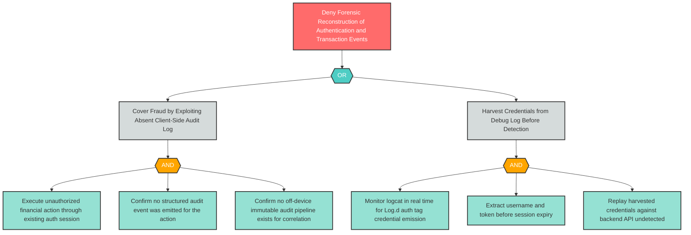

# R-1: M8 Accountability-Loss — Missing Audit Logging and Log PII Leakage

**Component**: WellnessBank Android Client | **Risk Level**: Critical | **Finding**: R-1

An attacker exploits the absence of tamper-evident audit logging and the presence of credential-leaking debug logs to cover financial fraud and deny forensic reconstruction of authentication events.

