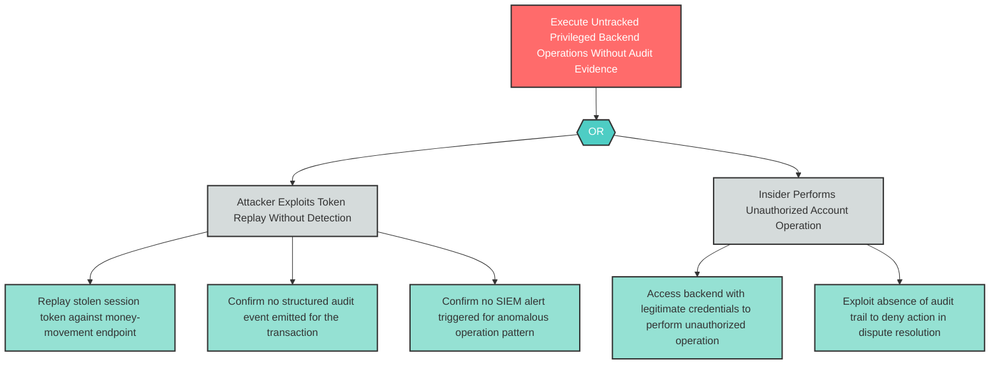

# R-2: Missing Backend Audit Trail on Transaction Operations

**Component**: WellnessBank Backend API | **Risk Level**: High | **Finding**: R-2

An attacker or insider performs unauthorized privileged operations on the backend API that cannot be forensically reconstructed because no audit event emission is implemented on money-movement or account-write endpoints.

