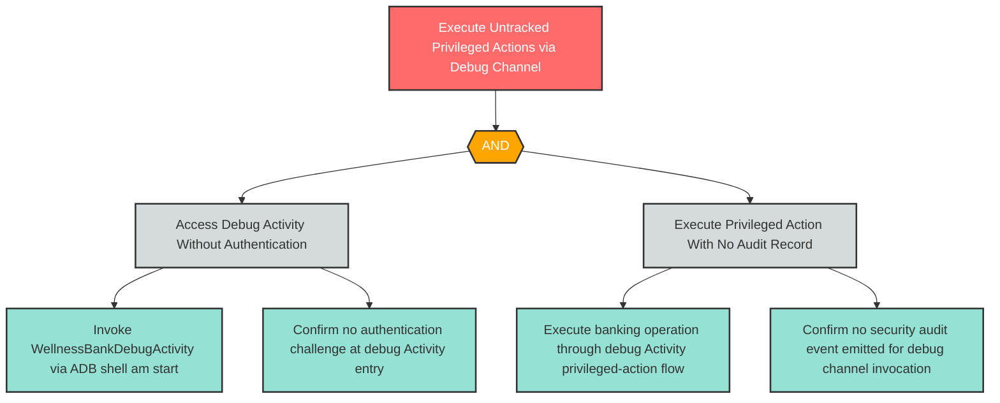

# R-4: Unlogged Debug Activity Invocations

**Component**: WellnessBankDebugActivity | **Risk Level**: High | **Finding**: R-4

An attacker invokes privileged operations through the debug Activity channel, leaving no accountability trail that would allow forensic detection or attribution of the unauthorized access.

