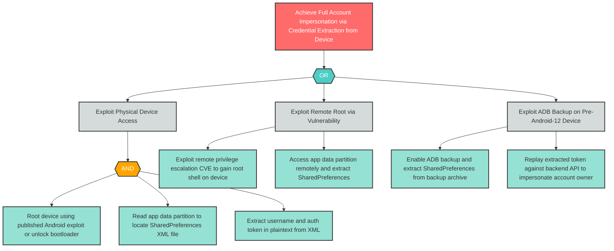

# S-1: Improper Mobile Credential Usage — Auth Token in Unprotected SharedPreferences

**Component**: WellnessBank Android Client | **Risk Level**: Critical | **Finding**: S-1

An attacker who physically or remotely accesses a rooted device extracts long-lived authentication credentials from unencrypted SharedPreferences and achieves full account impersonation.

