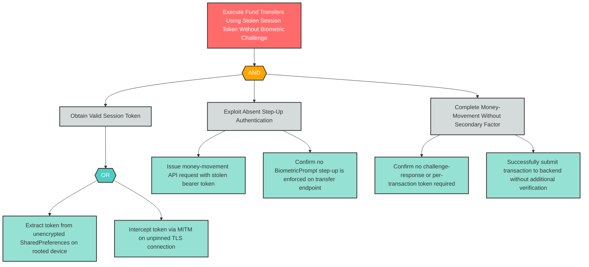

# S-2: Insecure Mobile Authentication — No Biometric Step-Up on Money Movement

**Component**: WellnessBank Android Client | **Risk Level**: Critical | **Finding**: S-2

An attacker who obtains a valid session token executes fund transfers without any biometric or secondary-factor challenge, exploiting the absence of step-up authentication on sensitive operations.

