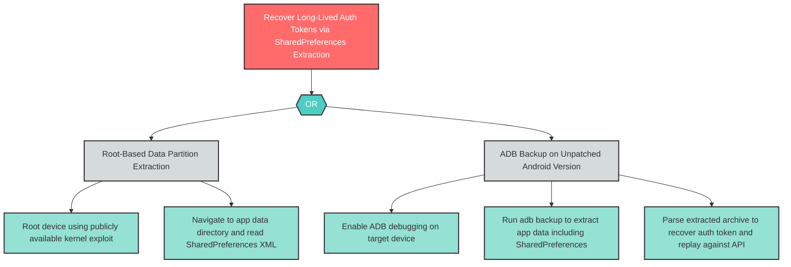

# S-3: Credential Theft via SharedPreferences Extraction on Rooted Device

**Component**: WellnessBank Android Client | **Risk Level**: High | **Finding**: S-3

An attacker extracts long-lived auth tokens from MODE_PRIVATE SharedPreferences on a rooted device or via ADB backup, enabling offline credential recovery without live user presence.

