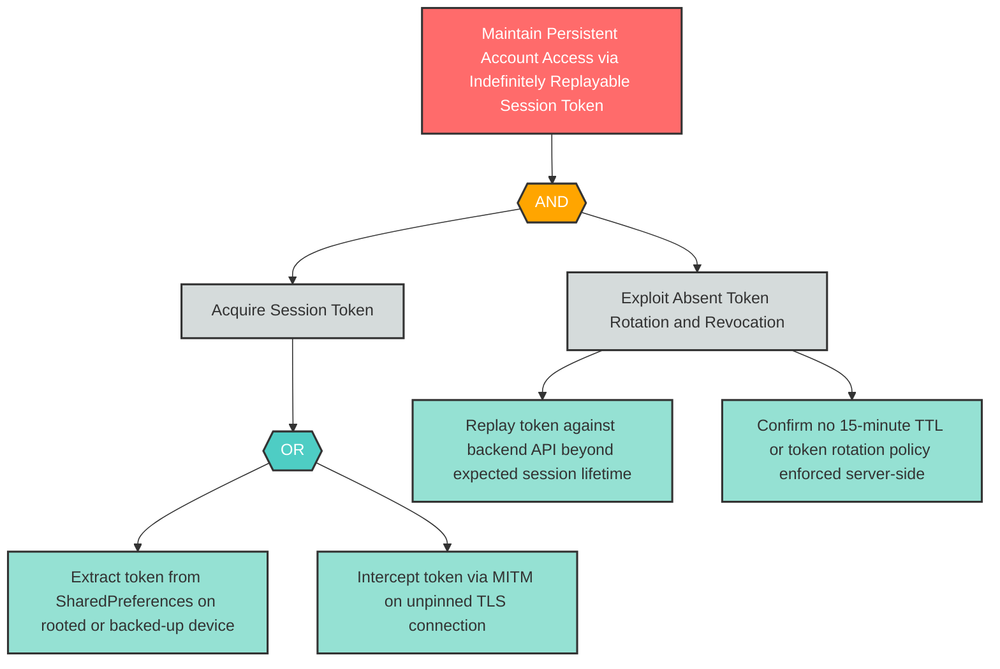

# S-5: Long-Lived Session Token Replay

**Component**: Mobile Banking Customer | **Risk Level**: High | **Finding**: S-5

An attacker who obtains a session token replays it indefinitely against the backend API because no token rotation policy or expiry enforcement exists, transforming a temporary credential theft into a permanent account compromise.

