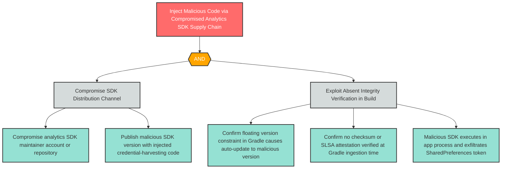

# T-1: Mobile Supply Chain Integrity — Analytics SDK Compromise

**Component**: WellnessAnalyticsSDK | **Risk Level**: High | **Finding**: T-1

An attacker compromises the WellnessAnalyticsSDK supply chain by exploiting the floating version constraint and absent artifact checksum verification, injecting malicious code that executes inside the application's full security context.

