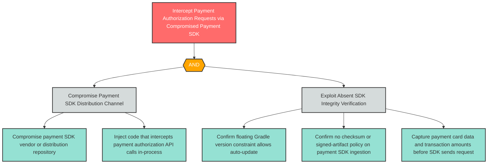

# T-2: Mobile Supply Chain Integrity — Payment SDK Compromise

**Component**: WellnessPaySDK | **Risk Level**: High | **Finding**: T-2

An attacker compromises the WellnessPaySDK supply chain, injecting code that intercepts or modifies payment authorization requests before they leave the device.

