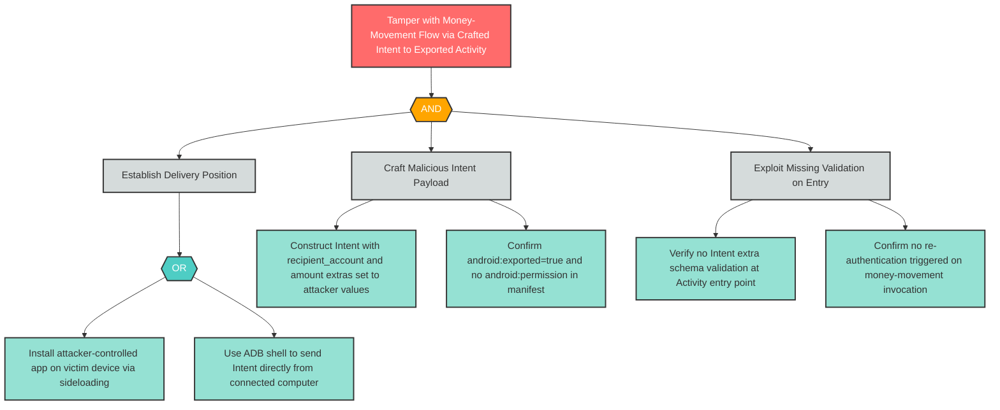

# T-3: Mobile IPC Input Validation — Intent Hijacking into Money Movement

**Component**: MoneyTransferActivity | **Risk Level**: Critical | **Finding**: T-3

A malicious co-installed application sends a crafted Android Intent to the exported MoneyTransferActivity, directly invoking the money-movement business logic with attacker-controlled recipient and amount parameters.

