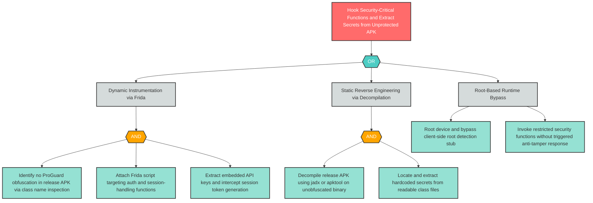

# T-4: Insufficient Mobile Binary Protections — No Obfuscation or Anti-Tampering

**Component**: WellnessBank Android Client | **Risk Level**: Critical | **Finding**: T-4

An attacker uses dynamic instrumentation tooling to hook security-critical functions in the unobfuscated release APK, bypassing client-side controls and extracting embedded secrets.

